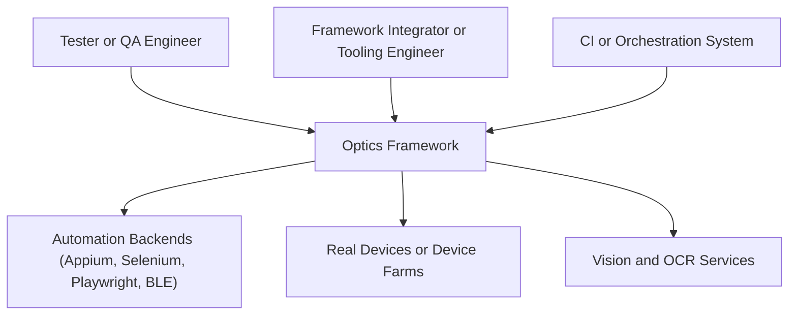
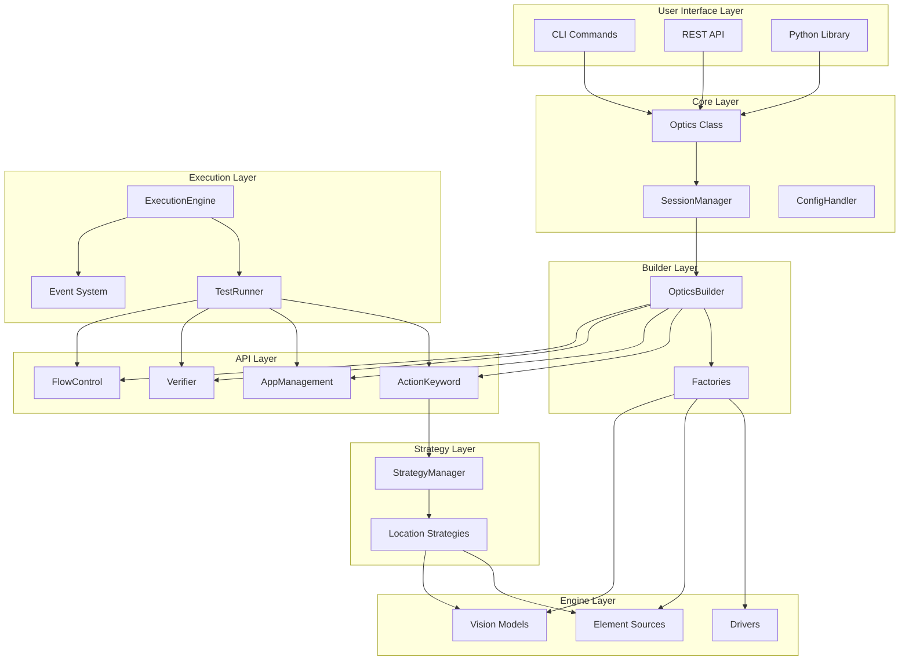
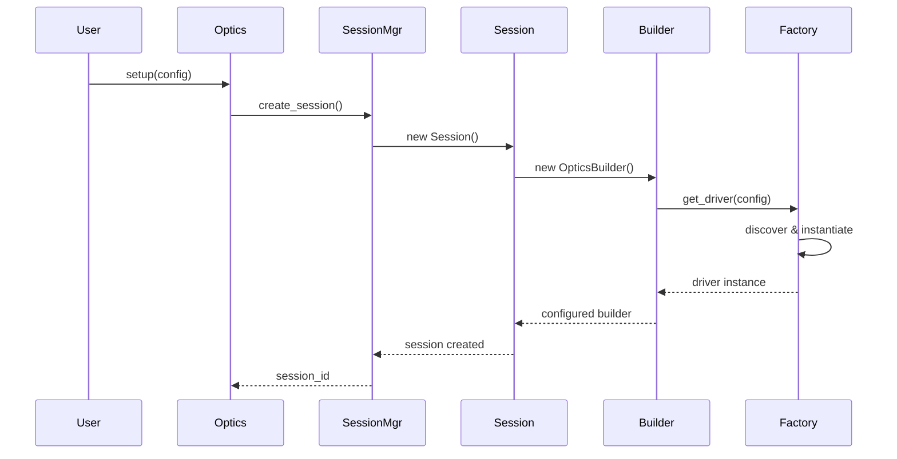
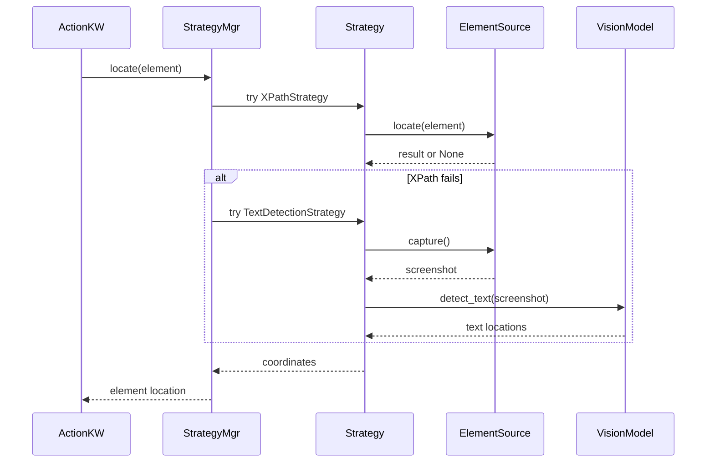

# Architecture Overview

The Optics Framework is built on a modular, extensible architecture that enables vision-powered, self-healing test automation. This document provides a high-level overview of the framework's design, core principles, and component relationships.

## Design Principles

The framework follows several key design principles:

1. **Modularity**: Components are organized into clear, independent modules with well-defined interfaces
2. **Extensibility**: New drivers, element sources, and vision models can be added without modifying core code
3. **Resilience**: Built-in fallback mechanisms ensure tests continue even when primary methods fail
4. **Separation of Concerns**: Clear boundaries between action execution, element detection, and vision processing
5. **Interface-Based Design**: Components communicate through well-defined interfaces, enabling easy substitution

## Level 1 – System Context

At the system level, the Optics Framework sits between test authors and external automation infrastructure.
It exposes multiple entry points (CLI, REST API, Python library) while orchestrating drivers, vision models, and device farms underneath.

## Level 2 – Containers and Layers

The rest of this document describes the Optics Framework's internal containers and layers (C4 Level 2), and how they collaborate at runtime.

The framework is organized into several key layers:

The layers have the following responsibilities and primary references:

- **User Interface Layer**:
  - Entry points for humans and tooling via CLI commands, the REST API, and the Python library.
  - Translates user intent into high-level operations without dealing directly with drivers or vision models.
  - See [CLI Layer](architecture/cli_layer.md) and [REST API Layer](architecture/api_layer.md).

- **Core Layer**:
  - Hosts the `Optics` facade, `SessionManager`, and `ConfigHandler`.
  - Owns configuration and session lifecycle, bridging interface-layer calls into the builder and execution pipeline.
  - See [Component Architecture](architecture/components.md) for core component details.

- **Builder Layer**:
  - Uses `OpticsBuilder` and factories to turn configuration into concrete driver, element source, and vision model instances.
  - Central place for dependency wiring and fallback chains between engines.
  - See [Component Architecture](architecture/components.md) and [Engines](architecture/engines.md).

- **API Layer**:
  - Provides high-level, user-facing keywords for actions, app management, verification, and flow control.
  - Encapsulates orchestration logic while delegating low-level work to strategies and engines.
  - See [Component Architecture](architecture/components.md) and [Strategies](architecture/strategies.md).

- **Strategy Layer**:
  - Implements self-healing location strategies that combine DOM, text, and image-based techniques.
  - Decides which element or vision strategy to apply and in what order.
  - See [Strategies](architecture/strategies.md) for details.

- **Engine Layer**:
  - Contains concrete automation backends (drivers), element sources, and vision models.
  - Talks to external systems such as Appium/Selenium/Playwright, device farms, and OCR/image services.
  - See [Engines](architecture/engines.md) for driver, element source, and vision model implementations.

- **Execution Layer**:
  - Coordinates test execution, result collection, and event publishing.
  - Provides runners and event infrastructure that drive API-layer keywords over time.
  - See [Execution](architecture/execution.md) and [Event System](architecture/event_system.md).

For a deeper, component-level (C4 Level 3) view and the concrete design patterns used in Optics, see:
- **Component Architecture**: [Component Architecture](architecture/components.md) for Optics, SessionManager, builders, factories, and interfaces.
- **Strategies and Engines**: [Strategies](architecture/strategies.md) and [Engines](architecture/engines.md) for self-healing strategies and engine implementations.
- **Architecture Decisions**: [Architecture Decisions](architecture/decisions.md) for the rationale behind major architectural choices.

## Data Flow

### Session Creation Flow

### Element Location Flow

## Cross-Cutting Concerns

These concerns cut across multiple layers and containers, and collectively shape the framework's runtime behavior and quality attributes.

### Self-Healing Mechanism

The framework implements self-healing through multiple layers:

1. **Strategy Fallback**: If one location strategy fails, try the next
2. **Driver Fallback**: If one driver fails, try the next configured driver
3. **Element Source Fallback**: If one element source fails, try the next
4. **Vision Model Fallback**: If one OCR/image model fails, try the next

This multi-layered approach ensures maximum test resilience.

### Configuration Structure

Configuration is hierarchical and supports:
- Multiple drivers with priority ordering
- Multiple element sources with fallback chains
- Multiple vision models for redundancy
- Per-component configuration options

### Extension Points

The framework is designed for easy extension:

1. **New Drivers**: Implement `DriverInterface` in `engines/drivers/`
2. **New Element Sources**: Implement `ElementSourceInterface` in `engines/elementsources/`
3. **New Vision Models**: Implement `ImageInterface` or `TextInterface` in `engines/vision_models/`
4. **New Strategies**: Extend `LocatorStrategy` in `common/strategies.py`
5. **New Keywords**: Add methods to API classes with `@keyword` decorator

## Next Steps

From here you can move from the C4 Level 1 and Level 2 views in this document into more detailed Level 3 component and system documentation.

### Containers and Layers (Level 2 → Level 3)

- [Component Architecture](architecture/components.md) - Deep dive into individual components
- [Engines](architecture/engines.md) - Driver, element source, and vision model implementations
- [Strategies](architecture/strategies.md) - Strategy pattern and self-healing mechanisms
- [Execution](architecture/execution.md) - Test execution flow and event system
- [Event System](architecture/event_system.md) - EventSDK and event tracking
- [Error Handling](architecture/error_handling.md) - Error codes and error handling system

### Interface Entry Points

- [REST API Layer](architecture/api_layer.md) - REST API architecture and integration
- [CLI Layer](architecture/cli_layer.md) - Command-line interface architecture
- [Library Layer](architecture/library_layer.md) - Python library and programmatic interface

### Cross-Cutting Systems and Decisions

- [Logging Architecture](architecture/logging.md) - Logging system and configuration
- [Architecture Decisions](architecture/decisions.md) - ADRs and design rationale

### Extension and Customization

- [Extending the Framework](architecture/extending.md) - Creating custom extensions

## Related Documentation

- [REST API Usage](usage/REST_API_usage.md) - Complete REST API endpoint reference
- [API Reference](api_reference.md) - Python API documentation
- [Configuration](configuration.md) - Configuration guide
- [Quick Start](quickstart.md) - Getting started guide
- [Usage Guide](usage/usage.md) - Usage examples and patterns
