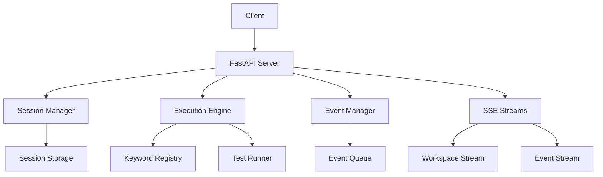
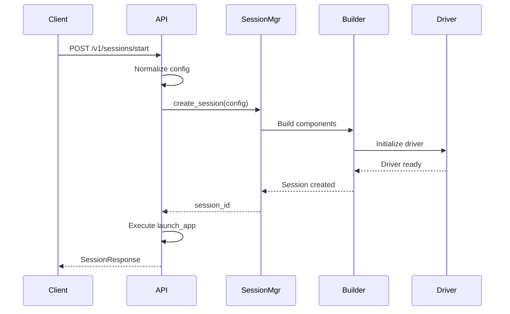
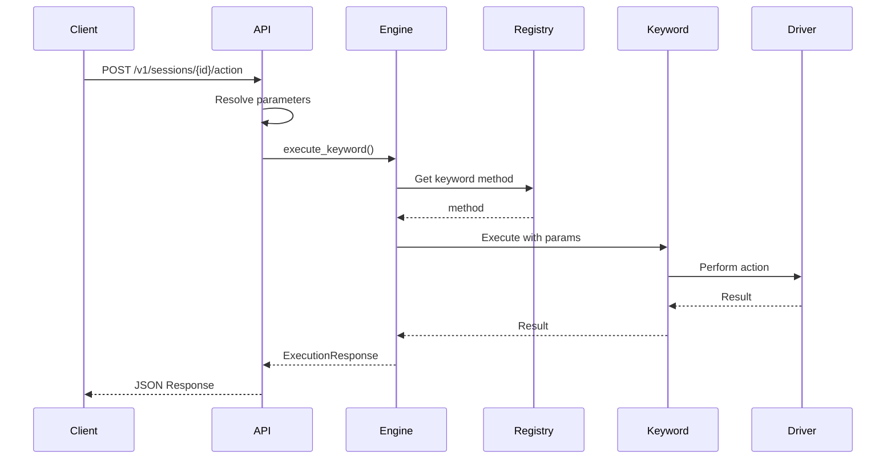

# REST API Architecture

The Optics Framework provides a RESTful API layer built on FastAPI that enables programmatic access to framework functionality. This document explains the API architecture, request/response flows, and integration with the core framework.

## Overview

The REST API layer provides:

1. **Session Management** - Create, manage, and terminate sessions
2. **Keyword Execution** - Execute keywords programmatically
3. **Workspace Streaming** - Real-time workspace updates via SSE
4. **Event Streaming** - Real-time execution events via SSE
5. **Workspace Inspection** - Get screenshots, elements, and page source

## API Architecture



**Location:** `optics_framework/common/expose_api.py`

## API Server

The API server is built using FastAPI:

```python
from fastapi import FastAPI
from fastapi.middleware.cors import CORSMiddleware

app = FastAPI(title="Optics Framework API", version="1.0")

# CORS configuration
app.add_middleware(
    CORSMiddleware,
    allow_origins=["*"],
    allow_credentials=True,
    allow_methods=["*"],
    allow_headers=["*"],
)
```

### Server Startup

The API server can be started using the CLI:

```bash
optics serve --host 0.0.0.0 --port 8000
```

Or programmatically:

```python
from optics_framework.helper.serve import run_uvicorn_server

run_uvicorn_server(host="0.0.0.0", port=8000, workers=1)
```

## Request/Response Flow

### Session Creation Flow



### Keyword Execution Flow



## Session Management

### Session Creation

**Endpoint:** `POST /v1/sessions/start`

**Request Body:**
```json
{
  "driver_sources": [{"appium": {"enabled": true, "url": "...", "capabilities": {...}}}],
  "elements_sources": [{"appium": {"enabled": true}}],
  "text_detection": [{"easyocr": {"enabled": true}}],
  "image_detection": [{"templatematch": {"enabled": true}}],
  "project_path": "/path/to/project"
}
```

**Response:**
```json
{
  "session_id": "uuid-string",
  "driver_id": "driver-session-id",
  "status": "created"
}
```

**Implementation Details:**

1. **Configuration Normalization**: Converts various input formats to internal format
2. **Session Creation**: Creates session with normalized configuration
3. **Auto-Launch**: Automatically executes `launch_app` keyword
4. **Logging Configuration**: Reconfigures logging for the session

### Session Termination

**Endpoint:** `DELETE /v1/sessions/{session_id}/stop`

**Response:**
```json
{
  "status": "terminated"
}
```

**Implementation Details:**

1. Retrieves session from SessionManager
2. Terminates driver connection
3. Cleans up session resources
4. Removes session from storage

## Keyword Execution

### Execute Keyword

**Endpoint:** `POST /v1/sessions/{session_id}/action`

**Request Body:**
```json
{
  "mode": "keyword",
  "keyword": "Press Element",
  "params": ["submit_button"]
}
```

**Response:**
```json
{
  "execution_id": "uuid-string",
  "status": "SUCCESS",
  "data": {
    "result": "action completed"
  }
}
```

### Parameter Formats

The API supports multiple parameter formats:

#### Positional Parameters
```json
{
  "params": ["element_id", "30", "button_clicked"]
}
```

#### Named Parameters
```json
{
  "params": {
    "element": "submit_button",
    "timeout": "30",
    "event_name": "button_clicked"
  }
}
```

#### Fallback Parameters
```json
{
  "params": ["value1", "value2", "value3"]
}
```

Or nested fallbacks:
```json
{
  "params": [["value1a", "value1b"], "value2"]
}
```

### Parameter Resolution

The API automatically:

1. **Detects Format**: Determines if params are positional, named, or fallback
2. **Normalizes Values**: Converts all values to lists for fallback support
3. **Resolves Named Params**: Converts named params to positional based on method signature
4. **Generates Combinations**: Creates all fallback combinations using `itertools.product`
5. **Tries Each Combination**: Executes until one succeeds or all fail

### Fallback Execution

```python
# Generate all combinations
combinations = list(product(*normalized_param_lists))

# Try each combination
for combo in combinations:
    try:
        result = execute_keyword(keyword, combo)
        return result  # Success
    except Exception:
        continue  # Try next combination

# All failed
raise RuntimeError("All fallback attempts failed")
```

## Server-Sent Events (SSE)

The API uses Server-Sent Events for real-time streaming.

### Event Streaming

**Endpoint:** `GET /v1/sessions/{session_id}/events`

**Response:** SSE stream of execution events

**Event Format:**
```json
{
  "execution_id": "uuid-string",
  "status": "RUNNING|SUCCESS|FAIL|HEARTBEAT",
  "message": "Event message"
}
```

**Implementation:**

```python
async def event_generator(session: Session):
    HEARTBEAT_INTERVAL = 15  # seconds
    while True:
        try:
            event = await asyncio.wait_for(
                session.event_queue.get(),
                timeout=HEARTBEAT_INTERVAL
            )
            yield {"data": json.dumps(event)}
        except asyncio.TimeoutError:
            # Send heartbeat
            yield {"data": json.dumps({
                "execution_id": "heartbeat",
                "status": "HEARTBEAT"
            })}
```

### Workspace Streaming

**Endpoint:** `GET /v1/sessions/{session_id}/workspace/stream`

**Query Parameters:**
- `interval_ms` (int, default: 2000): Polling interval (minimum 500ms)
- `include_source` (bool, default: false): Include page source
- `filter_config` (List[str], optional): Filter element types

**Response:** SSE stream of workspace updates

**Workspace Data Format:**
```json
{
  "screenshot": "base64-encoded-image",
  "elements": [...],
  "source": "..." // if include_source=true
}
```

**Change Detection:**

The API only emits updates when workspace data changes:

```python
# Compute hash of current workspace
current_hash = _compute_workspace_hash(workspace_data)
last_hash = workspace_hashes.get(session_id)

# Only emit if changed
if current_hash != last_hash:
    workspace_hashes[session_id] = current_hash
    yield {"data": json.dumps(workspace_data)}
else:
    # Send heartbeat if no change
    yield {"data": json.dumps({"type": "heartbeat"})}
```

**Benefits:**
- Reduces network traffic
- Lowers driver load
- Provides efficient real-time updates

## Workspace Inspection

### Get Screenshot

**Endpoint:** `GET /v1/sessions/{session_id}/screenshot`

**Response:**
```json
{
  "execution_id": "uuid-string",
  "status": "SUCCESS",
  "data": {
    "result": "base64-encoded-image"
  }
}
```

### Get Page Source

**Endpoint:** `GET /v1/sessions/{session_id}/source`

**Response:**
```json
{
  "execution_id": "uuid-string",
  "status": "SUCCESS",
  "data": {
    "result": "<html>...</html>"
  }
}
```

### Get Screen Elements

**Endpoint:** `GET /v1/sessions/{session_id}/screen_elements`

**Query Parameters:**
- `filter_config` (List[str], optional): Filter types (all, interactive, buttons, inputs, images, text)

**Response:**
```json
{
  "execution_id": "uuid-string",
  "status": "SUCCESS",
  "data": {
    "result": [
      {
        "type": "button",
        "text": "Submit",
        "bounds": {...},
        "clickable": true
      }
    ]
  }
}
```

## Error Handling

### Error Response Format

The API converts `OpticsError` to HTTP responses:

```python
try:
    result = execute_keyword(keyword, params)
except OpticsError as e:
    raise HTTPException(
        status_code=e.status_code,
        detail=e.to_payload(include_status=True)
    )
```

### Error Response Structure

```json
{
  "detail": {
    "type": "optics:driver",
    "code": "E0101",
    "status": 500,
    "message": "Driver not initialized",
    "details": {
      "driver": "appium",
      "session_id": "abc123"
    }
  }
}
```

### Common Error Codes

- **404**: Session not found, keyword not found
- **400**: Invalid parameters, configuration error
- **500**: Driver error, execution error
- **504**: Timeout errors

See [Error Handling](error_handling.md) for complete error code reference.

## Keyword Discovery

### List Keywords

**Endpoint:** `GET /v1/keywords`

**Response:**
```json
[
  {
    "keyword": "Press Element",
    "keyword_slug": "press_element",
    "description": "Taps on a given element...",
    "parameters": [
      {
        "name": "element",
        "type": "str",
        "default": null
      }
    ]
  }
]
```

**Implementation:**

The API discovers keywords by:

1. Scanning `optics_framework.api` package
2. Extracting public methods from API classes
3. Inspecting method signatures for parameters
4. Extracting docstrings for descriptions

```python
def discover_keywords() -> List[KeywordInfo]:
    api_pkg = "optics_framework.api"
    keywords = []
    for module in api_modules:
        for cls in module_classes:
            for method in public_methods(cls):
                keywords.append(KeywordInfo(
                    keyword=_humanize_keyword(method_name),
                    keyword_slug=method_name,
                    description=method.__doc__,
                    parameters=_get_keyword_parameters(method)
                ))
    return keywords
```

## Configuration Normalization

The API normalizes various configuration formats to a consistent internal format.

### Supported Formats

#### Simple String List
```json
{
  "driver_sources": ["appium", "selenium"]
}
```

#### Detailed Dictionary
```json
{
  "driver_sources": [
    {
      "appium": {
        "enabled": true,
        "url": "http://localhost:4723",
        "capabilities": {
          "platformName": "Android"
        }
      }
    }
  ]
}
```

#### Deprecated Format (with warnings)
```json
{
  "appium_url": "http://localhost:4723",
  "appium_config": {
    "capabilities": {...}
  }
}
```

### Normalization Process

```python
def normalize_sources(self) -> Dict[str, List[Dict[str, DependencyConfig]]]:
    driver = [
        self._normalize_item(i, top_level_url=self.appium_url)
        for i in self.driver_sources
    ]
    # ... normalize other sources
    return {
        "driver_sources": driver,
        "elements_sources": elements,
        "text_detection": text,
        "image_detection": image
    }
```

## Integration with Core Framework

### Session Manager Integration

```python
session_manager = SessionManager()

@app.post("/v1/sessions/start")
async def create_session(config: SessionConfig):
    session_id = session_manager.create_session(
        session_config,
        test_cases=None,
        modules=None
    )
    return SessionResponse(session_id=session_id)
```

### Execution Engine Integration

```python
execution_engine = ExecutionEngine()

async def execute_keyword(session_id: str, request: ExecuteRequest):
    params = ExecutionParams(
        session_id=session_id,
        mode="keyword",
        keyword=request.keyword,
        params=request.params
    )
    result = await execution_engine.execute(params)
    return ExecutionResponse(
        execution_id=str(uuid4()),
        status="SUCCESS",
        data={"result": result}
    )
```

### Event Manager Integration

```python
@app.get("/v1/sessions/{session_id}/events")
async def stream_events(session_id: str):
    session = session_manager.get_session(session_id)
    event_manager = get_event_manager(session_id)
    return EventSourceResponse(event_generator(session))
```

## Performance Considerations

### 1. Connection Pooling

- Sessions reuse driver connections
- Multiple API requests share the same session
- Driver connections persist until session termination

### 2. Streaming Efficiency

- Workspace streaming only emits on changes
- Heartbeat mechanism prevents connection timeouts
- Configurable polling intervals

### 3. Parameter Resolution

- Named parameter resolution is cached
- Fallback combinations generated lazily
- Early exit on first successful execution

### 4. Error Handling

- Errors are caught and converted to HTTP responses
- No exception propagation to client
- Structured error responses for debugging

## Security Considerations

### CORS Configuration

Currently, CORS is enabled for all origins:

```python
app.add_middleware(
    CORSMiddleware,
    allow_origins=["*"],  # Consider restricting in production
    allow_credentials=True,
    allow_methods=["*"],
    allow_headers=["*"],
)
```

**Recommendation**: Restrict CORS in production environments.

### Authentication

Currently, the API does not require authentication. Consider adding:

- API key authentication
- Bearer token authentication
- Session-based authentication

### Input Validation

- Pydantic models validate all inputs
- Parameter types are checked
- Configuration is normalized and validated

## Best Practices

### 1. Session Management

- Create sessions for logical test groups
- Terminate sessions when done
- Reuse sessions for multiple operations

### 2. Error Handling

- Check response status codes
- Handle OpticsError responses
- Implement retry logic for transient errors

### 3. Streaming

- Use appropriate polling intervals
- Handle heartbeat events
- Implement reconnection logic

### 4. Parameter Passing

- Use named parameters for clarity
- Leverage fallback parameters for resilience
- Validate parameters before sending

## Troubleshooting

### Session Not Found

**Problem**: 404 error when accessing session endpoints.

**Solutions**:

1. Verify session ID is correct
2. Check session hasn't been terminated
3. Ensure session was created successfully

### Keyword Execution Fails

**Problem**: Keyword execution returns error.

**Solutions**:

1. Check keyword name is correct
2. Verify parameters match method signature
3. Review error details in response
4. Check driver is properly initialized

### Streaming Issues

**Problem**: SSE stream disconnects or doesn't emit.

**Solutions**:

1. Check session is still active
2. Verify network connectivity
3. Review server logs for errors
4. Ensure proper SSE client implementation

## Related Documentation

- [REST API Usage](../usage/REST_API_usage.md) - Complete REST API endpoint reference
- [API Reference](../api_reference.md) - Python API documentation
- [Session Management](components.md#sessionmanager) - Session lifecycle
- [Execution](execution.md) - Execution engine details
- [Error Handling](error_handling.md) - Error codes and handling
- [Fallback Parameters](components.md#fallback-parameter-system) - Fallback parameter system
- [Keyword Registry](execution.md#keyword-registry) - Keyword registration
- [Architecture Decisions](decisions.md) - API design decisions
