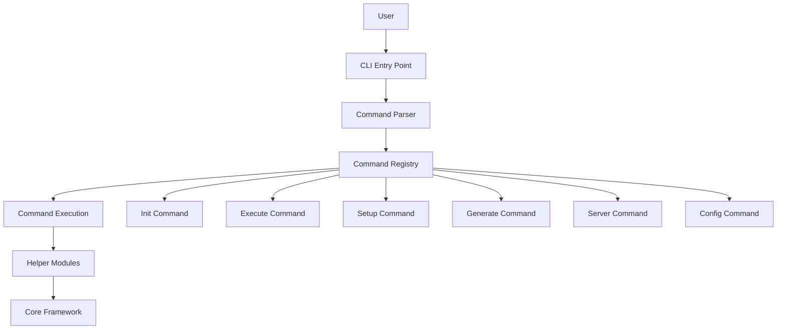
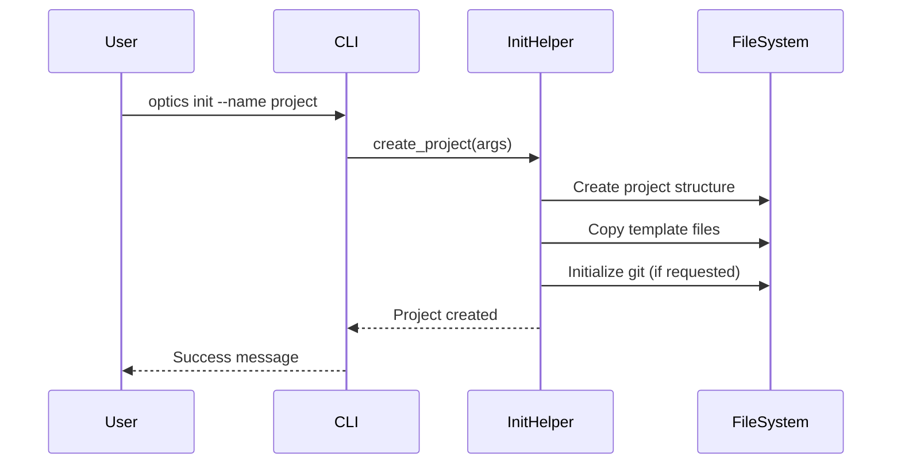
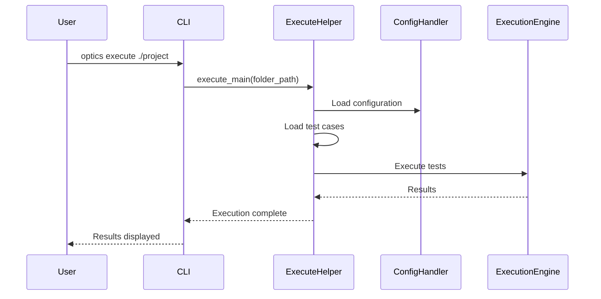
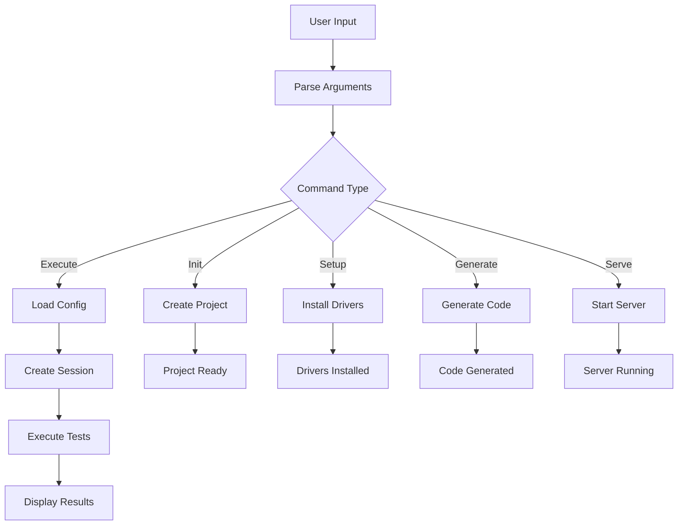

# CLI Layer Architecture

The Optics Framework provides a command-line interface (CLI) that enables users to interact with the framework without writing code. This document explains the CLI architecture, command structure, and how commands integrate with the core framework.

## Overview

The CLI layer provides:

1. **Project Management** - Initialize and manage test projects
2. **Test Execution** - Execute and validate test cases
3. **Driver Setup** - Install and configure drivers
4. **Code Generation** - Generate test framework code
5. **API Server** - Start the REST API server
6. **Configuration** - Manage framework configuration

## CLI Architecture



**Location:** `optics_framework/helper/cli.py`

## Command Structure

The CLI follows a command-based architecture where each command is a self-contained unit that:

- Registers itself with the argument parser
- Defines its arguments and options
- Executes its functionality when invoked
- Integrates with helper modules and the core framework

All commands follow a consistent pattern: registration, argument parsing, validation, and execution.

## Available Commands

### 1. Init Command

**Command:** `optics init`

**Purpose:** Initialize a new test project

**Usage:**
```bash
optics init --name my_project --path ./tests --template contact --git-init
```

**Arguments:**

- `--name` (required): Project name
- `--path` (optional): Directory where project will be created
- `--template` (optional): Project template to use
- `--force` (flag): Override if project exists
- `--git-init` (flag): Initialize git repository

**Flow:**



### 2. Execute Command

**Command:** `optics execute`

**Purpose:** Execute test cases from a project

**Usage:**
```bash
optics execute ./my_project --runner test_runner --use-printer
```

**Arguments:**

- `folder_path` (required): Path to project folder
- `--runner` (optional): Test runner to use (default: test_runner)
- `--use-printer` / `--no-use-printer`: Enable/disable live result printer

**Flow:**



### 3. Dry Run Command

**Command:** `optics dry_run`

**Purpose:** Validate test cases without executing actions

**Usage:**
```bash
optics dry_run ./my_project --runner test_runner
```

**Arguments:**

- `folder_path` (required): Path to project folder
- `--runner` (optional): Test runner to use
- `--use-printer` / `--no-use-printer`: Enable/disable result printer

**Behavior:** Similar to ExecuteCommand but validates test cases without performing actual actions, useful for syntax checking and validation.

### 4. Setup Command

**Command:** `optics setup`

**Purpose:** Install and configure drivers

**Usage:**
```bash
optics setup --install Appium EasyOCR
optics setup --list
```

**Arguments:**

- `--install` (list): Drivers to install
- `--list` (flag): List available drivers

**Modes:**
- **Interactive Mode**: Launches a TUI (Text User Interface) for driver selection
- **List Mode**: Displays all available drivers
- **Install Mode**: Installs specified drivers via package manager

**Available Drivers:**
- Appium
- Selenium
- Playwright
- EasyOCR
- GoogleVision
- PyTesseract
- TemplateMatch
- RemoteOIR
- RemoteOCR

### 5. Generate Command

**Command:** `optics generate`

**Purpose:** Generate test framework code from project

**Usage:**
```bash
optics generate ./my_project --framework pytest --output test_generated.py
```

**Arguments:**

- `project_path` (required): Path to project
- `--framework` (optional): Framework to use (pytest, robot)
- `--output` (optional): Output file path

**Behavior:** Reads test cases, modules, and configuration from the project and generates executable test code in the specified framework format.

### 6. Server Command

**Command:** `optics serve`

**Purpose:** Start the REST API server

**Usage:**
```bash
optics serve --host 0.0.0.0 --port 8000 --workers 1
```

**Arguments:**

- `--host` (optional): Host to bind (default: 127.0.0.1)
- `--port` (optional): Port to bind (default: 8000)
- `--workers` (optional): Number of worker processes (default: 1)

**Behavior:** Starts a FastAPI server that exposes the framework functionality via REST API endpoints.

### 7. List Command

**Command:** `optics list`

**Purpose:** List all available keywords

**Usage:**
```bash
optics list
```

**Behavior:** Scans the framework API package and displays all available keywords that can be used in test cases, along with their parameters and descriptions.

### 8. Config Command

**Command:** `optics config`

**Purpose:** Manage framework configuration

**Usage:**
```bash
optics config
```

**Behavior:** Launches an interactive configuration manager that allows users to view, edit, and validate framework configuration files.

### 9. Completion Command

**Command:** `optics completion`

**Purpose:** Enable shell autocompletion

**Usage:**
```bash
optics completion
```

**Behavior:** Updates shell RC files (`.bashrc`, `.zshrc`) to enable command and argument autocompletion for the CLI.

## Helper Modules

The CLI layer delegates complex operations to helper modules that encapsulate specific functionality:

### Execute Helper

**Location:** `optics_framework/helper/execute.py`

**Responsibilities:**

- Loads configuration and test cases from project
- Creates and manages test sessions
- Executes tests via ExecutionEngine
- Manages live result printing and output formatting

### Initialize Helper

**Location:** `optics_framework/helper/initialize.py`

**Responsibilities:**

- Creates project directory structure
- Copies template files and configurations
- Initializes git repository (optional)
- Sets up initial configuration files

### Generate Helper

**Location:** `optics_framework/helper/generate.py`

**Responsibilities:**

- Reads test cases, modules, and elements from project
- Converts project structure to target framework format (pytest/Robot Framework)
- Generates executable test code
- Writes generated code to output file

### Setup Helper

**Location:** `optics_framework/helper/setup.py`

**Responsibilities:**

- Lists available drivers and their dependencies
- Installs driver packages via package manager
- Provides interactive TUI for driver selection
- Validates driver installations

### Config Manager

**Location:** `optics_framework/helper/config_manager.py`

**Responsibilities:**

- Interactive configuration file editor
- Configuration validation and error checking
- Configuration file management (create, read, update)
- Configuration template generation

### Serve Helper

**Location:** `optics_framework/helper/serve.py`

**Responsibilities:**

- Configures and starts Uvicorn server
- Sets up FastAPI application with routes
- Manages server lifecycle (start, stop, restart)
- Handles server configuration and logging

## Error Handling

The CLI includes comprehensive error handling with appropriate exit codes:

**Exit Codes:**
- `0`: Success
- `1`: Unexpected error
- `2`: Argument error
- `3`: Value error
- `130`: User cancellation (Ctrl+C)

Error handling covers:

- User input validation
- Configuration errors
- Execution failures
- Resource errors
- User interruptions

## Integration with Core Framework

### Session Creation

CLI commands that execute tests create sessions through the `SessionManager`. The session encapsulates all test execution state, including configuration, test cases, and component instances.

### Execution

Test execution commands use the `ExecutionEngine` to orchestrate test runs. The engine handles test case parsing, keyword execution, result collection, and event publishing.

### Configuration Loading

Commands load configuration through `ConfigHandler`, which supports hierarchical configuration (default, global, project) with proper precedence and merging.

## Command Execution Flow



## Best Practices

### 1. Command Design

- Use descriptive command names that clearly indicate purpose
- Provide clear help text and documentation
- Validate arguments early in the execution flow
- Use structured models for argument validation

### 2. Error Messages

- Provide clear, actionable error messages
- Include suggestions for fixing common errors
- Use appropriate exit codes for different error types
- Log detailed errors for debugging while showing user-friendly messages

### 3. User Experience

- Provide progress indicators for long-running operations
- Use consistent output formatting across commands
- Support both interactive and non-interactive modes
- Offer helpful suggestions when commands fail

### 4. Integration

- Reuse core framework components rather than duplicating logic
- Delegate complex operations to helper modules
- Maintain clear separation between CLI layer and core framework
- Use helper modules for operations that require multiple framework components

## Extending the CLI

To add a new command:

1. **Create Command Class**: Define a command class that registers arguments and implements execution logic
2. **Register Command**: Add the command to the command registry in the main CLI entry point
3. **Create Helper Module** (if needed): For complex operations, create a helper module that encapsulates the functionality

The CLI architecture is designed to be extensible, allowing new commands to be added without modifying existing code.

## Troubleshooting

### Command Not Found

**Problem:** Command not recognized

**Solutions:**

1. Verify command is registered in the CLI entry point
2. Check command name spelling
3. Verify CLI installation is complete

### Argument Errors

**Problem:** Invalid arguments

**Solutions:**

1. Check argument names and types
2. Review command help: `optics <command> --help`
3. Verify required arguments are provided

### Execution Failures

**Problem:** Command execution fails

**Solutions:**

1. Check error messages for details
2. Verify configuration is correct
3. Check dependencies are installed
4. Review logs for more information

## Related Documentation

- [API Layer](api_layer.md) - REST API server architecture
- [Library Layer](library_layer.md) - Python library interface
- [Execution](execution.md) - Test execution architecture
- [Configuration](../configuration.md) - Configuration management
- [CLI Usage Guide](../usage/CLI_usage.md) - CLI usage examples
