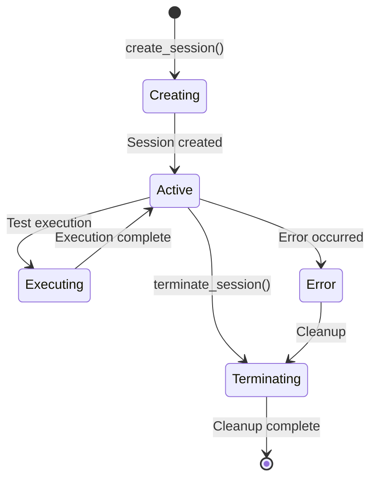
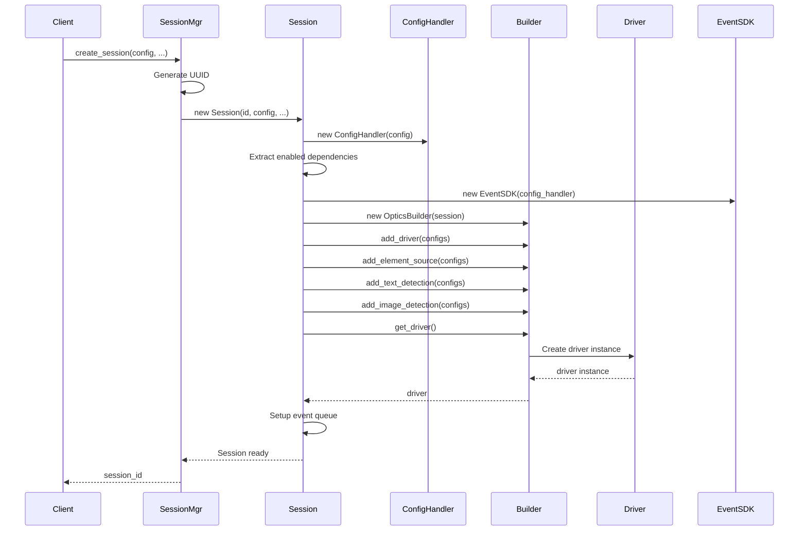
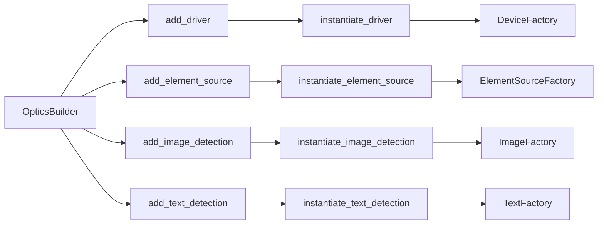
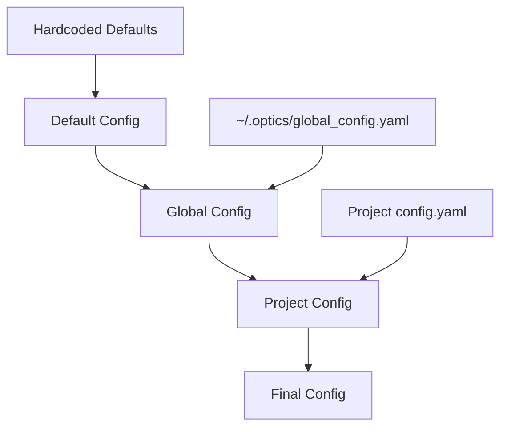
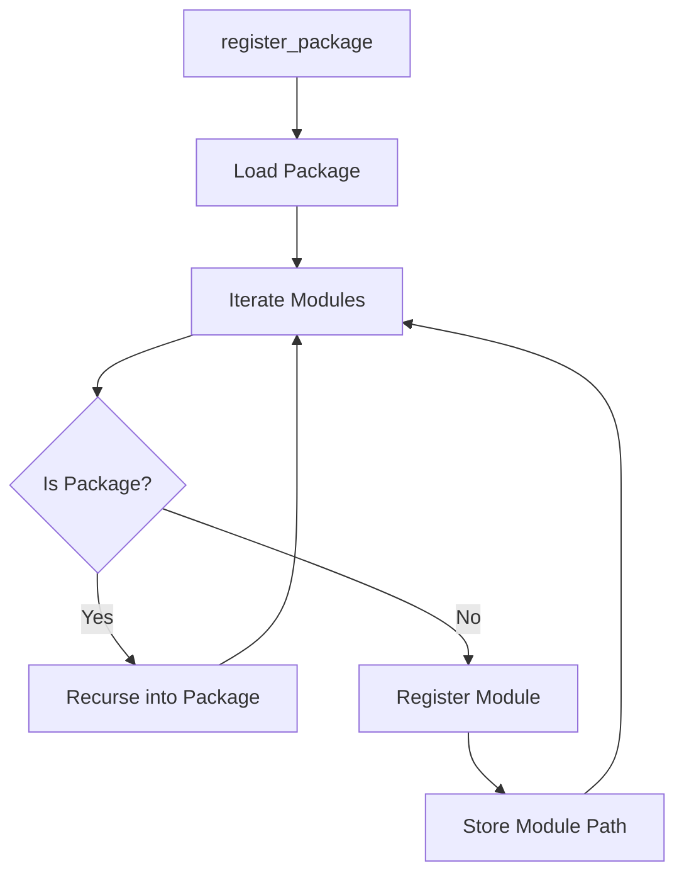
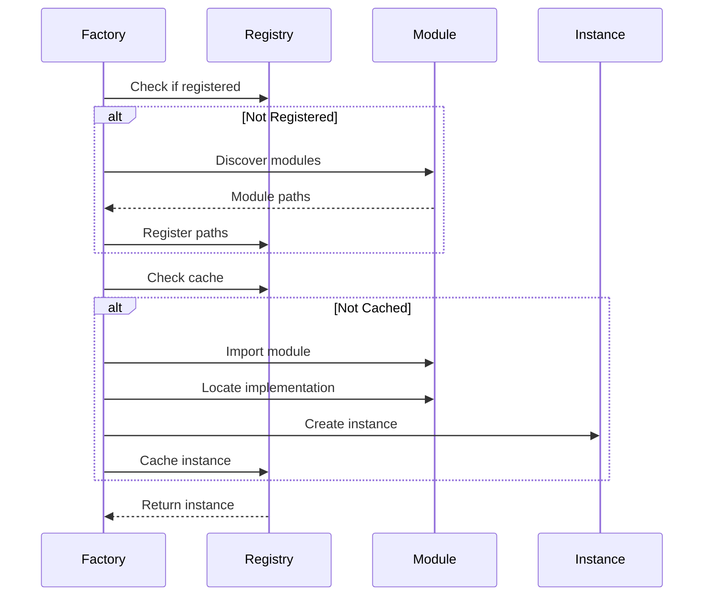
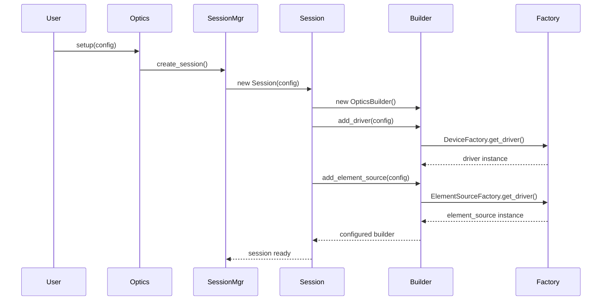
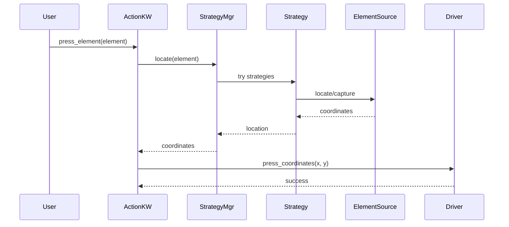

# Component Architecture

This document provides detailed documentation of all major components in the Optics Framework, their responsibilities, and how they interact.

## Core Components

### Optics Class

**Location:** `optics_framework/optics.py`

The `Optics` class is the main entry point for the framework. It provides a unified interface for both programmatic use and Robot Framework integration.

#### Key Responsibilities

- Configuration parsing and validation
- Session lifecycle management
- Keyword registration and exposure
- Template discovery
- Element and API data management

#### Key Methods

```python
@keyword("Setup")
def setup(self, config: Union[str, Dict[str, Any], None] = None, ...)
    """Configure the framework with driver and element source settings."""

@keyword("Press Element")
@fallback_params
def press_element(self, element: fallback_str, ...)
    """Press an element with automatic fallback support."""

@keyword("Add Element")
def add_element(self, name: str, value: Any)
    """Add or update an element in the current session."""
```

#### Architecture Notes

- Uses `@fallback_params` decorator to support multiple fallback values
- Integrates with Robot Framework when available
- Manages session state through `SessionManager`
- Delegates actual execution to API classes (ActionKeyword, Verifier, etc.)

#### Fallback Parameter System

The Optics Framework provides a sophisticated fallback parameter system that allows keywords to automatically try multiple values until one succeeds. This is particularly useful for element location where multiple strategies or identifiers might work.

##### How It Works

The `@fallback_params` decorator enables automatic fallback for parameters typed as `fallback_str`:

```python
from optics_framework.optics import fallback_str, fallback_params

@keyword("Press Element")
@fallback_params
def press_element(self, element: fallback_str, timeout: int = 30):
    """Press an element, trying multiple values if needed."""
    # Implementation
```

**Type Definition:**
```python
fallback_str = Union[str, List[str]]
```

##### Parameter Normalization

The decorator normalizes fallback values:

```python
def _normalize_fallback_values(name: str, val: Any) -> List[str]:
    """
    Normalize fallback parameter values.

    - str -> [str] (single value)
    - List[str] -> List[str] (multiple values)
    - None -> [] (empty, skipped)
    - Empty list -> ValueError
    """
```

**Examples:**
```python
# Single value (no fallback)
press_element("submit_button")  # element = ["submit_button"]

# Multiple values (fallback)
press_element(["submit_btn", "submit_button", "//button[@id='submit']"])
# Tries each value in order until one succeeds

# Mixed parameters
press_element(["btn1", "btn2"], timeout=30)  # Only element has fallback
```

##### Combination Generation

When multiple parameters have fallback values, all combinations are tried:

```python
from itertools import product

# Generate all combinations
for combo in product(*(fallback_lists[k] for k in keys)):
    combo_kwargs = dict(zip(keys, combo))
    try:
        return func(self, **combo_kwargs)
    except Exception:
        continue  # Try next combination
```

**Example:**
```python
@fallback_params
def press_element(self, element: fallback_str, area: fallback_str):
    pass

# Called with:
press_element(["btn1", "btn2"], ["area1", "area2"])

# Tries:
# 1. element="btn1", area="area1"
# 2. element="btn1", area="area2"
# 3. element="btn2", area="area1"
# 4. element="btn2", area="area2"
```

##### Error Aggregation

If all fallback attempts fail, errors are aggregated:

```python
if errors:
    msg = "\n".join([f"{c} -> {err}" for c, err in errors])
    raise RuntimeError(
        f"All fallback attempts failed in {func.__name__}:\n{msg}"
    )
```

**Error Message Format:**
```
All fallback attempts failed in press_element:
{'element': 'btn1'} -> Element not found
{'element': 'btn2'} -> Element not found
{'element': 'btn3'} -> Timeout exceeded
```

##### Integration with API Layer

The REST API layer also supports fallback parameters:

```python
# API request with fallback
{
  "keyword": "Press Element",
  "params": ["btn1", "btn2", "btn3"]  # Positional fallback
}

# Or named parameters with fallback
{
  "keyword": "Press Element",
  "params": {
    "element": ["btn1", "btn2"],
    "timeout": "30"
  }
}
```

The API uses the same combination generation logic:

```python
async def _execute_keyword_with_fallback(
    engine: ExecutionEngine,
    session_id: str,
    keyword: str,
    params: Union[List[Union[str, List[str]]], Dict[str, Union[str, List[str]]]],
    method: Callable[..., Any],
    session: Session
) -> Any:
    # Normalize parameters
    # Generate combinations
    # Try each combination
    # Aggregate errors
```

##### Use Cases

**1. Element Location Fallback:**
```python
# Try multiple element identifiers
press_element([
    "//button[@id='submit']",      # XPath
    "Submit Button",                # Text
    "submit_template.png"           # Image template
])
```

**2. Multiple Strategies:**
```python
# Try different approaches
enter_text(["username", "user_name", "//input[@name='user']"], "testuser")
```

**3. Environment-Specific Values:**
```python
# Different values for different environments
launch_app([
    "com.example.app.dev",      # Development
    "com.example.app.staging",  # Staging
    "com.example.app.prod"      # Production
])
```

##### Best Practices

1. **Order Matters**: Place most likely to succeed values first
2. **Limit Combinations**: Avoid too many fallback values (exponential growth)
3. **Meaningful Errors**: Ensure errors provide context for debugging
4. **Type Safety**: Always use `fallback_str` type hint
5. **Documentation**: Document expected fallback behavior

**Example:**
```python
@keyword("Press Element")
@fallback_params
def press_element(
    self,
    element: fallback_str,  # Document: "Tries XPath, text, then image"
    timeout: int = 30
) -> None:
    """
    Press an element with automatic fallback.

    Args:
        element: Element identifier(s). Can be:
            - Single string: One identifier
            - List of strings: Multiple fallback identifiers
            Tries each in order until one succeeds.
        timeout: Maximum time to wait for element
    """
```

##### Performance Considerations

- **Early Exit**: Decorator stops on first success
- **Error Handling**: Only catches non-critical exceptions
- **Combination Limit**: Consider limiting combinations for performance
- **Caching**: Results may be cached by strategy layer

##### Limitations

- **Type Restriction**: Only works with `fallback_str` type
- **Exception Handling**: SystemExit, KeyboardInterrupt, GeneratorExit are re-raised
- **No Partial Success**: All parameters must succeed together
- **Error Visibility**: Individual attempt errors are aggregated

### SessionManager

**Location:** `optics_framework/common/session_manager.py`

Manages the lifecycle of test execution sessions, including creation, retrieval, and termination with proper resource management and cleanup.

#### Key Responsibilities

- Session creation with unique IDs
- Session storage and retrieval
- Resource cleanup on termination
- Session-scoped configuration management
- Event manager lifecycle
- Driver lifecycle management

#### Class Structure

```python
class SessionManager(SessionHandler):
    def __init__(self):
        self.sessions: Dict[str, Session] = {}

    def create_session(self, config: Config, ...) -> str:
        """Creates a new session with a unique ID."""

    def get_session(self, session_id: str) -> Optional[Session]:
        """Retrieves a session by ID."""

    def terminate_session(self, session_id: str) -> None:
        """Terminates a session and cleans up resources."""
```

#### Session Lifecycle



#### Session Creation Flow



#### Session Class

Each `Session` instance contains:

**Core Attributes:**

- `session_id`: Unique identifier (UUID)
- `config_handler`: Configuration handler instance
- `config`: Configuration object
- `test_cases`: Test case data structure
- `modules`: Reusable module definitions
- `elements`: Element definitions and values
- `apis`: API endpoint definitions
- `templates`: Image template mappings

**Component Instances:**

- `optics`: OpticsBuilder instance
- `driver`: Driver instance (via fallback)
- `event_sdk`: Event tracking SDK
- `event_queue`: Async queue for execution events

#### Session Initialization

During session creation, the following occurs:

1. **Configuration Setup:**
   ```python
   self.config_handler = ConfigHandler(config)
   self.config = self.config_handler.config
   ```

2. **Dependency Extraction:**

   - Extract enabled driver configurations
   - Extract enabled element source configurations
   - Extract enabled text detection configurations
   - Extract enabled image detection configurations

3. **Component Initialization:**
   ```python
   self.event_sdk = EventSDK(self.config_handler)
   self.optics = OpticsBuilder(self)
   self.optics.add_driver(enabled_driver_configs)
   self.optics.add_element_source(enabled_element_configs)
   self.optics.add_text_detection(enabled_text_configs)
   self.optics.add_image_detection(enabled_image_configs)
   ```

4. **Driver Initialization:**
   ```python
   self.driver = self.optics.get_driver()
   ```

5. **Event Queue Setup:**
   ```python
   self.event_queue = asyncio.Queue()
   ```

#### Session State Transitions

**Creating State:**

- Session ID generated
- Configuration loaded
- Components initialized
- Driver connection established

**Active State:**

- Session ready for execution
- Driver connected
- Event queue ready
- All components initialized

**Executing State:**

- Test cases being executed
- Events being published
- Driver performing actions

**Terminating State:**

- Driver termination initiated
- Event manager cleanup
- JUnit handler cleanup
- Session removal from registry

#### Session Termination

Session termination performs comprehensive cleanup:

```python
def terminate_session(self, session_id: str) -> None:
    session = self.sessions.pop(session_id, None)
    if session and session.driver:
        session.driver.terminate()  # Close driver connection
    cleanup_junit(session_id)  # Cleanup JUnit reports
    get_event_manager_registry().remove_session(session_id)  # Remove event manager
```

**Cleanup Steps:**

1. **Remove from Registry**: Remove session from sessions dictionary
2. **Driver Termination**: Call `driver.terminate()` to close connections
3. **JUnit Cleanup**: Cleanup JUnit report handlers
4. **Event Manager Cleanup**: Remove event manager for session

#### Resource Management

**Driver Resources:**

- WebDriver connections
- Appium sessions
- Browser instances
- Device connections

**Event Resources:**

- Event queues
- Event subscribers
- JUnit handlers

**File Resources:**

- Log files
- Screenshot files
- Execution output

#### Session Isolation

Sessions are isolated from each other:

- **Separate Configuration**: Each session has its own configuration
- **Separate Drivers**: Each session has its own driver instance
- **Separate Event Queues**: Each session has its own event queue
- **Separate State**: Test cases, elements, modules are session-scoped

#### Concurrency Considerations

**Current Implementation:**

- Sessions are stored in a dictionary (not thread-safe for writes)
- Each session has its own driver instance
- Event queues are per-session

**Best Practices:**

- Create separate sessions for concurrent execution
- Don't share sessions between threads
- Terminate sessions when done

#### Session Retrieval

```python
def get_session(self, session_id: str) -> Optional[Session]:
    """Retrieves a session by ID, or None if not found."""
    return self.sessions.get(session_id)
```

**Usage:**

- Returns `None` if session doesn't exist
- Returns `Session` instance if found
- No locking required (read-only operation)

#### Session Validation

During session creation, validation occurs:

```python
if not enabled_driver_configs:
    raise OpticsError(Code.E0501, message="No enabled drivers found")
```

**Validations:**

- At least one driver must be enabled
- Configuration must be valid
- Dependencies must be properly configured

#### Error Recovery

**Session Creation Errors:**

- Configuration errors are raised immediately
- Driver initialization errors are propagated
- Partial initialization is cleaned up

**Session Termination Errors:**

- Driver termination errors are logged but don't stop cleanup
- Event manager cleanup errors are logged
- Session is always removed from registry

#### Session Persistence

**Current Implementation:**

- Sessions are stored in memory only
- No persistence to disk
- Sessions are lost on process termination

**Future Considerations:**

- Session serialization for persistence
- Session recovery on restart
- Session state snapshots

#### Best Practices

1. **Always Terminate Sessions**: Call `terminate_session()` when done
2. **One Session Per Test Run**: Create a new session for each test run
3. **Reuse Sessions Within Run**: Reuse session for multiple test cases in same run
4. **Handle Termination Errors**: Wrap termination in try/except
5. **Check Session Existence**: Verify session exists before use

#### Troubleshooting

**Session Not Found:**

- Verify session ID is correct
- Check session hasn't been terminated
- Ensure session was created successfully

**Driver Not Initialized:**

- Check at least one driver is enabled
- Verify driver configuration is correct
- Review driver initialization logs

**Resource Leaks:**

- Ensure `terminate_session()` is called
- Check for exception handling that skips cleanup
- Review driver termination logs

### OpticsBuilder

**Location:** `optics_framework/common/optics_builder.py`

Implements the Builder pattern to construct complex component hierarchies with proper dependency injection.

#### Key Responsibilities

- Configuration normalization
- Component instantiation through factories
- Dependency management between components
- Lazy instantiation of components

#### Builder Flow



#### Key Methods

```python
def add_driver(self, config: Union[str, List[Union[str, Dict]]]) -> "OpticsBuilder"
    """Add driver configuration."""

def add_element_source(self, config: Union[str, List[Union[str, Dict]]]) -> "OpticsBuilder"
    """Add element source configuration."""

def build(self, cls: Type[T]) -> T:
    """Build an instance of the specified class using stored configurations."""
```

#### Usage Example

**Basic Builder Usage:**
```python
from optics_framework.common.optics_builder import OpticsBuilder

# Create builder
builder = OpticsBuilder(session)

# Add components
builder.add_driver([{"appium": {"enabled": True, "url": "..."}}])
builder.add_element_source([{"appium_find_element": {"enabled": True}}])
builder.add_text_detection([{"easyocr": {"enabled": True}}])
builder.add_image_detection([{"templatematch": {"enabled": True}}])

# Get components
driver = builder.get_driver()
element_source = builder.get_element_source()
text_detection = builder.get_text_detection()
image_detection = builder.get_image_detection()
```

**Fluent API:**
```python
# Builder supports method chaining
builder = (OpticsBuilder(session)
    .add_driver([{"appium": {"enabled": True}}])
    .add_element_source([{"appium_find_element": {"enabled": True}}])
    .add_text_detection([{"easyocr": {"enabled": True}}])
)
```

**Building API Classes:**
```python
# Build API classes with dependencies
action_keyword = builder.build(ActionKeyword)
# ActionKeyword receives driver, element_source, strategy_manager, etc.

verifier = builder.build(Verifier)
# Verifier receives builder components
```

#### Dependency Injection

The builder automatically injects dependencies:

- Element sources receive matching drivers
- Image detection receives project path and templates
- Text detection receives execution output path

**Example - Element Source Injection:**
```python
# Element source automatically receives matching driver
builder.add_driver([{"appium": {"enabled": True}}])
builder.add_element_source([{"appium_find_element": {"enabled": True}}])

# When element source is created:
# ElementSourceFactory matches appium_find_element with appium driver
# Injects driver into element source constructor
element_source = builder.get_element_source()
# element_source.driver is the Appium driver instance
```

**Example - Vision Model Injection:**
```python
# Image detection receives project path and templates
builder.add_image_detection([{
    "templatematch": {
        "enabled": True,
        "project_path": "/path/to/project",
        "execution_output_path": "/path/to/output"
    }
}])

# Template data is automatically discovered and injected
image_detection = builder.get_image_detection()
# image_detection has access to templates from project_path
```

### ConfigHandler

**Location:** `optics_framework/common/config_handler.py`

Handles configuration parsing, validation, and access with support for hierarchical configuration and precedence rules.

#### Key Responsibilities

- Configuration file parsing (JSON/YAML)
- Configuration validation using Pydantic
- Dependency configuration management
- Enabled/disabled state tracking
- Configuration hierarchy and precedence
- Configuration merging

#### Configuration Structure

```python
class Config(BaseModel):
    # Driver and element sources
    driver_sources: List[Dict[str, DependencyConfig]]
    elements_sources: List[Dict[str, DependencyConfig]]
    image_detection: Optional[List[Dict[str, DependencyConfig]]]
    text_detection: Optional[List[Dict[str, DependencyConfig]]]

    # Paths
    project_path: Optional[str]
    execution_output_path: Optional[str]

    # Logging
    console: bool = True
    file_log: bool = False
    json_log: bool = False
    json_path: Optional[str] = None
    log_level: str = "INFO"
    log_path: Optional[str] = None

    # Execution
    include: Optional[List[str]] = None
    exclude: Optional[List[str]] = None
    halt_duration: float = 0.1
    max_attempts: int = 3

    # Events
    event_attributes_json: Optional[str] = None
```

#### DependencyConfig

Each dependency has its own configuration:

```python
class DependencyConfig(BaseModel):
    enabled: bool  # Whether this dependency is enabled
    url: Optional[str] = None  # Connection URL (for drivers)
    capabilities: Dict[str, Any] = {}  # Dependency-specific settings
```

#### Configuration Hierarchy

Configuration is loaded from multiple sources with precedence:



**Precedence Order (highest to lowest):**

1. **Project Config** - Project-specific configuration
2. **Global Config** - User's global configuration (`~/.optics/global_config.yaml`)
3. **Default Config** - Framework defaults

#### Configuration Loading

```python
def load(self) -> Config:
    default_config = Config()  # Framework defaults
    global_config = self._load_yaml(self.global_config_path)  # Global config
    project_config = self.config  # Project config

    # Merge with precedence: project > global > default
    merged = deep_merge(default_config, global_config)
    self.config = deep_merge(merged, project_config)
    return self.config
```

#### Configuration Merging

The `deep_merge()` function recursively merges configurations:

```python
def deep_merge(c1: Config, c2: Config) -> Config:
    """Merge c2 into c1, with c2 taking precedence."""
    # Recursively merge dictionaries
    # c2 values override c1 values
```

**Merge Rules:**

- Dictionary values are merged recursively
- List values are replaced (not merged)
- Scalar values are replaced
- `None` values don't override existing values

#### Default Configuration

If no configuration is provided, defaults are set:

**Driver Sources:**

- appium (enabled=False)
- selenium (enabled=False)
- ble (enabled=False)

**Element Sources:**

- appium_find_element (enabled=False)
- appium_page_source (enabled=False)
- appium_screenshot (enabled=False)
- camera_screenshot (enabled=False)
- selenium_find_element (enabled=False)
- selenium_screenshot (enabled=False)

**Text Detection:**

- easyocr (enabled=False)
- pytesseract (enabled=False)
- google_vision (enabled=False)
- remote_ocr (enabled=False)

**Image Detection:**

- templatematch (enabled=False)
- remote_oir (enabled=False)

#### Enabled Configuration Tracking

ConfigHandler precomputes enabled dependencies:

```python
def _precompute_enabled_configs(self) -> None:
    """Precompute enabled configuration names for each dependency type."""
    for key in self.DEPENDENCY_KEYS:
        dependencies = getattr(self.config, key, [])
        self._enabled_configs[key] = [
            name for item in dependencies
            for name, details in item.items()
            if details.enabled
        ]
```

This allows efficient lookup of enabled dependencies without iterating through all configurations.

#### Configuration Access

```python
# Get enabled dependencies
enabled_drivers = config_handler.get("driver_sources")  # Returns list of enabled driver names

# Get specific dependency config
driver_config = config_handler.get_dependency_config("driver_sources", "appium")
# Returns: {"url": "...", "capabilities": {...}}

# Get any config value
log_level = config_handler.get("log_level", "INFO")
```

#### Configuration Validation

Configuration is validated using Pydantic:

- Type checking for all fields
- Required field validation
- Default value application
- Model validation on initialization

**Example:**
```python
try:
    config = Config(**config_dict)
except ValidationError as e:
    raise OpticsError(Code.E0503, message=f"Configuration validation failed: {e}")
```

#### Configuration Update

Configurations can be updated dynamically:

```python
config_handler.update_config({
    "log_level": "DEBUG",
    "driver_sources": [{"appium": {"enabled": True, "url": "..."}}]
})
```

The update merges new values into existing configuration.

#### Configuration File Format

**YAML Format:**
```yaml
driver_sources:
  - appium:
      enabled: true
      url: "http://localhost:4723"
      capabilities:
        platformName: "Android"
        deviceName: "emulator-5554"

elements_sources:
  - appium_find_element:
      enabled: true

text_detection:
  - easyocr:
      enabled: true
      capabilities:
        languages: ["en"]

project_path: "/path/to/project"
execution_output_path: "/path/to/output"
log_level: "INFO"
```

#### Configuration Examples

**Minimal Configuration:**
```yaml
driver_sources:
  - appium:
      enabled: true
      url: "http://localhost:4723"
```

**Full Configuration:**
```yaml
driver_sources:
  - appium:
      enabled: true
      url: "http://localhost:4723"
      capabilities:
        platformName: "Android"
        appPackage: "com.example.app"
  - selenium:
      enabled: false

elements_sources:
  - appium_find_element:
      enabled: true
  - appium_screenshot:
      enabled: true

text_detection:
  - easyocr:
      enabled: true
      capabilities:
        languages: ["en"]
        gpu: true

image_detection:
  - templatematch:
      enabled: true

project_path: "/path/to/project"
execution_output_path: "/path/to/output"
log_level: "DEBUG"
file_log: true
log_path: "/path/to/logs"
event_attributes_json: "/path/to/events.json"
max_attempts: 5
halt_duration: 0.2
```

#### Environment-Specific Configuration

Use global config for environment-specific settings:

**Global Config (`~/.optics/global_config.yaml`):**
```yaml
# Development environment
log_level: "DEBUG"
file_log: true

# Production environment
# log_level: "INFO"
# file_log: false
```

**Project Config:**
```yaml
# Project-specific settings
driver_sources:
  - appium:
      enabled: true
      url: "http://localhost:4723"
```

#### Configuration Precedence Examples

**Example 1: Log Level**

- Default: `INFO`
- Global: `DEBUG`
- Project: `WARNING`
- **Result:** `WARNING` (project overrides)

**Example 2: Driver URL**

- Default: `None`
- Global: `http://localhost:4723`
- Project: `http://remote:4723`
- **Result:** `http://remote:4723` (project overrides)

**Example 3: Capabilities Merge**

- Default: `{}`
- Global: `{platformName: "Android"}`
- Project: `{deviceName: "emulator"}`
- **Result:** `{platformName: "Android", deviceName: "emulator"}` (merged)

#### Configuration Validation Rules

1. **Required Fields**: None (all fields have defaults)
2. **Type Validation**: All fields validated by Pydantic
3. **Dependency Validation**: Enabled dependencies must have valid configuration
4. **Path Validation**: Paths are validated on access (not on load)

#### Best Practices

1. **Use Global Config for Environment Settings**: Store environment-specific settings in global config
2. **Use Project Config for Project Settings**: Store project-specific settings in project config
3. **Enable Only Needed Dependencies**: Disable unused dependencies for better performance
4. **Use Capabilities for Driver Settings**: Store driver-specific settings in capabilities
5. **Validate Configuration Early**: Check configuration during initialization

#### Troubleshooting

**Configuration Not Loading:**

- Check file path is correct
- Verify YAML syntax is valid
- Check file permissions

**Dependencies Not Enabled:**

- Verify `enabled: true` in configuration
- Check dependency name is correct
- Review enabled configs: `config_handler.get("driver_sources")`

**Configuration Not Applied:**

- Check precedence order (project > global > default)
- Verify configuration was saved
- Check for merge conflicts

## Factory System

### GenericFactory

**Location:** `optics_framework/common/base_factory.py`

Base factory class that provides dynamic module discovery and instantiation capabilities with automatic registration, caching, and fallback support.

#### Key Features

- Automatic module discovery within packages
- Dynamic class loading and instantiation
- Interface-based implementation detection
- Instance caching for performance
- Support for extra dependencies (e.g., driver injection)
- Lazy module loading
- Fallback instance management

#### Module Discovery Algorithm

The factory uses a recursive discovery algorithm:



**Discovery Process:**

1. **Package Loading**: Load the package using `importlib.import_module()`
2. **Module Iteration**: Use `pkgutil.iter_modules()` to iterate through modules
3. **Recursive Discovery**: For subpackages, recursively discover modules
4. **Path Registration**: Store module paths in registry for later use

```python
@classmethod
def register_package(cls, package: str) -> None:
    """Registers all modules within the specified package."""
    package_obj = cls._load_package(package)
    if package_obj:
        cls._register_submodules(package_obj.__path__, package)

@classmethod
def _register_submodules(cls, package_paths, base_package: str) -> None:
    """Recursively registers all submodules in a package."""
    for _, module_name, is_pkg in pkgutil.iter_modules(package_paths):
        full_module_name = f"{base_package}.{module_name}"
        cls._registry.module_paths[module_name] = full_module_name
        if is_pkg:
            cls._register_subpackage(full_module_name)
```

#### Module Registry

The factory maintains a registry of discovered modules:

```python
class ModuleRegistry(BaseModel, Generic[S]):
    module_paths: Dict[str, str]  # name -> full_module_path
    instances: Dict[str, S]  # name -> cached_instance
```

**Registry Structure:**
- `module_paths`: Maps module names to full import paths
- `instances`: Caches instantiated objects for reuse

#### Instance Creation

The factory provides multiple methods for instance creation:

##### Dynamic Instance Creation

```python
@classmethod
def create_instance_dynamic(
    cls,
    config_dict: dict,
    interface: Type[T],
    package: str,
    extra_kwargs: dict|None = None,
) -> T:
    """Unified instance creation supporting config and extra dependencies."""
```

**Process:**

1. Extract name and config from `config_dict`
2. Check if module is registered, load if not
3. Import module dynamically
4. Locate implementation class
5. Inspect constructor signature
6. Instantiate with config and extra kwargs
7. Cache instance

**Example:**
```python
driver = DeviceFactory.create_instance_dynamic(
    {"appium": {"enabled": True, "url": "..."}},
    DriverInterface,
    "optics_framework.engines.drivers",
    extra_kwargs={"event_sdk": event_sdk}
)
```

##### Instance Creation with Caching

```python
@classmethod
def _create_or_retrieve(cls, config_dict: dict, interface: Type[T], package: str) -> T:
    """Creates a new instance or retrieves a cached one."""
```

**Caching Strategy:**

- Check if instance exists in cache
- If cached, return existing instance
- If not cached, create new instance and cache it
- Cache key is the module name

**Benefits:**

- Reduces instantiation overhead
- Ensures singleton behavior per module name
- Improves performance for repeated access

#### Lazy Module Loading

Modules are loaded on-demand:

```python
@classmethod
def _load_module(cls, name: str, package: str) -> None:
    """Loads a specific module dynamically."""
    full_module_name = f"{package}.{name}"
    importlib.import_module(full_module_name)
    cls._registry.module_paths[name] = full_module_name
```

**When Lazy Loading Occurs:**

- Module not found in registry during instantiation
- First access to a module
- Dynamic module discovery

**Benefits:**

- Faster startup time
- Only loads modules that are actually used
- Reduces memory footprint

#### Interface-Based Detection

The factory locates implementations by checking interface inheritance:

```python
@staticmethod
def _locate_implementation(module: ModuleType, interface: Type[T]) -> Optional[Type[T]]:
    """Locates a class in the module that implements the given interface."""
    for _, obj in inspect.getmembers(module, inspect.isclass):
        if issubclass(obj, interface) and obj is not interface:
            return obj
    return None
```

**Detection Rules:**

1. Iterate through all classes in module
2. Check if class is subclass of interface
3. Exclude the interface itself
4. Return first matching class

#### Constructor Signature Inspection

The factory inspects constructor signatures to determine parameters:

```python
sig = inspect.signature(implementation.__init__)
kwargs = {}
if "config" in sig.parameters:
    kwargs["config"] = config
if extra_kwargs:
    for k, v in extra_kwargs.items():
        if k in sig.parameters:
            kwargs[k] = v
instance = implementation(**kwargs)
```

**Parameter Injection:**

- `config`: Injected if constructor accepts it
- `extra_kwargs`: Injected if constructor accepts them
- Graceful fallback if config causes TypeError

#### Fallback Instance Creation

When multiple configurations are provided, factory creates fallback instances:

```python
@classmethod
def _create_fallback(cls, name: List[dict], interface: Type[T], package: str) -> T:
    """Creates a fallback instance from a list of config dicts."""
    instances = []
    for config_dict in name:
        instances.append(cls._create_or_retrieve(config_dict, interface, package))
    return InstanceFallback(instances)
```

**Fallback Flow:**

1. Create instance for each configuration
2. Wrap instances in `InstanceFallback`
3. Fallback tries each instance until one succeeds

#### InstanceFallback

Manages multiple instances with automatic fallback:

```python
class InstanceFallback(BaseModel, Generic[T]):
    instances: List[T]
    current_instance: Optional[T]
```

**Fallback Mechanism:**
```python
def __getattr__(self, attr):
    def fallback_method(*args, **kwargs):
        for instance in self.instances:
            try:
                method = getattr(instance, attr)
                return method(*args, **kwargs)
            except Exception as e:
                continue  # Try next instance
        raise AttributeError("All instances failed")
    return fallback_method
```

**Usage:**
```python
# If Appium fails, automatically tries Selenium
fallback_driver.press_element(element)
```

#### Factory Registration Timing

Factories register packages at different times:

**DeviceFactory:**

- Registers `optics_framework.engines.drivers` on first use

**ElementSourceFactory:**

- Registers `optics_framework.engines.elementsources` on first use

**ImageFactory:**

- Registers `optics_framework.engines.vision_models.image_models` on first use

**TextFactory:**

- Registers `optics_framework.engines.vision_models.ocr_models` on first use

#### Error Handling

The factory handles various error scenarios:

**Module Not Found:**
```python
except KeyError as exc:
    raise OpticsError(Code.E0601, message=f"Unknown module: '{name}'")
```

**No Implementation Found:**
```python
if not implementation:
    raise OpticsError(Code.E0603, message=f"No implementation found")
```

**Import Errors:**
```python
except ModuleNotFoundError as e:
    raise OpticsError(Code.X0604, message=f"Import error: {e}")
```

#### Performance Considerations

1. **Instance Caching**: Reduces instantiation overhead
2. **Lazy Loading**: Only loads modules when needed
3. **Registry Lookup**: Fast O(1) module path lookup
4. **Signature Caching**: Pydantic caches signature inspection

#### Cache Management

```python
@classmethod
def clear_instances(cls) -> None:
    """Clears all cached instances."""
    cls._registry.instances.clear()
```

**When to Clear:**

- Between test runs
- When configuration changes
- During cleanup

#### Factory Lifecycle



#### Best Practices

1. **Register Packages Early**: Register packages during initialization
2. **Use Caching**: Leverage instance caching for performance
3. **Handle Errors**: Always handle factory errors gracefully
4. **Clear Cache When Needed**: Clear cache between test runs
5. **Use Fallback**: Configure multiple instances for resilience

#### Troubleshooting

**Module Not Found:**

- Verify module is in correct package directory
- Check module name matches file name
- Ensure module implements correct interface

**No Implementation Found:**

- Verify class extends interface
- Check class is not the interface itself
- Ensure class is imported in module

**Import Errors:**

- Check module dependencies are installed
- Verify import paths are correct
- Review module initialization code

### DeviceFactory

**Location:** `optics_framework/common/factories.py`

Factory for creating driver instances.

#### Default Package
```python
DEFAULT_PACKAGE = "optics_framework.engines.drivers"
```

#### Usage
```python
driver = DeviceFactory.get_driver(
    [{"appium": {"enabled": True, "url": "...", "capabilities": {...}}}],
    event_sdk=event_sdk
)
```

### ElementSourceFactory

**Location:** `optics_framework/common/factories.py`

Factory for creating element source instances with automatic driver matching.

#### Key Features

- Automatically matches element sources with compatible drivers
- Uses `REQUIRED_DRIVER_TYPE` attribute for matching
- Injects matched driver into element source constructor

#### Driver Matching Logic

```python
@classmethod
def _find_matching_driver(cls, implementation, driver_instances):
    """Find a driver instance that matches the required driver type."""
    required_type = getattr(implementation, "REQUIRED_DRIVER_TYPE", None)
    # Matches by NAME attribute
```

### ImageFactory and TextFactory

**Location:** `optics_framework/common/factories.py`

Factories for vision model instantiation.

- **ImageFactory**: `optics_framework.engines.vision_models.image_models`
- **TextFactory**: `optics_framework.engines.vision_models.ocr_models`

### InstanceFallback

**Location:** `optics_framework/common/base_factory.py`

Wraps multiple implementations and provides automatic fallback when methods fail.

#### Fallback Mechanism

```python
class InstanceFallback(BaseModel, Generic[T]):
    instances: List[T]
    current_instance: Optional[T]

    def __getattr__(self, attr):
        """Tries each instance until one succeeds."""
        for instance in self.instances:
            try:
                return getattr(instance, attr)(*args, **kwargs)
            except Exception:
                continue
        raise AttributeError("All instances failed")
```

#### Usage Pattern

When multiple drivers are configured, they're wrapped in `InstanceFallback`:
```python
# If Appium fails, automatically tries Selenium
fallback_driver.press_element(element)
```

## Interfaces

### DriverInterface

**Location:** `optics_framework/common/driver_interface.py`

Abstract interface for action drivers that execute user actions.

#### Key Methods

- `launch_app()` - Launch applications
- `press_coordinates()` - Press at absolute coordinates
- `press_element()` - Press UI elements
- `enter_text()` - Text input
- `swipe()` / `scroll()` - Gesture actions
- `get_text_element()` - Extract text
- `terminate()` - Cleanup

#### Implementations

- `AppiumDriver` - Mobile app automation
- `SeleniumDriver` - Web browser automation
- `PlaywrightDriver` - Modern web automation
- `BLEDriver` - Non-intrusive BLE mouse/keyboard

### ElementSourceInterface

**Location:** `optics_framework/common/elementsource_interface.py`

Abstract interface for element detection and screen capture.

#### Key Methods

- `capture()` - Capture current screen state
- `locate()` - Locate elements (XPath, text, etc.)
- `assert_elements()` - Verify element presence
- `get_interactive_elements()` - Get clickable elements

#### Implementations

- `AppiumFindElement` - Appium-based element location
- `SeleniumFindElement` - Selenium-based element location
- `PlaywrightFindElement` - Playwright-based element location
- `AppiumScreenshot` / `SeleniumScreenshot` / `PlaywrightScreenshot` - Screenshot capture
- `CameraScreenshot` - External camera capture
- `AppiumPageSource` / `SeleniumPageSource` / `PlaywrightPageSource` - Page source extraction

### ImageInterface

**Location:** `optics_framework/common/image_interface.py`

Abstract interface for image template matching.

#### Key Methods

- `element_exist()` - Check if image exists in frame
- `find_element()` - Locate image with detailed info
- `assert_elements()` - Verify multiple images

#### Implementations

- `TemplateMatch` - OpenCV template matching
- `RemoteOIR` - Remote object image recognition service

### TextInterface

**Location:** `optics_framework/common/text_interface.py`

Abstract interface for OCR and text detection.

#### Key Methods

- `element_exist()` - Check if text exists
- `find_element()` - Locate text with bounding box
- `detect_text()` - Full text detection with confidence

#### Implementations

- `EasyOCR` - EasyOCR library
- `GoogleVision` - Google Cloud Vision API
- `PyTesseract` - Tesseract OCR
- `RemoteOCR` - Remote OCR service

## API Modules

### ActionKeyword

**Location:** `optics_framework/api/action_keyword.py`

High-level API for executing user actions with self-healing.

#### Key Features

- Self-healing through `@with_self_healing` decorator
- Automatic strategy selection
- Area of Interest (AOI) support
- Screenshot capture on actions

#### Self-Healing Decorator

```python
@with_self_healing
def press_element(self, element: str, ..., *, located: Any = None):
    """Automatically tries multiple strategies until one succeeds."""
```

#### Key Methods

- `press_element()` - Press with AOI support
- `press_by_coordinates()` - Absolute coordinates
- `press_by_percentage()` - Percentage coordinates
- `swipe()` / `scroll()` - Gestures
- `enter_text()` - Text input
- `press_keycode()` - Hardware keys

### AppManagement

**Location:** `optics_framework/api/app_management.py`

Manages application lifecycle.

#### Key Methods

- `launch_app()` - Launch with identifier/activity
- `launch_other_app()` - Launch different app
- `start_appium_session()` - Start Appium session
- `close_and_terminate_app()` - Cleanup
- `force_terminate_app()` - Force kill
- `get_app_version()` - Version info

### Verifier

**Location:** `optics_framework/api/verifier.py`

Provides assertion and validation capabilities.

#### Key Methods

- `validate_element()` - Verify single element
- `validate_screen()` - Verify multiple elements
- `assert_presence()` - Assert with rules (any/all)
- `assert_images_vision()` - Vision-based image assertion
- `assert_texts_vision()` - Vision-based text assertion
- `get_interactive_elements()` - Get UI elements
- `capture_screenshot()` - Screenshot capture
- `capture_pagesource()` - Page source capture

### FlowControl

**Location:** `optics_framework/api/flow_control.py`

Manages control flow and data operations.

#### Key Methods

- `condition()` - Conditional execution
- `evaluate()` - Expression evaluation
- `read_data()` - Read from CSV/API/list
- `run_loop()` - Loop execution
- `invoke_api()` - REST API calls
- `date_evaluate()` - Date calculations

## Component Interactions

### Initialization Flow



### Action Execution Flow



## Extension Points

### Adding a New Driver

1. Create class in `optics_framework/engines/drivers/`
2. Implement `DriverInterface`
3. Factory automatically discovers it

### Adding a New Element Source

1. Create class in `optics_framework/engines/elementsources/`
2. Implement `ElementSourceInterface`
3. Set `REQUIRED_DRIVER_TYPE` if driver-dependent
4. Factory automatically matches with drivers

### Adding a New Vision Model

1. Create class in `optics_framework/engines/vision_models/`
2. Implement `ImageInterface` or `TextInterface`
3. Factory automatically discovers it

### Adding a New Keyword

1. Add method to appropriate API class
2. Decorate with `@keyword("Keyword Name")`
3. Optionally add `@fallback_params` for fallback support
4. Register in `KeywordRegistry`

## Related Documentation

- [Architecture Overview](../architecture.md) - High-level architecture
- [Engines](engines.md) - Engine implementations
- [Strategies](strategies.md) - Strategy pattern and self-healing
- [Execution](execution.md) - Execution flow and data models
- [Error Handling](error_handling.md) - Error handling system
- [Event System](event_system.md) - EventSDK integration
- [Logging](logging.md) - Logging architecture
- [Architecture Decisions](decisions.md) - Design decisions and rationale
- [REST API Usage](../usage/REST_API_usage.md) - REST API endpoints
- [API Reference](../api_reference.md) - Python API documentation
