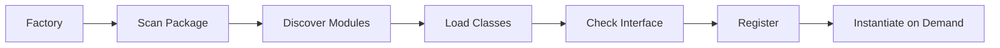

# Engine Implementations

This document details the engine implementations in the Optics Framework, including drivers, element sources, and vision models.

## Drivers

Drivers are responsible for executing user actions on target applications or devices. All drivers implement the `DriverInterface` and are located in `optics_framework/engines/drivers/`.

### Appium Driver

**Location:** `optics_framework/engines/drivers/appium.py`

The Appium driver provides mobile app automation capabilities for both Android and iOS.

#### Key Features

- Native mobile app automation
- Support for Android (UiAutomator2) and iOS (XCUITest)
- Gesture support (swipe, scroll, tap)
- Hardware key simulation
- App lifecycle management

#### Configuration

```yaml
driver_sources:
  - appium:
      enabled: true
      url: "http://localhost:4723"
      capabilities:
        platformName: "Android"
        deviceName: "emulator-5554"
        appPackage: "com.example.app"
        appActivity: ".MainActivity"
```

#### Key Methods

- `launch_app()` - Launch with package/activity
- `press_coordinates()` - Tap at absolute coordinates
- `press_element()` - Tap UI elements
- `swipe()` / `swipe_percentage()` - Swipe gestures
- `scroll()` - Scroll actions
- `enter_text()` - Text input
- `press_keycode()` - Hardware key codes
- `get_app_version()` - App version info

#### Special Features

- Mobile-specific keycodes (BACK, HOME, MENU, etc.)
- Mobile type command support
- UI helper integration for element interaction

### Selenium Driver

**Location:** `optics_framework/engines/drivers/selenium.py`

The Selenium driver provides web browser automation capabilities.

#### Key Features

- Cross-browser support (Chrome, Firefox, Edge, Safari)
- Web element interaction
- JavaScript execution
- Window and frame management

#### Configuration

```yaml
driver_sources:
  - selenium:
      enabled: true
      url: "http://localhost:4444"
      capabilities:
        browserName: "chrome"
        version: "latest"
```

#### Key Methods

- `launch_app()` - Navigate to URL
- `press_element()` - Click web elements
- `enter_text()` - Form input
- `execute_script()` - JavaScript execution
- `get_text_element()` - Extract text from elements

### Playwright Driver

**Location:** `optics_framework/engines/drivers/playwright.py`

The Playwright driver provides modern web automation with better reliability.

#### Key Features

- Modern browser automation
- Auto-waiting for elements
- Network interception
- Multi-browser support

#### Configuration

```yaml
driver_sources:
  - playwright:
      enabled: true
      capabilities:
        browser: "chromium"
        headless: false
```

### BLE Driver

**Location:** `optics_framework/engines/drivers/ble.py`

The BLE (Bluetooth Low Energy) driver provides non-intrusive automation for production devices.

#### Key Features

- Non-intrusive mouse and keyboard control
- Serial communication via BLE
- Coordinate mapping (pixels to mickeys)
- Production-safe automation

#### Use Cases

- Production app monitoring
- Devices without USB debugging
- DRM-protected applications
- Smart TV automation

#### Configuration

```yaml
driver_sources:
  - ble:
      enabled: true
      capabilities:
        device_id: "BLE_DEVICE_ID"
        port: "/dev/ttyUSB0"
        pixel_width: 1920
        pixel_height: 1080
        mickeys_width: 32767
        mickeys_height: 32767
        x_invert: 1
        y_invert: 1
```

#### Key Methods

- `press_coordinates()` - Mouse click at coordinates
- `press_percentage_coordinates()` - Percentage-based clicks
- `swipe()` - Mouse drag gestures
- `enter_text_using_keyboard()` - Keyboard input
- `press_keycode()` - Special key codes

#### Coordinate Mapping

The BLE driver maps screen coordinates to mouse movements (mickeys):
- Pixel coordinates → Mickey coordinates
- Supports coordinate inversion
- Configurable mapping ratios

## Element Sources

Element sources are responsible for detecting and locating UI elements. They implement `ElementSourceInterface` and are located in `optics_framework/engines/elementsources/`.

### Screenshot-Based Sources

#### AppiumScreenshot

**Location:** `optics_framework/engines/elementsources/appium_screenshot.py`

Captures screenshots from Appium sessions.

- Uses Appium's screenshot capability
- Returns NumPy arrays for image processing
- Supports interactive element detection

#### SeleniumScreenshot

**Location:** `optics_framework/engines/elementsources/selenium_screenshot.py`

Captures screenshots from Selenium browser sessions.

- Browser screenshot capture
- Full page or viewport screenshots
- Base64 encoding support

#### PlaywrightScreenshot

**Location:** `optics_framework/engines/elementsources/playwright_screenshot.py`

Captures screenshots from Playwright sessions.

- High-quality screenshots
- Multiple screenshot formats
- Element-specific screenshots

#### CameraScreenshot

**Location:** `optics_framework/engines/elementsources/camera_screenshot.py`

Captures screenshots from external cameras or capture cards.

- External camera support
- Video capture card support
- Production monitoring use case

### Page Source-Based Sources

#### AppiumPageSource

**Location:** `optics_framework/engines/elementsources/appium_page_source.py`

Extracts and parses Appium page source XML.

- XML-based element location
- XPath support
- Element hierarchy navigation
- Interactive element detection

#### SeleniumPageSource

**Location:** `optics_framework/engines/elementsources/selenium_page_source.py`

Extracts and parses Selenium page source HTML.

- HTML DOM parsing
- CSS selector support
- Element attribute extraction

#### PlaywrightPageSource

**Location:** `optics_framework/engines/elementsources/playwright_page_source.py`

Extracts and parses Playwright page source.

- Modern DOM API
- Accessibility tree support
- Element state detection

### Find Element Sources

#### AppiumFindElement

**Location:** `optics_framework/engines/elementsources/appium_find_element.py`

Direct element location using Appium's find element methods.

- Multiple locator strategies
- Element interaction
- Element state checking

#### SeleniumFindElement

**Location:** `optics_framework/engines/elementsources/selenium_find_element.py`

Direct element location using Selenium's find element methods.

- WebDriver locator strategies
- Element waiting
- Element interaction

#### PlaywrightFindElement

**Location:** `optics_framework/engines/elementsources/playwright_find_element.py`

Direct element location using Playwright's locator API.

- Auto-waiting for elements
- Multiple locator types
- Element state queries

### Element Source Selection

Element sources are automatically matched with compatible drivers:

```python
# Element source declares required driver type
REQUIRED_DRIVER_TYPE = "appium"

# Factory automatically matches with Appium driver
ElementSourceFactory.get_driver(config, driver_fallback)
```

## Vision Models

Vision models provide image and text detection capabilities. They are located in `optics_framework/engines/vision_models/`.

### Image Detection Models

#### TemplateMatch

**Location:** `optics_framework/engines/vision_models/image_models/templatematch.py`

OpenCV-based template matching using SIFT and FLANN.

#### Key Features

- SIFT feature detection
- FLANN-based matching
- Confidence thresholding
- Multiple match support (index-based)
- Template loading from project directory

#### Configuration

```yaml
image_detection:
  - templatematch:
      enabled: true
      project_path: "/path/to/project"
      execution_output_path: "/path/to/output"
```

#### Methods

- `find_element()` - Locate template in image
- `element_exist()` - Check if template exists
- `assert_elements()` - Verify multiple templates

#### Algorithm

1. Load template image from project directory
2. Convert input and template to grayscale
3. Detect SIFT keypoints and descriptors
4. Match descriptors using FLANN
5. Filter matches by distance ratio
6. Calculate homography for geometric verification
7. Return center coordinates of matched template

#### RemoteOIR

**Location:** `optics_framework/engines/vision_models/image_models/remote_oir.py`

Remote Object Image Recognition service integration.

#### Key Features

- Remote service-based matching
- API integration
- High-accuracy matching
- Cloud-based processing

#### Configuration

```yaml
image_detection:
  - remote_oir:
      enabled: true
      url: "https://api.example.com/oir"
      api_key: "your-api-key"
```

### OCR/Text Detection Models

#### EasyOCR

**Location:** `optics_framework/engines/vision_models/ocr_models/easyocr.py`

EasyOCR library integration for text detection.

#### Key Features

- Multi-language support
- High accuracy
- Bounding box detection
- Confidence scores

#### Configuration

```yaml
text_detection:
  - easyocr:
      enabled: true
      languages: ["en"]
      gpu: true
```

#### Methods

- `detect_text()` - Full text detection
- `find_element()` - Locate specific text
- `element_exist()` - Check text presence

#### GoogleVision

**Location:** `optics_framework/engines/vision_models/ocr_models/googlevision.py`

Google Cloud Vision API integration.

#### Key Features

- Cloud-based OCR
- High accuracy
- Document text detection
- Handwriting recognition

#### Configuration

```yaml
text_detection:
  - googlevision:
      enabled: true
      credentials_path: "/path/to/credentials.json"
      project_id: "your-project-id"
```

#### PyTesseract

**Location:** `optics_framework/engines/vision_models/ocr_models/pytesseract.py`

Tesseract OCR engine integration.

#### Key Features

- Open-source OCR
- Multiple language support
- Configurable OCR modes
- Page segmentation modes

#### Configuration

```yaml
text_detection:
  - pytesseract:
      enabled: true
      lang: "eng"
      config: "--psm 6"
```

#### RemoteOCR

**Location:** `optics_framework/engines/vision_models/ocr_models/remote_ocr.py`

Remote OCR service integration.

#### Key Features

- Remote service-based OCR
- API integration
- Custom OCR engines
- Scalable processing

#### Configuration

```yaml
text_detection:
  - remote_ocr:
      enabled: true
      url: "https://api.example.com/ocr"
      api_key: "your-api-key"
```

## Engine Discovery and Loading

Engines are automatically discovered by the factory system:



### Discovery Process

1. Factory scans package directory (`engines/drivers/`, etc.)
2. Discovers all Python modules
3. Imports modules dynamically
4. Inspects classes for interface implementation
5. Registers implementations in module registry
6. Instantiates on demand based on configuration

### Configuration-Based Selection

Engines are selected based on configuration:

```yaml
driver_sources:
  - appium: {...}      # First priority
  - selenium: {...}     # Fallback
```

The factory creates `InstanceFallback` wrapper that tries each in order.

## Extension Guide

### Adding a New Driver

1. Create file in `optics_framework/engines/drivers/your_driver.py`
2. Implement `DriverInterface`
3. Set class attributes:
   ```python
   DEPENDENCY_TYPE = "driver_sources"
   NAME = "your_driver"
   ```
4. Factory automatically discovers it

### Adding a New Element Source

1. Create file in `optics_framework/engines/elementsources/your_source.py`
2. Implement `ElementSourceInterface`
3. If driver-dependent, set:
   ```python
   REQUIRED_DRIVER_TYPE = "appium"  # or "selenium", "playwright", etc.
   ```
4. Factory automatically matches with compatible driver

### Adding a New Vision Model

1. Create file in appropriate subdirectory:
   - `image_models/` for image detection
   - `ocr_models/` for text detection
2. Implement `ImageInterface` or `TextInterface`
3. Factory automatically discovers it

## Best Practices

1. **Error Handling**: Always handle driver initialization failures gracefully
2. **Resource Cleanup**: Implement proper cleanup in `terminate()` methods
3. **Configuration Validation**: Validate configuration in `__init__`
4. **Logging**: Use `internal_logger` for debug information
5. **Event Tracking**: Integrate with `EventSDK` for action tracking
6. **Fallback Support**: Design for graceful degradation

## Performance Considerations

- **Screenshot Caching**: Element sources may cache screenshots
- **Connection Pooling**: Drivers should reuse connections when possible
- **Lazy Loading**: Engines are loaded on demand, not at startup
- **Parallel Execution**: Multiple engines can run in parallel for fallback

## Related Documentation

- [Components](components.md) - Component architecture and factory system
- [Strategies](strategies.md) - Strategy pattern and element location
- [Execution](execution.md) - Test execution
- [Extending](extending.md) - Creating custom engines
- [Error Handling](error_handling.md) - Error codes and handling
- [Architecture Decisions](decisions.md) - Factory pattern and engine design decisions
- [Factory System](components.md#factory-system) - Dynamic module discovery
