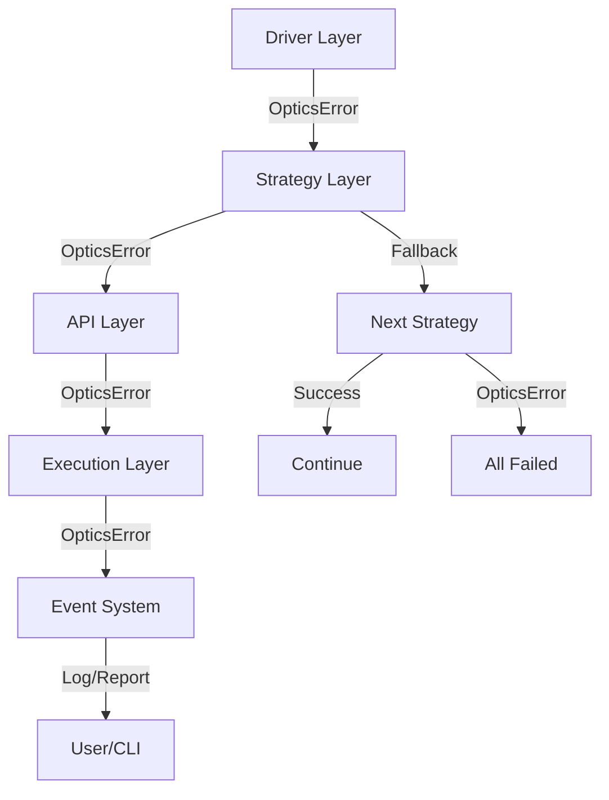

# Error Handling System

The Optics Framework uses a structured error handling system that provides consistent error codes, categories, and error propagation across all layers. This document explains the error handling architecture, error codes, and how errors flow through the system.

## Overview

The error handling system consists of:

1. **Error Codes** - Structured error identifiers with categories
2. **OpticsError** - Custom exception class with metadata
3. **Error Registry** - Centralized error code definitions
4. **Error Propagation** - How errors flow through layers
5. **Error Recovery** - Fallback and retry mechanisms

## Error Code Structure

**Location:** `optics_framework/common/error.py`

### Error Code Format

Error codes follow a structured format:

```
[Severity][Category][Number]
```

### Severity Prefixes

- **E** - Error (default severity)
- **W** - Warning (non-fatal)
- **X** - Exception (critical/unhandled)

### Categories

Error codes are organized by category:

- **01** - Driver issues
- **02** - Element location issues
- **03** - Screenshot issues
- **04** - Keyword execution issues
- **05** - Config/File issues
- **06** - Module/Factory issues
- **07** - Test case issues
- **08** - General issues

### Examples

```
E0101 - Driver not initialized (Error, Driver category)
W0104 - Driver config incomplete (Warning, Driver category)
X0201 - Element not found after all fallbacks (Exception, Element category)
E0402 - Keyword not found (Error, Keyword category)
```

## Error Registry

The error registry (`ERROR_REGISTRY`) contains all defined error codes with their specifications:

```python
ERROR_REGISTRY = {
    "E0101": ErrorSpec(
        code=Code.E0101,
        default_message="Driver not initialized",
        category=Category.DRIVER,
        default_status=500,
    ),
    "E0201": ErrorSpec(
        code=Code.E0201,
        default_message="Element not found",
        category=Category.ELEMENT,
        default_status=404,
    ),
    # ... more error codes
}
```

### ErrorSpec Structure

Each error specification includes:

- **code**: Error code enum value
- **default_message**: Default error message
- **category**: Error category (Driver, Element, etc.)
- **default_status**: HTTP status code (for API responses)
- **meta**: Optional metadata

## OpticsError Exception

The `OpticsError` class is the primary exception type used throughout the framework.

### Creating OpticsError

```python
from optics_framework.common.error import OpticsError, Code

# Using error code
raise OpticsError(Code.E0101, message="Custom message", details={"driver": "appium"})

# Using string code
raise OpticsError("E0101", message="Driver initialization failed")

# With details
raise OpticsError(
    Code.E0201,
    message="Element not found",
    details={"element": "submit_button", "strategies_tried": ["xpath", "ocr"]},
    cause=original_exception
)
```

### OpticsError Attributes

- **code**: Error code (Code enum or string)
- **category**: Error category
- **status_code**: HTTP status code
- **message**: Human-readable message
- **details**: Additional error context
- **meta**: Optional metadata
- **cause**: Original exception (if any)

### Error Logging

OpticsError includes rich logging capabilities:

```python
error = OpticsError(Code.E0101, message="Driver failed")
error.log()  # Prints formatted error with rich formatting
error.log(use_rich=False)  # Uses standard logging
```

## Error Categories

### Driver Errors (01xx)

Driver-related errors:

- **E0101**: Driver not initialized
- **E0102**: Failed to start session
- **E0103**: Failed to end session
- **E0104**: Driver config incomplete
- **W0104**: Driver config incomplete (warning)

**Example:**
```python
if not self.driver:
    raise OpticsError(Code.E0101, message="Appium driver not initialized")
```

### Element Errors (02xx)

Element location errors:

- **E0201**: Element not found
- **X0201**: Element not found after all fallbacks
- **E0202**: Unsupported operation for element source
- **W0203**: Element format mismatch
- **E0204**: Timeout locating element
- **E0205**: Invalid element type

**Example:**
```python
if not element:
    raise OpticsError(
        Code.E0201,
        message=f"Element '{element_id}' not found",
        details={"strategies": ["xpath", "ocr", "image"]}
    )
```

### Screenshot Errors (03xx)

Screenshot-related errors:

- **E0301**: Screenshot disabled
- **W0302**: Fallback to next camera supported driver
- **E0303**: Screenshot empty/black

**Example:**
```python
if screenshot is None or is_black_screen(screenshot):
    raise OpticsError(Code.E0303, message="Screenshot is empty or black")
```

### Keyword Errors (04xx)

Keyword execution errors:

- **E0401**: Action failed
- **X0401**: Action failed with exception
- **E0402**: Keyword not found
- **E0403**: Invalid keyword parameters
- **W0404**: Keyword deprecated

**Example:**
```python
if keyword not in registry:
    raise OpticsError(
        Code.E0402,
        message=f"Keyword '{keyword}' not found",
        details={"available_keywords": list(registry.keys())}
    )
```

### Config Errors (05xx)

Configuration and file errors:

- **E0501**: Missing required files
- **X0502**: File read exception
- **E0503**: Config parser error (important param)
- **W0503**: Config parser warning (can be ignored)

**Example:**
```python
if not os.path.exists(config_path):
    raise OpticsError(
        Code.E0501,
        message=f"Configuration file not found: {config_path}",
        details={"path": config_path}
    )
```

### Module/Factory Errors (06xx)

Module and factory errors:

- **E0601**: Module not found
- **W0602**: No valid instances, ignoring it
- **E0603**: Factory init failed
- **X0604**: Import related problem

**Example:**
```python
try:
    module = importlib.import_module(module_name)
except ImportError as e:
    raise OpticsError(
        Code.X0604,
        message=f"Failed to import module: {module_name}",
        cause=e
    )
```

### Test Case Errors (07xx)

Test case execution errors:

- **E0701**: Execution failed
- **E0702**: Test case not found
- **E0703**: Parameter resolution failed
- **E0704**: Test case timeout
- **W0705**: Test case skipped

**Example:**
```python
if test_case_id not in session.test_cases:
    raise OpticsError(
        Code.E0702,
        message=f"Test case '{test_case_id}' not found",
        details={"session_id": session.session_id}
    )
```

### General Errors (08xx)

General framework errors:

- **E0801**: Unexpected error
- **E0802**: Unhandled exception

**Example:**
```python
except Exception as e:
    raise OpticsError(
        Code.E0802,
        message="Unhandled exception occurred",
        cause=e,
        details={"context": "keyword_execution"}
    )
```

## Error Propagation Flow

Errors propagate through the framework layers:



### Propagation Rules

1. **Driver Layer**: Raises OpticsError for driver-specific issues
2. **Strategy Layer**: Catches errors, tries fallback strategies
3. **API Layer**: Wraps errors with context, propagates to execution
4. **Execution Layer**: Handles errors, publishes events, continues or stops
5. **Event System**: Logs errors, publishes error events

### Error Context Preservation

Errors preserve context as they propagate:

```python
try:
    element = strategy.locate(element_id)
except OpticsError as e:
    # Add context
    raise OpticsError(
        e.code,
        message=f"Failed to locate element in {strategy.__class__.__name__}",
        details={**e.details, "strategy": strategy.__class__.__name__},
        cause=e
    )
```

## Error Recovery Mechanisms

### 1. Strategy Fallback

When element location fails, try next strategy:

```python
for strategy in strategies:
    try:
        result = strategy.locate(element)
        return result
    except OpticsError as e:
        if e.code == Code.E0201:  # Element not found
            continue  # Try next strategy
        raise  # Re-raise other errors
```

### 2. Driver Fallback

When driver fails, try next driver:

```python
for driver in driver_fallback.instances:
    try:
        driver.press_element(element)
        return
    except OpticsError as e:
        if e.code in [Code.E0101, Code.E0102]:  # Driver errors
            continue  # Try next driver
        raise
```

### 3. Retry Logic

Some operations include retry logic:

```python
max_retries = 3
for attempt in range(max_retries):
    try:
        return operation()
    except OpticsError as e:
        if attempt < max_retries - 1:
            time.sleep(2 ** attempt)  # Exponential backoff
            continue
        raise
```

### 4. Graceful Degradation

Some errors are warnings that allow execution to continue:

```python
try:
    screenshot = element_source.capture()
except OpticsError as e:
    if e.code == Code.W0302:  # Warning
        # Try fallback screenshot source
        screenshot = fallback_source.capture()
    else:
        raise
```

## Error Handling in API Layer

The REST API converts OpticsError to HTTP responses:

```python
from optics_framework.common.error import OpticsError

try:
    result = execute_keyword(keyword, params)
except OpticsError as e:
    return JSONResponse(
        status_code=e.status_code,
        content=e.to_payload(include_status=True)
    )
```

### API Error Response Format

```json
{
  "type": "optics:driver",
  "code": "E0101",
  "status": 500,
  "message": "Driver not initialized",
  "details": {
    "driver": "appium",
    "session_id": "abc123"
  }
}
```

## Error Handling Best Practices

### 1. Use Appropriate Error Codes

Choose error codes that match the error category:

```python
# Good
raise OpticsError(Code.E0201, message="Element not found")

# Bad - wrong category
raise OpticsError(Code.E0101, message="Element not found")  # Should be E0201
```

### 2. Include Context in Details

Provide useful debugging information:

```python
raise OpticsError(
    Code.E0201,
    message="Element not found",
    details={
        "element": element_id,
        "strategies_tried": ["xpath", "ocr"],
        "screenshot_path": "/path/to/screenshot.png"
    }
)
```

### 3. Preserve Original Exceptions

Use `cause` parameter to preserve exception chain:

```python
try:
    driver.connect()
except ConnectionError as e:
    raise OpticsError(
        Code.E0102,
        message="Failed to connect to driver",
        cause=e
    )
```

### 4. Use Warnings for Non-Critical Issues

Use warning codes for issues that don't stop execution:

```python
if config.get("optional_setting") is None:
    raise OpticsError(
        Code.W0503,
        message="Optional setting not configured, using default"
    )
```

### 5. Handle Errors at Appropriate Levels

Handle errors where recovery is possible:

```python
# Strategy level - try fallback
try:
    return xpath_strategy.locate(element)
except OpticsError:
    return ocr_strategy.locate(element)  # Fallback

# Execution level - stop execution
try:
    execute_test_case(test_case)
except OpticsError as e:
    publish_error_event(e)
    raise  # Stop execution
```

## Error Logging

### Structured Logging

OpticsError integrates with the logging system:

```python
error = OpticsError(Code.E0101, message="Driver failed")
error.log()  # Logs with rich formatting
error.log(level=logging.WARNING)  # Custom log level
error.log(extra={"session_id": session_id})  # Additional context
```

### Error Log Format

```
❌ E0101 (driver)
Driver not initialized

Details: {'driver': 'appium', 'session_id': 'abc123'}
```

## Debugging Errors

### 1. Enable Debug Logging

```python
import logging
logging.getLogger("optics_framework").setLevel(logging.DEBUG)
```

### 2. Check Error Details

```python
try:
    operation()
except OpticsError as e:
    print(f"Code: {e.code}")
    print(f"Category: {e.category}")
    print(f"Details: {e.details}")
    print(f"Cause: {e.__cause__}")
```

### 3. Error Code Lookup

Reference the error registry:

```python
from optics_framework.common.error import ERROR_REGISTRY

spec = ERROR_REGISTRY.get("E0101")
print(f"Message: {spec.default_message}")
print(f"Category: {spec.category}")
print(f"Status: {spec.default_status}")
```

## Extending Error Handling

### Registering Custom Error Codes

```python
from optics_framework.common.error import ErrorSpec, Category, Code, register_error

custom_code = Code("E0901")  # Custom code
spec = ErrorSpec(
    code=custom_code,
    default_message="Custom error",
    category=Category.GENERAL,
    default_status=500
)
register_error(spec)
```

### Custom Error Classes

```python
class CustomOpticsError(OpticsError):
    def __init__(self, custom_field, **kwargs):
        super().__init__(**kwargs)
        self.custom_field = custom_field
```

## Related Documentation

- [Components](components.md) - Component error handling
- [Strategies](strategies.md) - Strategy fallback mechanisms
- [Execution](execution.md) - Execution error handling
- [API Layer](api_layer.md) - API error handling
- [Logging](logging.md) - Error logging patterns
- [Architecture Decisions](decisions.md) - Error handling design decisions
- [REST API Usage](../usage/REST_API_usage.md) - REST API error responses
- [API Reference](../api_reference.md) - Python API documentation
