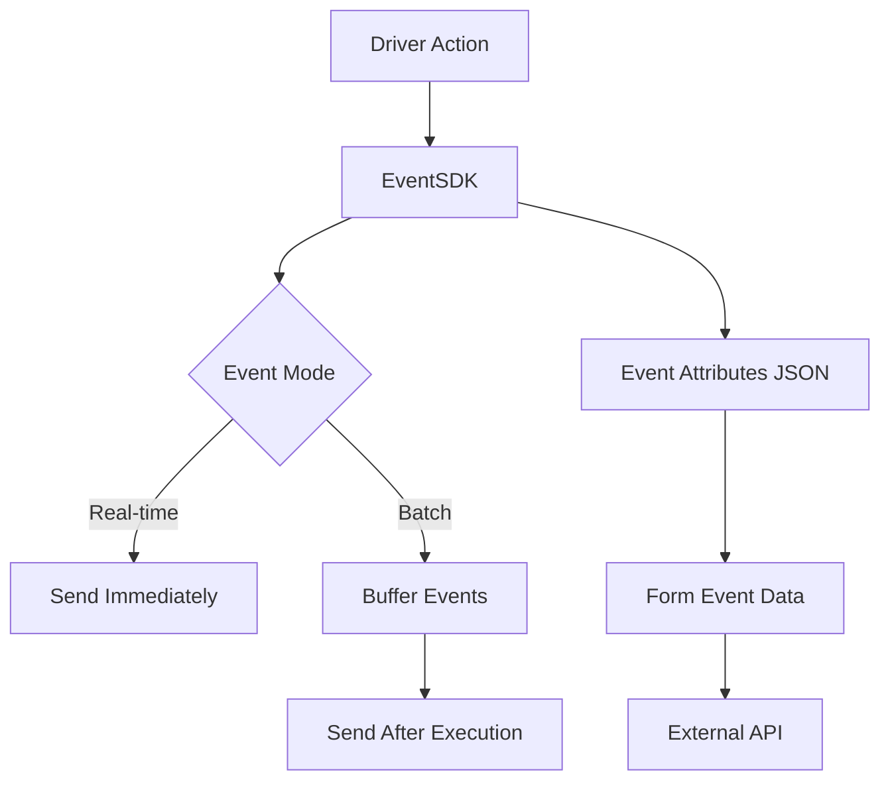
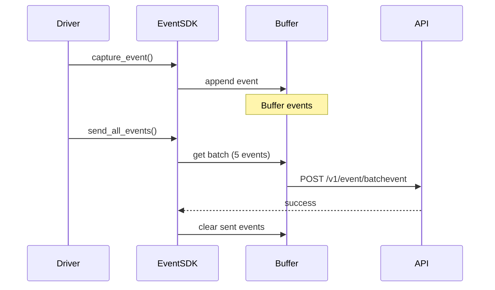

# Event System and EventSDK

The Optics Framework includes a comprehensive event tracking system that captures execution events and sends them to external services for monitoring and analytics. This document explains how the event system works, including EventSDK integration, event attributes, and submission modes.

## Overview

The event system consists of two main components:

1. **EventManager** - Internal event system for execution tracking (see [Execution](execution.md))
2. **EventSDK** - External event tracking SDK for analytics and monitoring

This document focuses on EventSDK, which is used for tracking user actions and sending events to external services.

## EventSDK Architecture



## EventSDK Component

**Location:** `optics_framework/common/eventSDK.py`

The `EventSDK` class provides event tracking capabilities for monitoring test execution and user actions.

### Initialization

EventSDK is initialized with a `ConfigHandler` instance:

```python
from optics_framework.common.config_handler import ConfigHandler
from optics_framework.common.eventSDK import EventSDK

config_handler = ConfigHandler(config)
event_sdk = EventSDK(config_handler)
```

### Key Responsibilities

- Event capture and formatting
- Event attribute management
- Real-time and batch event submission
- Integration with test context
- Event buffering and retry logic

## Event Attributes Configuration

EventSDK uses a JSON configuration file to define event attributes and metadata.

### Configuration Structure

The event attributes JSON file should contain:

```json
{
  "eventUrl": "https://api.example.com",
  "testParameters_bearer": "your-bearer-token",
  "applicationName": "MyApp",
  "appVersion": "1.0.0"
}
```

### Configuration Fields

- **eventUrl**: Base URL for the event submission API
- **testParameters_bearer**: Bearer token for API authentication
- **applicationName**: Name of the application under test
- **appVersion**: Version of the application under test

### Loading Event Attributes

EventSDK loads the event attributes JSON file during initialization:

```python
def __init__(self, config_handler: ConfigHandler):
    self.config_handler = config_handler
    self.event_attributes_json_path = self.config_handler.config.event_attributes_json
    self.event_attributes_data = self._load_event_attributes_json()
```

The file path is specified in the main configuration:

```yaml
event_attributes_json: "/path/to/event_attributes.json"
```

## Event Capture

### Basic Event Capture

Events are captured using the `capture_event()` method:

```python
event_sdk.capture_event(
    event_name="button_clicked",
    button_id="submit",
    screen="login",
    timestamp="2024-01-01T12:00:00"
)
```

### Event Structure

Each captured event contains:

1. **Event Name**: Identifier for the event type
2. **Event Attributes**: Key-value pairs with event data
3. **Mozark Event Attributes**: Additional metadata from configuration
4. **DateTime**: Automatically added timestamp

### Automatic Attributes

EventSDK automatically adds the following attributes:

- `dateTime`: Current timestamp in ISO format
- `testCaseName`: Current test case name (from test context)
- `applicationName`: From event attributes JSON
- `applicationVersion`: From event attributes JSON

### Event Format

The final event structure looks like:

```json
{
  "eventName": "button_clicked",
  "eventAttributes": {
    "dateTime": "2024-01-01T12:00:00+05:30",
    "testCaseName": "test_login",
    "applicationName": "MyApp",
    "applicationVersion": "1.0.0",
    "button_id": "submit",
    "screen": "login"
  },
  "mozarkEventAttributes": {
    "applicationName": "MyApp"
  }
}
```

## Event Submission Modes

EventSDK supports two submission modes:

### 1. Real-Time Submission

Events are sent immediately as they occur:

```python
event_sdk.submit_single_event(
    event_name="action_completed",
    event_attributes={"action": "press_element"},
    real_time=True,
    time_interval=1.0  # Send every 1 second
)
```

**Characteristics:**
- Events are sent immediately
- Uses threading.Timer for scheduled submission
- Suitable for live monitoring
- Higher network overhead

### 2. Batch Submission

Events are buffered and sent after execution:

```python
event_sdk.submit_single_event(
    event_name="action_completed",
    event_attributes={"action": "press_element"},
    real_time=False
)
```

**Characteristics:**
- Events are buffered in memory
- Sent in batches of 5 events
- Lower network overhead
- Suitable for post-execution analytics

### Batch Submission Flow



## Integration with Drivers

EventSDK is integrated into drivers through the driver interface:

```python
class AppiumDriver(DriverInterface):
    def __init__(self, config, event_sdk: Optional[EventSDK] = None):
        self.event_sdk = event_sdk

    def press_element(self, element: str, event_name: Optional[str] = None):
        if self.event_sdk:
            self.event_sdk.track_action("press_element", event_name)
        # ... press logic
```

### Track Action Method

The `track_action()` method is a convenience wrapper:

```python
def track_action(self, action_type: str, event_name: Optional[str] = None):
    event_name = event_name or action_type
    self.capture_event(
        event_name=event_name,
        action_type=action_type,
        timestamp=self.get_current_time_for_events()
    )
```

## Test Context Integration

EventSDK automatically retrieves the current test case name from test context:

```python
def get_test_case_name(self):
    return test_context.current_test_case.get()
```

This allows events to be associated with the test case that triggered them.

## Event Submission API

### API Endpoint

Events are submitted to:

```
POST {eventUrl}/v1/event/batchevent
```

### Request Format

```json
[
  {
    "eventName": "button_clicked",
    "eventAttributes": {...},
    "mozarkEventAttributes": {...}
  },
  ...
]
```

### Authentication

Requests include a Bearer token in the Authorization header:

```
Authorization: Bearer {testParameters_bearer}
```

### Response Handling

EventSDK includes retry logic for failed submissions:

```python
def send_all_events(self):
    max_retries = 3
    retry_delay = 2  # seconds

    for attempt in range(max_retries):
        success = self.send_batch_events(events_to_send)
        if success:
            self.all_events.clear()
            return True
        time.sleep(retry_delay * attempt)

    # All retries failed
    self.all_events.clear()
    return False
```

## Time Management

EventSDK uses a specific timezone (IST - UTC+5:30) for timestamps:

```python
def get_current_time_for_events(self):
    current_utc_time = datetime.now(timezone.utc)
    desired_timezone = timezone(timedelta(hours=5, minutes=30))
    current_time_in_desired_timezone = current_utc_time.astimezone(desired_timezone)
    formatted_time = current_time_in_desired_timezone.strftime("%Y-%m-%dT%H:%M:%S.%f%z")
    return formatted_time[:-2] + ":" + formatted_time[-2:]
```

This ensures consistent timestamp formatting across all events.

## Event Printing

Events can be printed to the console using the TreeResultPrinter:

```python
def print_event(self, event_data):
    printer = TreeResultPrinter.get_instance()
    printer.print_event_log(event_data)
```

This is useful for debugging and local development.

## Best Practices

### 1. Event Naming

Use consistent, descriptive event names:

```python
# Good
event_sdk.capture_event(event_name="login_button_clicked", ...)
event_sdk.capture_event(event_name="form_submission_completed", ...)

# Bad
event_sdk.capture_event(event_name="click", ...)
event_sdk.capture_event(event_name="done", ...)
```

### 2. Event Attributes

Include relevant context in event attributes:

```python
event_sdk.capture_event(
    event_name="element_pressed",
    element_id="submit_button",
    element_type="button",
    screen="login",
    test_case="test_user_login"
)
```

### 3. Submission Mode Selection

- Use **real-time** for live monitoring and debugging
- Use **batch** for production runs to reduce network overhead

### 4. Error Handling

EventSDK handles errors gracefully:

- Failed event submissions are logged but don't stop execution
- Retry logic ensures events are eventually sent
- Events are cleared after successful submission or max retries

### 5. Configuration Management

- Store event attributes JSON securely
- Use environment variables for sensitive data (bearer tokens)
- Validate configuration during initialization

## Troubleshooting

### Events Not Being Sent

**Problem**: Events are captured but not submitted.

**Solutions**:

1. Check `eventUrl` is set in event attributes JSON
2. Verify `testParameters_bearer` is valid
3. Check network connectivity to event API
4. Review execution logs for error messages

### Missing Test Case Name

**Problem**: `testCaseName` is None in events.

**Solutions**:

1. Ensure test context is set before capturing events
2. Verify test case execution is using proper session management
3. Check that `test_context.current_test_case` is set

### Timestamp Issues

**Problem**: Timestamps are incorrect or missing.

**Solutions**:

1. Verify system time is correct
2. Check timezone configuration
3. Ensure `get_current_time_for_events()` is called correctly

## Extension Points

### Custom Event Handlers

You can extend EventSDK to add custom event processing:

```python
class CustomEventSDK(EventSDK):
    def capture_event(self, event_name, **args):
        # Custom processing
        processed_args = self._process_attributes(args)
        super().capture_event(event_name, **processed_args)

    def _process_attributes(self, args):
        # Add custom attributes
        args['custom_field'] = 'custom_value'
        return args
```

### Custom Submission Logic

Override submission methods for custom behavior:

```python
class CustomEventSDK(EventSDK):
    def send_batch_events(self, event_data):
        # Custom submission logic
        # e.g., send to multiple endpoints
        result1 = self._send_to_endpoint1(event_data)
        result2 = self._send_to_endpoint2(event_data)
        return result1 and result2
```

## Related Documentation

- [Execution Architecture](execution.md) - Internal event system (EventManager)
- [Components](components.md) - Driver integration
- [Test Context](execution.md#test-context) - Context variable system
- [Logging](logging.md) - Logging system
- [Configuration](../configuration.md) - Configuration setup
- [Architecture Decisions](decisions.md) - Event system design decisions
- [Extending](extending.md) - Creating custom extensions
