# Test Execution Architecture

This document explains how test execution works in the Optics Framework, including the execution engine, test runners, event system, and data flow.

## Execution Overview

The execution system orchestrates test case execution, manages events, and handles results. It supports multiple execution modes and integrates with various test runners.

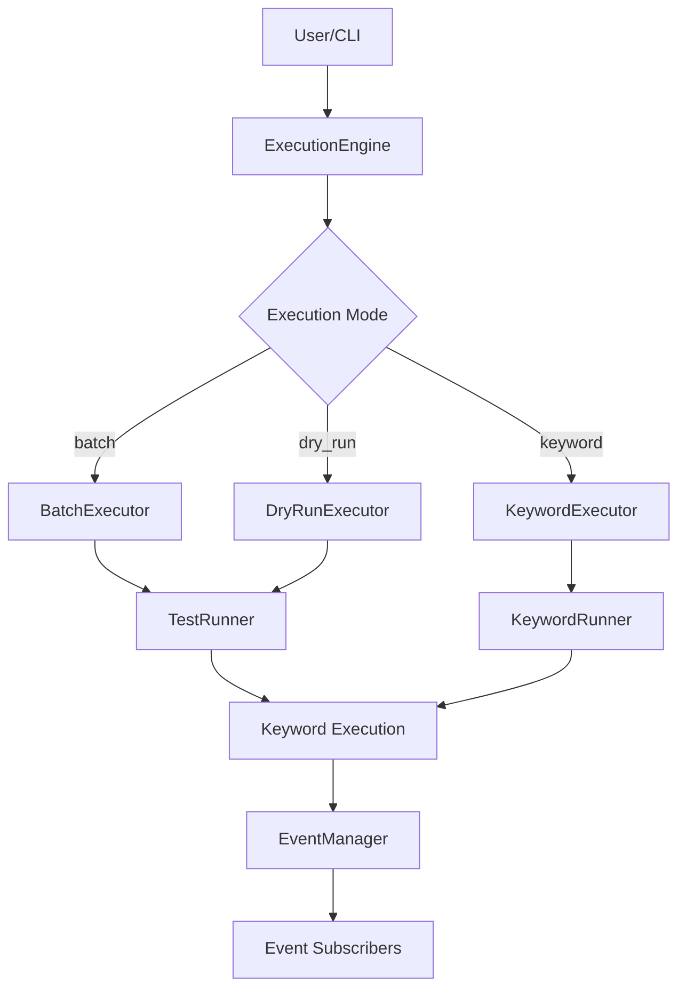

## ExecutionEngine

**Location:** `optics_framework/common/execution.py`

The `ExecutionEngine` is the main orchestrator for test execution.

### Key Responsibilities

- Execution mode selection
- Runner instantiation
- Event management coordination
- Result collection
- Error handling

### Execution Modes

#### Batch Mode

Executes all test cases in sequence.

```python
execution_params = ExecutionParams(
    session_id=session_id,
    mode="batch",
    runner_type="test_runner"
)
```

#### Dry Run Mode

Validates test cases without executing actions.

```python
execution_params = ExecutionParams(
    session_id=session_id,
    mode="dry_run",
    runner_type="test_runner"
)
```

#### Keyword Mode

Executes a single keyword with parameters.

```python
execution_params = ExecutionParams(
    session_id=session_id,
    mode="keyword",
    keyword="Press Element",
    params=["submit_button"]
)
```

### Execution Flow

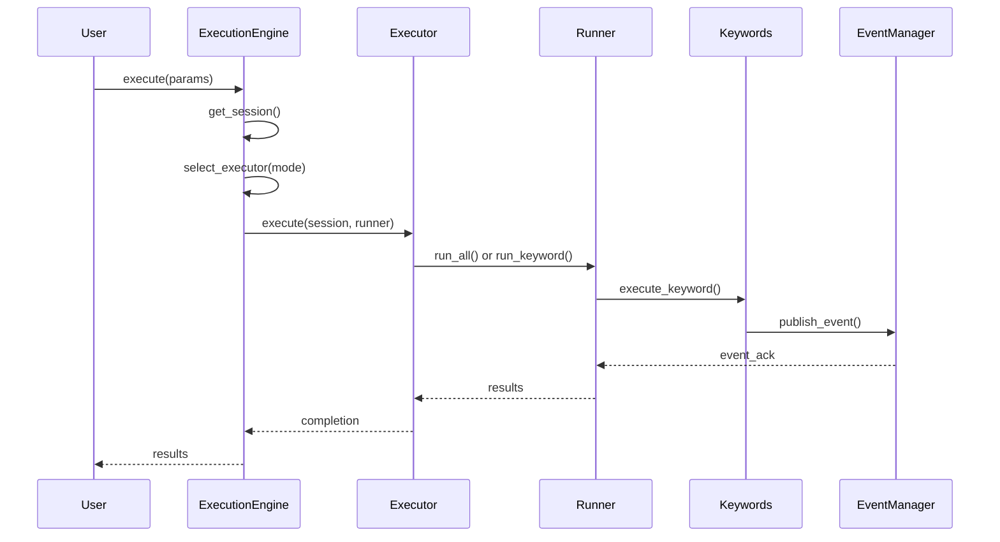

## Executors

Executors handle different execution modes and coordinate with runners.

### BatchExecutor

**Location:** `optics_framework/common/execution.py`

Executes all test cases in a session.

#### Flow

1. Validates test cases exist
2. Calls runner's `run_all()` method
3. Collects results from all test cases
4. Publishes execution completion event
5. Returns aggregated results

### DryRunExecutor

**Location:** `optics_framework/common/execution.py`

Validates test cases without executing actions.

#### Flow

1. Validates test cases exist
2. Calls runner's `dry_run_all()` method
3. Validates keyword existence and parameters
4. Does not execute actual actions
5. Returns validation results

### KeywordExecutor

**Location:** `optics_framework/common/execution.py`

Executes a single keyword with parameters.

#### Flow

1. Validates keyword exists
2. Builds keyword registry
3. Executes keyword with parameters
4. Handles fallback parameters
5. Returns keyword result

## Test Runners

Runners execute test cases and manage keyword execution.

### TestRunner

**Location:** `optics_framework/common/runner/test_runnner.py`

The main test runner for batch execution.

#### Key Features

- Test case execution
- Module execution
- Keyword execution
- Data-driven testing support
- Result collection and reporting

#### Execution Flow

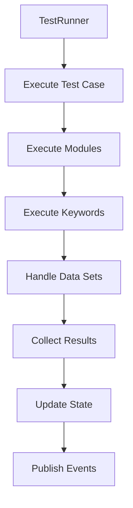

#### Test Case Execution

```python
async def execute_test_case(self, test_case: str):
    # 1. Get test case node
    test_case_node = self.test_suite.get_test_case(test_case)
    if not test_case_node:
        raise OpticsError(Code.E0702, f"Test case '{test_case}' not found")

    # 2. Initialize test case state
    test_case_node.state = State.RUNNING
    test_case_node.attempt_count += 1

    # 3. Execute modules in sequence
    current_module = test_case_node.modules_head
    while current_module:
        await self.execute_module(current_module, test_case)
        current_module = current_module.next

    # 4. Handle data sets (if data-driven)
    # Data sets are handled at test case level

    # 5. Collect and return results
    test_case_node.state = State.COMPLETED_PASSED
    return test_case_result
```

**Example Execution Flow:**
```python
# Test case structure:
# TestCaseNode: "Login Test"
#   ├── ModuleNode: "Launch Application"
#   │   └── KeywordNode: "Launch App"
#   ├── ModuleNode: "Enter Credentials"
#   │   ├── KeywordNode: "Press Element"
#   │   ├── KeywordNode: "Enter Text"
#   │   └── KeywordNode: "Press Element"
#   └── ModuleNode: "Verify Login"
#       └── KeywordNode: "Validate Element"

# Execution order:
# 1. Execute "Launch Application" module
# 2. Execute "Enter Credentials" module
# 3. Execute "Verify Login" module
```

#### Module Execution

```python
def execute_module(self, module_node: ModuleNode, test_case_id: str):
    # 1. Get module definition
    module_name = module_node.name
    module_definition = self.session.modules.get_module_definition(module_name)

    # 2. Initialize module state
    module_node.state = State.RUNNING

    # 3. Execute keywords in sequence
    current_keyword = module_node.keywords_head
    while current_keyword:
        await self.execute_keyword(
            current_keyword.name,
            current_keyword.params,
            module_node.id
        )
        current_keyword = current_keyword.next

    # 4. Handle flow control (loops, conditions)
    # Flow control keywords modify execution flow

    # 5. Return module result
    module_node.state = State.COMPLETED_PASSED
    return module_result
```

**Example Module Execution:**
```python
# Module: "Enter Credentials"
# Keywords:
#   1. Press Element ${username_field}
#   2. Enter Text ${username_field} testuser
#   3. Press Element ${password_field}
#   4. Enter Text ${password_field} testpass
#   5. Press Element ${login_button}

# Execution:
# - Each keyword executed in sequence
# - Element references resolved from elements.csv
# - State tracked per keyword
# - Module state updated on completion
```

#### Keyword Execution

```python
async def execute_keyword(
    self,
    keyword_name: str,
    args: List[str],
    module_id: str
):
    # 1. Look up keyword in registry
    keyword_slug = "_".join(keyword_name.split()).lower()
    method = self.keyword_registry.get_method(keyword_slug)
    if not method:
        raise OpticsError(Code.E0402, f"Keyword '{keyword_name}' not found")

    # 2. Resolve parameters (variables, fallbacks)
    resolved_args = self._resolve_parameters(args, module_id)
    # Variables: ${element_name} -> actual value
    # Fallbacks: ["value1", "value2"] -> try each

    # 3. Execute keyword with fallback support
    result = await self._try_execute_with_fallback(
        method, resolved_args, keyword_node, module_node
    )

    # 4. Handle exceptions
    # Exceptions caught and converted to OpticsError

    # 5. Publish events
    await self._send_event(
        "keyword",
        keyword_node,
        EventStatus.PASS,
        parent_id=module_node.id
    )

    # 6. Return result
    return result
```

**Example Keyword Execution:**
```python
# Keyword: "Press Element submit_button"
# Args: ["submit_button"]

# 1. Lookup: "press_element" in registry
# 2. Resolve: "submit_button" -> element value from elements.csv
#    - If element has multiple values: try each as fallback
# 3. Execute: ActionKeyword.press_element("submit_button")
#    - Self-healing decorator tries multiple strategies
#    - XPath -> Text -> OCR -> Image
# 4. Publish: Keyword execution event
# 5. Return: Success or raise error
```

**Parameter Resolution Example:**
```python
# Test case: "Press Element ${button_name}"
# Elements.csv: button_name = "submit_button"
# Resolved: "Press Element submit_button"

# With fallback in elements:
# Elements.csv: button_name = ["submit_btn", "submit_button", "//button[@id='submit']"]
# Tries each value until one succeeds
```

### PytestRunner

**Location:** `optics_framework/common/runner/test_runnner.py`

Integrates with pytest for test execution.

#### Key Features

- Pytest integration
- Fixture support
- Test discovery
- Pytest reporting

#### Usage

```python
# Test cases are automatically converted to pytest tests
pytest.main(["--optics-session", session_id])
```

### KeywordRunner

**Location:** `optics_framework/common/execution.py`

Minimal runner for single keyword execution.

#### Key Features

- Single keyword execution
- Parameter handling
- Result return
- No test case management

## Event System

The event system provides real-time execution tracking and extensibility.

### EventManager

**Location:** `optics_framework/common/events.py`

Centralized event management and distribution.

#### Key Features

- Event queuing
- Subscriber management
- Async event processing
- Command handling

#### Event Types

```python
class EventStatus(str, Enum):
    NOT_RUN = "NOT_RUN"
    RUNNING = "RUNNING"
    PASS = "PASS"
    FAIL = "FAIL"
    ERROR = "ERROR"
    SKIPPED = "SKIPPED"
    RETRYING = "RETRYING"
```

#### Event Structure

```python
class Event(BaseModel):
    entity_type: str  # "test_case", "module", "keyword"
    entity_id: str    # Unique identifier
    name: str         # Human-readable name
    status: EventStatus
    message: str
    parent_id: Optional[str]
    extra: Dict[str, str]
    timestamp: float
    args: Optional[List[Any]]
    start_time: Optional[float]
    end_time: Optional[float]
    elapsed: Optional[float]
    logs: Optional[List[str]]
```

### Event Flow

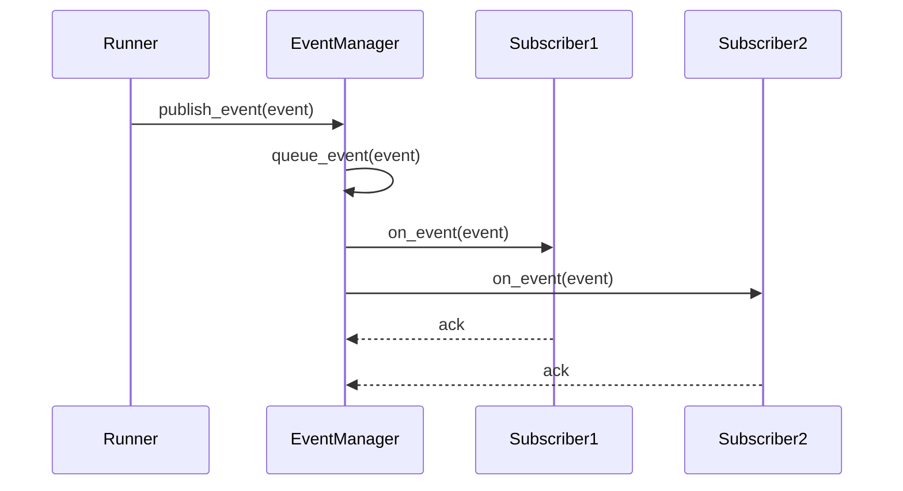

### Event Subscribers

Subscribers receive and process events.

#### JUnitEventHandler

**Location:** `optics_framework/common/Junit_eventhandler.py`

Generates JUnit XML reports from events.

#### Custom Subscribers

Implement `EventSubscriber` interface:

```python
class CustomSubscriber(EventSubscriber):
    async def on_event(self, event: Event) -> None:
        # Process event
        pass
```

### Event Registration

```python
event_manager = get_event_manager(session_id)
event_manager.subscribe("custom_subscriber", CustomSubscriber())
```

## Keyword Registry

**Location:** `optics_framework/common/runner/keyword_register.py`

The `KeywordRegistry` manages keyword registration, discovery, and lookup. It provides a centralized way to map keyword names to their implementation methods.

### Architecture

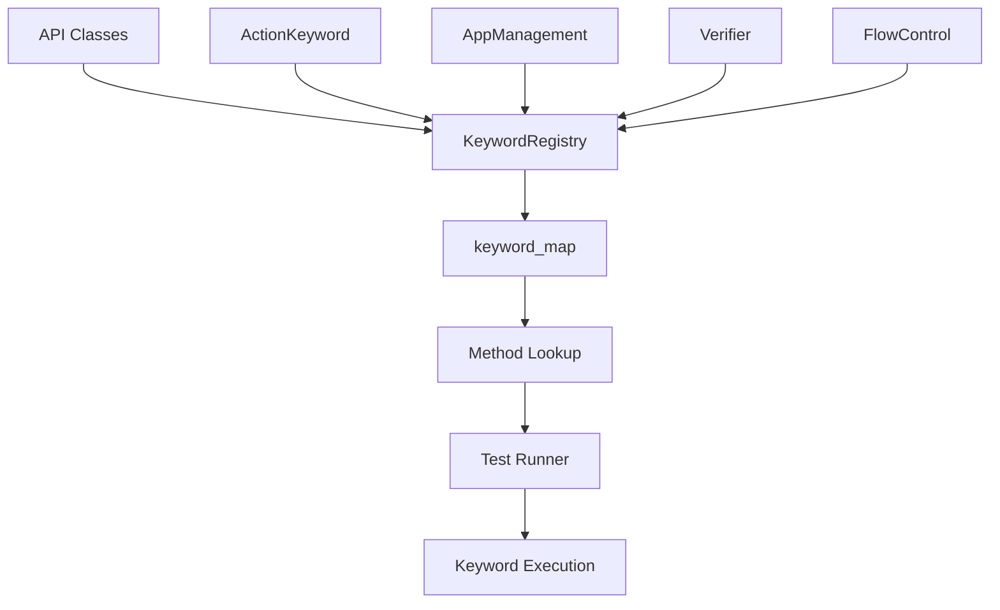

### Registration Process

Keywords are registered by passing API class instances to the registry:

```python
from optics_framework.common.runner.keyword_register import KeywordRegistry
from optics_framework.api.action_keyword import ActionKeyword
from optics_framework.api.app_management import AppManagement
from optics_framework.api.verifier import Verifier
from optics_framework.api.flow_control import FlowControl

registry = KeywordRegistry()

# Register API classes
action_keyword = ActionKeyword(builder)
app_management = AppManagement(builder)
verifier = Verifier(builder)
flow_control = FlowControl(builder)

registry.register(action_keyword)
registry.register(app_management)
registry.register(verifier)
registry.register(flow_control)
```

### Automatic Discovery

The registry automatically discovers public methods from registered instances:

```python
def register(self, instance: object) -> None:
    """
    Register all public callable methods of an instance.

    - Iterates over all attributes
    - Registers callable methods (not starting with _)
    - Warns on duplicate method names
    """
    for method_name in dir(instance):
        if not method_name.startswith("_"):
            method = getattr(instance, method_name)
            if callable(method):
                self.keyword_map[method_name] = method
```

**Registration Rules:**

- Only public methods (not starting with `_`)
- Must be callable
- Method name becomes the keyword identifier
- Duplicate names generate warnings

### Keyword Lookup

Keywords are looked up by converting human-readable names to method names:

```python
def get_method(self, func_name: str) -> Optional[Callable[..., object]]:
    """Retrieve a method by its function name."""
    return self.keyword_map.get(func_name)
```

**Name Conversion:**
```python
# Human-readable name -> Method name
"Press Element" -> "press_element"
"Enter Text" -> "enter_text"
"Validate Element" -> "validate_element"

# Conversion logic
keyword_slug = "_".join(keyword_name.split()).lower()
method = registry.keyword_map.get(keyword_slug)
```

**Lookup Flow:**
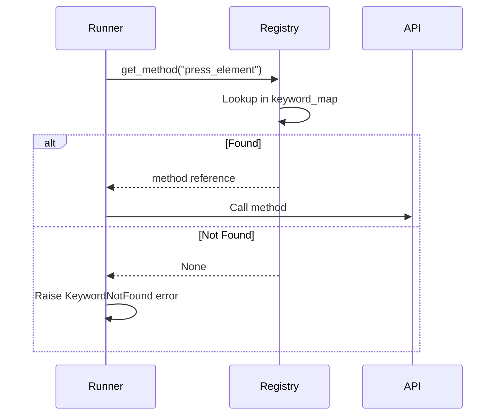

### Keyword Map Structure

The registry maintains a dictionary mapping method names to callable methods:

```python
class KeywordRegistry:
    def __init__(self):
        self.keyword_map: Dict[str, Callable[..., object]] = {}
```

**Example Map:**
```python
{
    "press_element": <bound method ActionKeyword.press_element>,
    "enter_text": <bound method ActionKeyword.enter_text>,
    "launch_app": <bound method AppManagement.launch_app>,
    "validate_element": <bound method Verifier.validate_element>,
    "condition": <bound method FlowControl.condition>,
    # ... more keywords
}
```

### Integration with Test Runner

The test runner uses the registry to execute keywords:

```python
# In TestRunner
def execute_keyword(self, keyword_name: str, args: List[str], module_id: str):
    # 1. Convert keyword name to method name
    keyword_slug = "_".join(keyword_name.split()).lower()

    # 2. Lookup method in registry
    method = self.keyword_registry.get_method(keyword_slug)
    if not method:
        raise OpticsError(Code.E0402, f"Keyword '{keyword_name}' not found")

    # 3. Resolve parameters
    resolved_args = self._resolve_parameters(args, module_id)

    # 4. Execute keyword
    return method(*resolved_args)
```

### Parameter Resolution

The registry works with the test runner to resolve parameters:

**1. Variable Substitution:**
```python
# Test case: "Press Element ${button_name}"
# Resolved: "Press Element submit_button"
# Where ${button_name} is replaced with actual value
```

**2. Fallback Parameters:**
```python
# Test case: "Press Element [btn1, btn2, btn3]"
# Registry provides method, runner handles fallback logic
```

**3. Type Conversion:**
```python
# String parameters converted to appropriate types
# Based on method signature inspection
```

### Robot Framework Integration

When Robot Framework is available, keywords are also exposed through the `@keyword` decorator:

```python
from optics_framework.optics import keyword

@keyword("Press Element")
def press_element(self, element: str):
    """Press an element."""
    pass
```

The registry works independently of Robot Framework, but both systems can coexist:

- **Registry**: For internal test execution
- **Robot Framework**: For Robot Framework test files

### Dynamic Keyword Loading

Keywords can be registered dynamically:

```python
# Register custom keywords
class CustomKeywords:
    def custom_action(self, param: str):
        pass

custom = CustomKeywords()
registry.register(custom)

# Now available as keyword
method = registry.get_method("custom_action")
```

### Error Handling

**Keyword Not Found:**
```python
method = registry.get_method("nonexistent_keyword")
if method is None:
    raise OpticsError(
        Code.E0402,
        message=f"Keyword 'nonexistent_keyword' not found",
        details={"available_keywords": list(registry.keyword_map.keys())}
    )
```

**Duplicate Registration:**
```python
# Warning logged, but registration continues
# Last registered method wins
internal_logger.warning(
    f"Warning: Duplicate method name '{method_name}'"
)
```

### Best Practices

1. **Consistent Naming**: Use consistent method naming conventions
2. **Public Methods Only**: Only expose methods intended as keywords
3. **Documentation**: Document keyword behavior in docstrings
4. **Error Handling**: Handle errors gracefully in keyword methods
5. **Type Hints**: Use type hints for better parameter resolution

### Registry Lifecycle

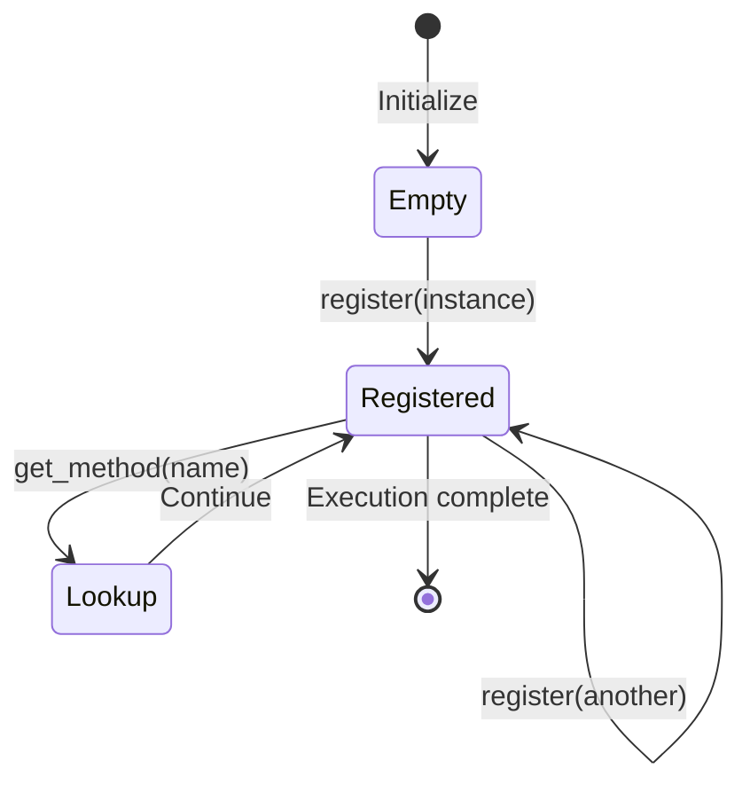

### Performance Considerations

- **O(1) Lookup**: Dictionary-based lookup is fast
- **Single Registration**: Methods registered once per session
- **No Re-scanning**: Methods cached after registration
- **Memory Efficient**: Only stores method references, not copies

### Related Components

- **Test Runner**: Uses registry for keyword execution
- **API Classes**: Provide keyword implementations
- **Execution Engine**: Coordinates registry usage
- **Parameter Resolution**: Works with registry for parameter handling

## Data Models

**Location:** `optics_framework/common/models.py`

The framework uses a linked list structure to represent test execution hierarchy and various data structures for managing test artifacts. This design provides efficient sequential execution, dynamic structure modification, and memory-efficient state tracking.

### Why Linked Lists?

The framework uses linked lists for the execution hierarchy because:

1. **Sequential Execution**: Natural order for test execution flow
2. **Memory Efficiency**: No array overhead, only stores necessary links
3. **Dynamic Structure**: Easy to add/remove nodes during execution
4. **State Tracking**: Each node tracks its own execution state
5. **Flexible Traversal**: Can traverse forward through execution flow

### Node Hierarchy

The execution structure is organized as a linked list:

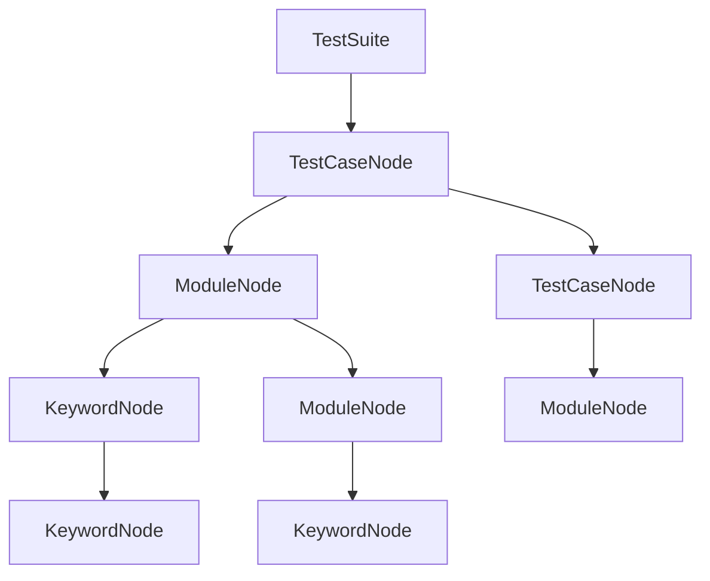

**Structure:**

- **TestSuite**: Container for test cases (head pointer)
- **TestCaseNode**: Individual test case with modules (linked list)
- **ModuleNode**: Reusable module with keywords (linked list)
- **KeywordNode**: Individual keyword execution (linked list)

### Base Node

All nodes extend the `Node` base class:

```python
class Node(BaseModel):
    id: str = Field(default_factory=lambda: str(uuid4()))  # Unique identifier (UUID)
    name: str  # Human-readable name
    state: State = State.NOT_RUN  # Execution state
    attempt_count: int = 0  # Number of execution attempts
    max_attempts: int = 3  # Maximum retry attempts
    last_failure_reason: Optional[str] = None  # Last failure message
```

**Node Properties:**

- **id**: Unique UUID for each node
- **name**: Human-readable identifier
- **state**: Current execution state (see State Enum)
- **attempt_count**: Tracks retry attempts
- **max_attempts**: Maximum retries before giving up
- **last_failure_reason**: Stores error message for debugging

### State Enum

Execution states track the lifecycle of each node:

```python
class State(str, Enum):
    NOT_RUN = "NOT_RUN"              # Initial state, not yet executed
    RUNNING = "RUNNING"              # Currently executing
    COMPLETED_PASSED = "COMPLETED_PASSED"  # Execution succeeded
    COMPLETED_FAILED = "COMPLETED_FAILED"  # Execution failed
    RETRYING = "RETRYING"            # Retrying after failure
    SKIPPED = "SKIPPED"              # Skipped execution
    ERROR = "ERROR"                  # Error occurred
```

**State Transitions:**
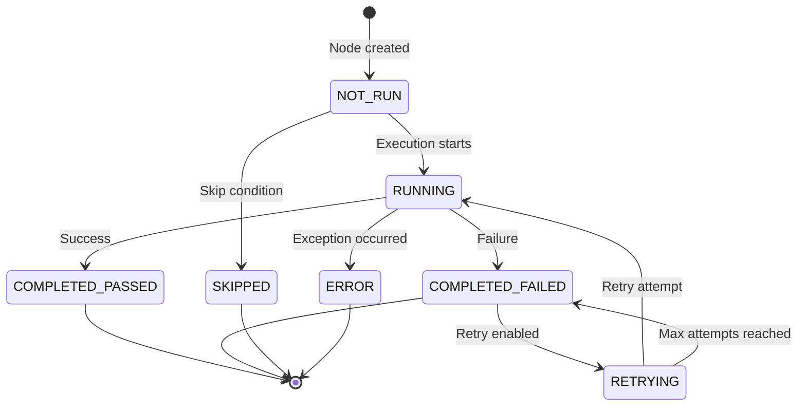

### TestCaseNode

Represents a test case with linked modules:

```python
class TestCaseNode(Node):
    modules_head: Optional[ModuleNode] = None
    next: Optional['TestCaseNode'] = None
```

**Methods:**

- `add_module(module)`: Add module to test case
- `remove_module(module_name)`: Remove module by name
- `get_module(module_name)`: Get module by name

**Structure:**
```
TestCaseNode
├── ModuleNode (modules_head)
│   ├── KeywordNode
│   └── KeywordNode (next)
└── ModuleNode (next)
    └── KeywordNode
```

### ModuleNode

Represents a module (reusable keyword sequence) with linked keywords:

```python
class ModuleNode(Node):
    keywords_head: Optional[KeywordNode] = None
    next: Optional['ModuleNode'] = None
```

**Methods:**

- `add_keyword(keyword)`: Add keyword to module
- `remove_keyword(keyword_name)`: Remove keyword by name
- `get_keyword(keyword_name)`: Get keyword by name

**Structure:**
```
ModuleNode
├── KeywordNode (keywords_head)
│   └── KeywordNode (next)
└── KeywordNode (next)
```

### KeywordNode

Represents a keyword execution with parameters:

```python
class KeywordNode(Node):
    params: List[str]  # Keyword parameters
    method_ref: Optional[Callable]  # Reference to keyword method
    next: Optional['KeywordNode'] = None
```

**Structure:**
```
KeywordNode
├── name: "Press Element"
├── params: ["submit_button", "30"]
├── method_ref: <function press_element>
└── next: KeywordNode
```

### TestSuite

Container for test cases:

```python
class TestSuite(BaseModel):
    test_cases_head: Optional[TestCaseNode] = None
```

**Methods:**

- `add_test_case(test_case)`: Add test case to suite
- `remove_test_case(test_case_name)`: Remove test case by name
- `get_test_case(test_case_name)`: Get test case by name

### Linked List Operations

**Traversal:**
```python
# Traverse test cases
current = test_suite.test_cases_head
while current:
    execute_test_case(current)
    current = current.next

# Traverse modules in test case
current = test_case.modules_head
while current:
    execute_module(current)
    current = current.next

# Traverse keywords in module
current = module.keywords_head
while current:
    execute_keyword(current)
    current = current.next
```

**Adding Nodes:**
```python
# Add module to test case
test_case.add_module(module_node)

# Add keyword to module
module.add_keyword(keyword_node)
```

**Removing Nodes:**
```python
# Remove module by name
test_case.remove_module("module_name")

# Remove keyword by name
module.remove_keyword("keyword_name")
```

**Searching:**
```python
# Get module by name
module = test_case.get_module("module_name")

# Get keyword by name
keyword = module.get_keyword("keyword_name")
```

### Linked List Benefits

1. **Sequential Execution**: Natural order for execution flow
2. **Memory Efficiency**: No array overhead, only stores necessary links
3. **Dynamic Structure**: Easy to add/remove nodes during execution
4. **State Tracking**: Each node tracks its own execution state independently
5. **Flexible Modification**: Can modify structure without reallocation
6. **Lazy Evaluation**: Nodes created only when needed

### ElementData

Manages element definitions with fallback support:

```python
class ElementData(BaseModel):
    elements: Dict[str, List[str]]  # name -> [value1, value2, ...]
```

**Key Features:**

- Multiple values per element (fallback support)
- Automatic fallback resolution
- Priority-based value selection

**Methods:**

- `add_element(name, value)`: Add value to element
- `remove_element(name)`: Remove element
- `get_element(name)`: Get all values for element
- `get_first(name)`: Get first (highest priority) value
- `resolve_with_fallback(name, resolver)`: Try values until one succeeds

**Example:**
```python
element_data = ElementData()
element_data.add_element("submit_button", "//button[@id='submit']")
element_data.add_element("submit_button", "Submit")  # Fallback
element_data.add_element("submit_button", "submit_template.png")  # Another fallback

# Try each value until one succeeds
element = element_data.resolve_with_fallback(
    "submit_button",
    resolver=lambda v: locate_element(v)
)
```

### ModuleData

Manages reusable module definitions:

```python
class ModuleData(BaseModel):
    modules: Dict[str, List[tuple[str, List[str]]]]  # name -> [(keyword, params), ...]
```

**Structure:**
```python
{
    "login_module": [
        ("Press Element", ["username_field"]),
        ("Enter Text", ["username", "testuser"]),
        ("Press Element", ["password_field"]),
        ("Enter Text", ["password", "testpass"]),
        ("Press Element", ["login_button"])
    ]
}
```

**Methods:**

- `add_module_definition(name, definition)`: Add module definition
- `remove_module_definition(name)`: Remove module
- `get_module_definition(name)`: Get module definition

### ApiData and ApiCollection

Manages API endpoint definitions:

```python
class ApiCollection(BaseModel):
    name: str
    base_url: str
    global_headers: Dict[str, str]
    apis: Dict[str, ApiDefinition]

class ApiDefinition(BaseModel):
    name: str
    endpoint: str
    request: RequestDefinition
    expected_result: Optional[ExpectedResultDefinition]
```

**Structure:**
```python
api_collection = ApiCollection(
    name="user_api",
    base_url="https://api.example.com",
    global_headers={"Authorization": "Bearer token"},
    apis={
        "get_user": ApiDefinition(
            name="get_user",
            endpoint="/users/{id}",
            request=RequestDefinition(method="GET"),
            expected_result=ExpectedResultDefinition(expected_status=200)
        )
    }
)
```

### TemplateData

Manages image template mappings:

```python
class TemplateData(BaseModel):
    templates: Dict[str, str]  # name -> file_path
```

**Methods:**
- `add_template(name, path)`: Add template mapping
- `remove_template(name)`: Remove template
- `get_template_path(name)`: Get template file path

**Example:**
```python
template_data = TemplateData()
template_data.add_template("submit_button", "/path/to/submit.png")
template_data.add_template("login_form", "/path/to/login.png")
```

## Data-Driven Testing

### DataReader

**Location:** `optics_framework/common/runner/data_reader.py`

Handles data reading from various sources.

#### Supported Sources

- CSV files
- API endpoints
- Lists/arrays
- Variables

### Data Flow

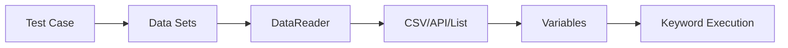

### Execution with Data Sets

```python
# For each data set
for data_set in test_case.data_sets:
    # Set variables
    session.elements.update(data_set)
    # Execute test case
    execute_test_case(test_case)
```

### Element Fallback Resolution

The `ElementData.resolve_with_fallback()` method provides automatic fallback:

```python
def resolve_with_fallback(
    self,
    name: str,
    resolver: Callable[[str], Any],
    on_error: Optional[Callable[[Exception, str], None]] = None,
    max_attempts: Optional[int] = None,
) -> Any:
    """Try each value until one succeeds."""
    values = self.get_element(name)
    for v in values:
        try:
            return resolver(v)
        except Exception as e:
            if on_error:
                on_error(e, v)
            continue
    raise OpticsError(Code.X0201, "All values failed")
```

**Usage:**
```python
element = session.elements.resolve_with_fallback(
    "submit_button",
    resolver=lambda v: strategy_manager.locate(v),
    on_error=lambda e, v: logger.warning(f"Failed {v}: {e}"),
    max_attempts=3
)
```

## Result Collection

### Result Printers

**Location:** `optics_framework/common/runner/printers.py`

Collect and format execution results.

#### TreeResultPrinter

Hierarchical result display:

- Test case results
- Module results
- Keyword results
- Nested structure

#### NullResultPrinter

No-op printer for programmatic use.

### Result Structure

```python
class TestCaseResult:
    name: str
    status: State
    modules: List[ModuleResult]
    elapsed: float

class ModuleResult:
    name: str
    status: State
    keywords: List[KeywordResult]
    elapsed: float

class KeywordResult:
    name: str
    status: State
    args: List[str]
    elapsed: float
    error: Optional[str]
```

## Session Lifecycle During Execution

### Session Creation

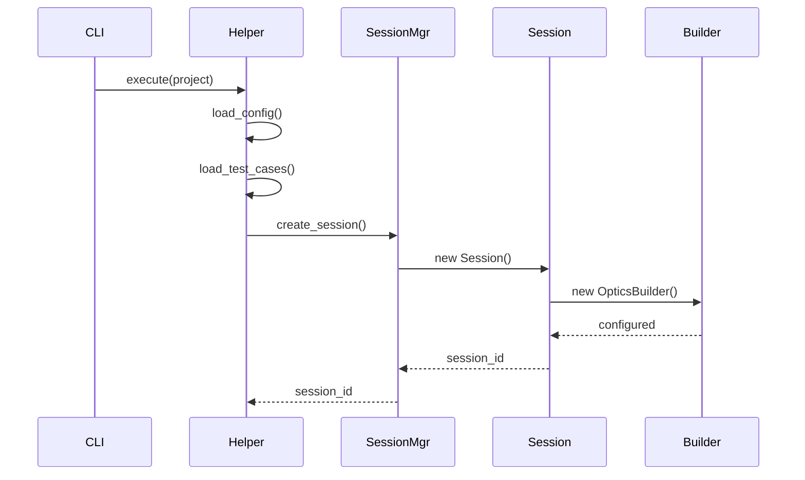

### Execution Phase

1. **Initialization**: Load test cases, modules, elements
2. **Setup**: Create session, initialize drivers
3. **Execution**: Run test cases
4. **Cleanup**: Terminate drivers, close sessions

### Session Termination

```python
def terminate_session(self, session_id: str):
    session = self.sessions.pop(session_id)
    if session.driver:
        session.driver.terminate()
    cleanup_junit(session_id)
    get_event_manager_registry().remove_session(session_id)
```

## Error Handling

### Error Types

- **OpticsError**: Framework-specific errors with error codes
- **Exception**: General Python exceptions
- **AssertionError**: Test assertion failures

### Error Flow

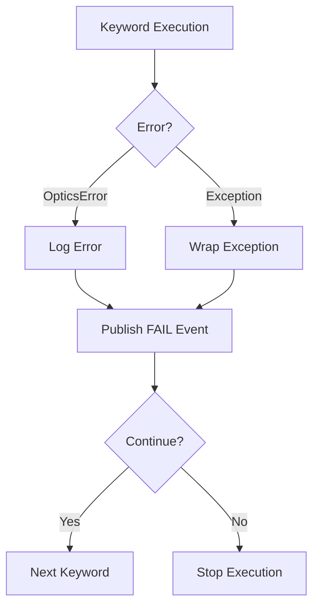

### Error Recovery

- **Keyword Level**: Try fallback parameters
- **Module Level**: Continue with next keyword
- **Test Case Level**: Continue with next test case
- **Session Level**: Terminate and cleanup

## Performance Considerations

### Async Execution

- Event processing is async
- Non-blocking event publishing
- Parallel event handling

### Resource Management

- Driver connection pooling
- Screenshot caching
- Lazy component instantiation

### Optimization Tips

1. **Batch Operations**: Execute multiple test cases in one session
2. **Connection Reuse**: Reuse driver connections
3. **Caching**: Cache screenshots and page sources
4. **Parallel Execution**: Run independent test cases in parallel

## Test Context

**Location:** `optics_framework/common/test_context.py`

Test context provides thread-local and async-safe storage for execution context information using Python's `contextvars` module. This allows components to access the current test case name without explicit parameter passing.

### Context Variables

The framework uses Python's `contextvars` module for context management:

```python
from contextvars import ContextVar

current_test_case: ContextVar[str] = ContextVar("current_test_case", default=None)
```

**Why Context Variables?**

- **Thread-Safe**: Each thread/async task has its own context
- **Async-Safe**: Automatically propagated to async tasks
- **No Parameter Passing**: Access context without explicit parameters
- **Isolation**: Context isolated per execution context

### Setting Test Context

Test context is set during test case execution:

```python
from optics_framework.common import test_context

# Set current test case
test_context.current_test_case.set("test_login")

# Access current test case
test_case_name = test_context.current_test_case.get()
# Returns: "test_login" or None if not set
```

**When Context is Set:**

- At the start of test case execution
- Before each test case in a suite
- Automatically by test runner

**When Context is Cleared:**

- After test case completion
- On test case failure
- On exception handling

### Usage in Components

Components can access test context without explicit parameters:

```python
from optics_framework.common import test_context

class EventSDK:
    def get_test_case_name(self):
        """Get current test case name from context."""
        return test_context.current_test_case.get()

    def capture_event(self, event_name, **args):
        """Capture event with test case context."""
        test_case = self.get_test_case_name()
        # Include test case in event attributes
        args['testCaseName'] = test_case
        # ... capture event
```

**Benefits:**

- No need to pass test case name through call stack
- Automatic context propagation
- Cleaner API signatures
- Consistent context access

### Context Propagation

Context variables are automatically propagated to:

- **Async Tasks**: Context copied to new async tasks
- **Thread Pools**: Context available in thread pool workers
- **Nested Function Calls**: Context available in all nested calls
- **Event Handlers**: Context available in event subscribers

**Example:**
```python
# Context set in main thread
test_context.current_test_case.set("test_login")

# Context automatically available in async task
async def async_operation():
    test_case = test_context.current_test_case.get()
    # Returns: "test_login"
```

### Context Isolation

Each execution context has its own context variables:

```python
# Context 1
test_context.current_test_case.set("test_1")
# ... execution ...

# Context 2 (different thread/async task)
test_context.current_test_case.set("test_2")
# ... execution ...

# Each context maintains its own value
```

**Use Cases:**

- Parallel test execution
- Async operations
- Event handling
- Logging and tracking

### Integration with EventSDK

EventSDK uses test context to automatically include test case name in events:

```python
class EventSDK:
    def get_test_case_name(self):
        return test_context.current_test_case.get()

    def capture_event(self, event_name, **args):
        test_case = self.get_test_case_name()
        if test_case:
            args['testCaseName'] = test_case
        # ... capture event
```

**Event Structure:**

```json
{
  "eventName": "button_clicked",
  "eventAttributes": {
    "testCaseName": "test_login",  // From context
    "button_id": "submit"
  }
}
```

### Best Practices

1. **Set Context Early**: Set context at the start of test case execution
2. **Clear on Completion**: Clear context after test case completes
3. **Handle None**: Always check if context is None before using
4. **Don't Modify**: Don't modify context from multiple threads simultaneously
5. **Use for Metadata**: Use context for metadata, not for control flow

## Execution Tracer

**Location:** `optics_framework/common/execution_tracer.py`

The execution tracer provides structured logging for strategy attempts during element location, helping debug self-healing behavior and understand why certain strategies succeed or fail.

### Purpose

Execution tracer logs comprehensive information about strategy attempts:

- **Strategy Class**: Which strategy is being tried
- **Element**: Element being located
- **Status**: Success or failure status
- **Duration**: How long the attempt took
- **Error Messages**: Error details (if any)

### Architecture

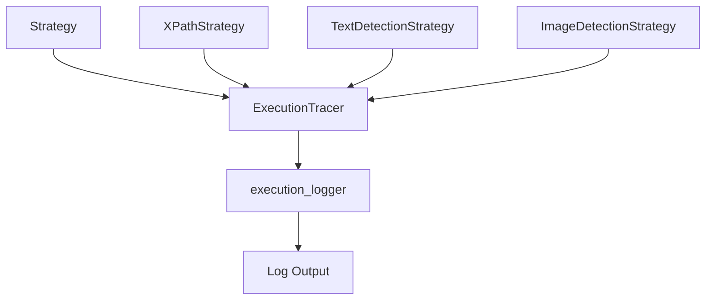

### Implementation

**ExecutionTracer Class:**
```python
class ExecutionTracer:
    @staticmethod
    def log_attempt(
        strategy,
        element: str,
        status: str,
        duration: Optional[float] = None,
        error: Optional[str] = None
    ):
        """
        Log structured strategy attempt information.

        Args:
            strategy: Strategy class instance
            element: Element being located
            status: "success" or "failed"
            duration: Duration in seconds
            error: Error message if failed
        """
```

### Usage

**Logging Successful Attempt:**
```python
from optics_framework.common.execution_tracer import execution_tracer

execution_tracer.log_attempt(
    strategy=XPathStrategy,
    element="submit_button",
    status="success",
    duration=0.15,
    error=None
)
```

**Logging Failed Attempt:**
```python
execution_tracer.log_attempt(
    strategy=TextDetectionStrategy,
    element="submit_button",
    status="failed",
    duration=2.5,
    error="Element not found in OCR results"
)
```

### Log Format

Tracer logs are formatted as structured messages:

**Success:**
```
Trying XPathStrategy on 'submit_button' ... SUCCESS, duration: 0.15s
```

**Failure:**
```
Trying TextDetectionStrategy on 'submit_button' ... FAILED (error: Element not found), duration: 2.50s
```

**Format Components:**

- Strategy class name
- Element identifier
- Status (SUCCESS/FAILED)
- Duration (if provided)
- Error message (if failed)

### Integration with Strategies

Strategies use the tracer to log their attempts:

```python
class TextDetectionStrategy(LocatorStrategy):
    def locate(self, element: str, index: int = 0):
        start_time = time.time()
        try:
            result = self._locate_with_ocr(element)
            duration = time.time() - start_time
            execution_tracer.log_attempt(
                self, element, "success", duration
            )
            return result
        except Exception as e:
            duration = time.time() - start_time
            execution_tracer.log_attempt(
                self, element, "failed", duration, str(e)
            )
            raise
```

**Automatic Logging:**

- Strategies automatically log attempts
- Duration calculated automatically
- Errors captured and logged
- No manual logging required in most cases

### Element Name Handling

The tracer handles different element formats:

```python
element_str = str(element)
if isinstance(element, list) and len(element) == 1:
    element_str = str(element[0])
```

**Examples:**

- Single string: `"submit_button"` → `"submit_button"`
- List with one item: `["submit_button"]` → `"submit_button"`
- List with multiple: `["btn1", "btn2"]` → `"['btn1', 'btn2']"`

### Integration with Logging System

The tracer uses the execution logger:

```python
from optics_framework.common.logging_config import execution_logger

execution_logger.info(log_line)
```

**Logger Configuration:**

- Uses `optics.execution` logger
- Logs at INFO level
- Formatted for user visibility
- Integrated with execution output

### Benefits

**1. Debugging:**

- See which strategies are tried
- Understand why strategies fail
- Track strategy selection order
- Identify strategy conflicts

**2. Performance Analysis:**

- Identify slow strategies
- Compare strategy performance
- Optimize strategy ordering
- Measure location time

**3. Observability:**

- Track self-healing behavior
- Monitor strategy success rates
- Understand fallback patterns
- Analyze element location patterns

**4. Troubleshooting:**

- Understand element location failures
- Debug strategy selection issues
- Identify configuration problems
- Track down performance issues

### Example Output

**Complete Execution Trace:**
```
Trying XPathStrategy on 'submit_button' ... FAILED (error: Element not found), duration: 0.05s
Trying TextElementStrategy on 'submit_button' ... FAILED (error: Element not found), duration: 0.10s
Trying TextDetectionStrategy on 'submit_button' ... SUCCESS, duration: 2.15s
```

**Analysis:**

- XPath failed quickly (0.05s) - element not in DOM
- TextElement failed quickly (0.10s) - element not accessible
- TextDetection succeeded (2.15s) - found via OCR

### Best Practices

1. **Always Log**: Log both success and failure
2. **Include Duration**: Measure and log execution time
3. **Capture Errors**: Include error messages for failures
4. **Use Consistently**: Use tracer in all strategies
5. **Review Logs**: Regularly review tracer logs for insights

### Related Components

- **Strategies**: Use tracer to log attempts
- **Execution Logger**: Receives tracer logs
- **Self-Healing**: Tracer helps understand self-healing behavior
- **Debugging**: Tracer essential for debugging location issues

## Extension Points

### Custom Runners

Extend `Runner` base class:

```python
class CustomRunner(Runner):
    async def run_all(self):
        # Custom execution logic
        pass
```

### Custom Executors

Implement `Executor` interface:

```python
class CustomExecutor(Executor):
    async def execute(self, session: Session, runner: Runner):
        # Custom execution logic
        pass
```

### Custom Event Handlers

Implement `EventSubscriber`:

```python
class CustomEventHandler(EventSubscriber):
    async def on_event(self, event: Event):
        # Custom event handling
        pass
```

## Debugging Execution

### Enable Debug Logging

```python
import logging
logging.getLogger("optics_framework.common.execution").setLevel(logging.DEBUG)
```

### Event Monitoring

```python
# Subscribe to all events
event_manager.subscribe("debug", DebugSubscriber())
```

### Result Inspection

```python
# Access results from runner
results = runner.result_printer.test_state
for test_case_id, result in results.items():
    print(f"{test_case_id}: {result.status}")
```

### Execution Tracer Logging

Execution tracer logs are automatically written to `execution_logger`:

```python
import logging
logging.getLogger("optics.execution").setLevel(logging.INFO)
# Tracer logs will appear in execution logs
```

## Related Documentation

- [Components](components.md) - Component architecture
- [Strategies](strategies.md) - Strategy pattern and self-healing
- [Error Handling](error_handling.md) - Error handling
- [Event System](event_system.md) - Event system
- [Logging](logging.md) - Logging system and execution tracer
- [Architecture Decisions](decisions.md) - Design decisions for execution architecture
- [Keyword Registry](execution.md#keyword-registry) - Keyword registration and lookup
- [Data Models](execution.md#data-models) - Linked list structure and data models
- [Test Context](execution.md#test-context) - Context variable system
- [Execution Tracer](execution.md#execution-tracer) - Strategy attempt logging
- [CLI Layer](cli_layer.md) - CLI execution
