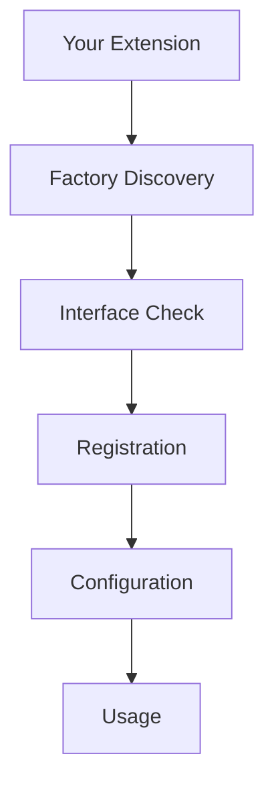

# Extending Optics Framework

This guide provides step-by-step instructions for extending the Optics Framework by creating custom drivers, element sources, vision models, event handlers, keywords, executors, and result printers.

## Introduction

The Optics Framework is designed to be highly extensible. You can extend it at multiple levels:

- **Engines**: Drivers, element sources, and vision models
- **API Layer**: Custom keywords and actions
- **Execution Layer**: Custom executors and result printers
- **Event System**: Custom event subscribers
- **Strategies**: Custom element location strategies

### When to Extend

Consider extending when:

- You need support for a new automation tool or protocol
- You want to integrate a custom OCR or image recognition service
- You need domain-specific keywords
- You want custom reporting or event handling
- You need specialized execution modes

### Extension Architecture

Extensions are automatically discovered by the factory system when placed in the correct directories:



## Creating New Drivers

Drivers execute user actions on target applications or devices.

### Step 1: Create Driver File

Create a new file in `optics_framework/engines/drivers/your_driver.py`:

```python
from typing import Any, Dict, Optional
from optics_framework.common.driver_interface import DriverInterface
from optics_framework.common.logging_config import internal_logger
from optics_framework.common.eventSDK import EventSDK
from optics_framework.common.error import OpticsError, Code

class YourDriver(DriverInterface):
    """
    Your custom driver implementation.
    """

    DEPENDENCY_TYPE = "driver_sources"
    NAME = "your_driver"

    def __init__(self, config: Optional[Dict[str, Any]] = None, event_sdk: Optional[EventSDK] = None):
        """
        Initialize your driver.

        Args:
            config: Configuration dictionary
            event_sdk: Optional EventSDK for tracking actions
        """
        self.config = config or {}
        self.event_sdk = event_sdk
        self.driver = None  # Your driver instance

        # Initialize your driver here
        self._initialize_driver()

    def _initialize_driver(self):
        """Initialize the underlying driver."""
        # Your initialization logic
        pass

    def launch_app(
        self,
        app_identifier: str | None = None,
        app_activity: str | None = None,
        event_name: str | None = None,
    ) -> Optional[str]:
        """Launch an application."""
        if self.event_sdk:
            self.event_sdk.track_action("launch_app", event_name)

        # Your launch logic
        session_id = "your_session_id"
        return session_id

    def press_coordinates(
        self,
        coor_x: int,
        coor_y: int,
        event_name: Optional[str] = None
    ) -> None:
        """Press at absolute coordinates."""
        if self.event_sdk:
            self.event_sdk.track_action("press_coordinates", event_name)

        # Your press logic
        pass

    def press_element(
        self,
        element: str,
        repeat: int,
        event_name: Optional[str] = None
    ) -> None:
        """Press a UI element."""
        if self.event_sdk:
            self.event_sdk.track_action("press_element", event_name)

        # Your element press logic
        pass

    def press_percentage_coordinates(
        self,
        percentage_x: float,
        percentage_y: float,
        repeat: int,
        event_name: Optional[str] = None
    ) -> None:
        """Press at percentage coordinates."""
        if self.event_sdk:
            self.event_sdk.track_action("press_percentage_coordinates", event_name)

        # Your percentage press logic
        pass

    def enter_text(
        self,
        text: str,
        event_name: Optional[str] = None
    ) -> None:
        """Enter text."""
        if self.event_sdk:
            self.event_sdk.track_action("enter_text", event_name)

        # Your text entry logic
        pass

    def press_keycode(
        self,
        keycode: str,
        event_name: Optional[str] = None
    ) -> None:
        """Press a key code."""
        if self.event_sdk:
            self.event_sdk.track_action("press_keycode", event_name)

        # Your keycode logic
        pass

    def enter_text_element(
        self,
        element: str,
        text: str,
        event_name: Optional[str] = None
    ) -> None:
        """Enter text into an element."""
        if self.event_sdk:
            self.event_sdk.track_action("enter_text_element", event_name)

        # Your text entry logic
        pass

    def enter_text_using_keyboard(
        self,
        text: str,
        event_name: Optional[str] = None
    ) -> None:
        """Enter text using keyboard."""
        if self.event_sdk:
            self.event_sdk.track_action("enter_text_using_keyboard", event_name)

        # Your keyboard input logic
        pass

    def clear_text(self, event_name: Optional[str] = None) -> None:
        """Clear text."""
        if self.event_sdk:
            self.event_sdk.track_action("clear_text", event_name)

        # Your clear text logic
        pass

    def clear_text_element(
        self,
        element: str,
        event_name: Optional[str] = None
    ) -> None:
        """Clear text from an element."""
        if self.event_sdk:
            self.event_sdk.track_action("clear_text_element", event_name)

        # Your clear text logic
        pass

    def swipe(
        self,
        x_coor: int,
        y_coor: int,
        direction: str,
        swipe_length: int,
        event_name: Optional[str] = None
    ) -> None:
        """Swipe gesture."""
        if self.event_sdk:
            self.event_sdk.track_action("swipe", event_name)

        # Your swipe logic
        pass

    def swipe_percentage(
        self,
        x_percentage: int,
        y_percentage: int,
        direction: str,
        swipe_length_percentage: int,
        event_name: Optional[str] = None
    ) -> None:
        """Swipe by percentage (x_percentage, y_percentage, swipe_length_percentage are integers 0-100)."""
        if self.event_sdk:
            self.event_sdk.track_action("swipe_percentage", event_name)

        # Your swipe logic
        pass

    def swipe_element(
        self,
        element: str,
        direction: str,
        swipe_length: int,
        event_name: Optional[str] = None
    ) -> None:
        """Swipe an element."""
        if self.event_sdk:
            self.event_sdk.track_action("swipe_element", event_name)

        # Your swipe logic
        pass

    def scroll(
        self,
        direction: str,
        duration: int,
        event_name: Optional[str] = None
    ) -> None:
        """Scroll gesture."""
        if self.event_sdk:
            self.event_sdk.track_action("scroll", event_name)

        # Your scroll logic
        pass

    def get_text_element(self, element: str) -> str:
        """Get text from an element."""
        # Your text extraction logic
        return "extracted_text"

    def force_terminate_app(
        self,
        app_name: str,
        event_name: Optional[str] = None
    ) -> None:
        """Force terminate an application."""
        if self.event_sdk:
            self.event_sdk.track_action("force_terminate_app", event_name)

        # Your termination logic
        pass

    def terminate(self) -> None:
        """Clean up and terminate the driver."""
        # Your cleanup logic
        if self.driver:
            # Close connections, release resources
            pass

    def get_app_version(self) -> str:
        """Get application version."""
        # Your version retrieval logic
        return "1.0.0"

    def launch_other_app(
        self,
        app_name: str,
        event_name: str | None
    ) -> None:
        """Launch another application."""
        if self.event_sdk:
            self.event_sdk.track_action("launch_other_app", event_name)

        # Your launch logic
        pass

    def get_driver_session_id(self) -> Optional[str]:
        """Get driver session ID if supported."""
        return getattr(self.driver, 'session_id', None)

    def execute_script(
        self,
        script: str,
        *args,
        event_name: Optional[str] = None
    ) -> Any:
        """Execute a script."""
        if self.event_sdk:
            self.event_sdk.track_action("execute_script", event_name)

        # Your script execution logic
        return None
```

### Step 2: Configuration

Your driver will be automatically discovered. Use it in configuration:

```yaml
driver_sources:
  - your_driver:
      enabled: true
      url: "your_driver_url"
      capabilities:
        key1: "value1"
        key2: "value2"
```

### Key Points

- Set `DEPENDENCY_TYPE = "driver_sources"` and `NAME = "your_driver"`
- Implement all abstract methods from `DriverInterface`
- Use `EventSDK` for action tracking (optional but recommended)
- Handle errors gracefully with `OpticsError`
- Implement proper cleanup in `terminate()`

## Creating New Element Sources

Element sources detect and locate UI elements.

### Step 1: Create Element Source File

Create a new file in `optics_framework/engines/elementsources/your_element_source.py`:

```python
from typing import Optional, Any, List
import numpy as np
from optics_framework.common.elementsource_interface import ElementSourceInterface
from optics_framework.common.logging_config import internal_logger

class YourElementSource(ElementSourceInterface):
    """
    Your custom element source implementation.
    """

    # If your element source requires a specific driver, set this:
    REQUIRED_DRIVER_TYPE = "your_driver"  # or None if driver-independent

    def __init__(self, driver: Optional[Any] = None, config: Optional[dict] = None):
        """
        Initialize element source.

        Args:
            driver: Optional driver instance (if REQUIRED_DRIVER_TYPE is set)
            config: Optional configuration dictionary
        """
        self.driver = driver
        self.config = config or {}

    def capture(self) -> np.ndarray:
        """
        Capture the current screen state.

        Returns:
            Screenshot as NumPy array
        """
        # Your screenshot capture logic
        # Return as numpy.ndarray with shape (height, width, channels)
        pass

    def locate(self, element: Any, index: int | None = None) -> tuple:
        """
        Locate an element within the current screen state.

        Args:
            element: Element identifier (XPath, text, etc.)
            index: Index if multiple matches

        Returns:
            Tuple (x, y) representing element center, or element object
        """
        # Your element location logic
        # Return coordinates (x, y) or element object
        pass

    def assert_elements(
        self,
        elements: Any,
        timeout: int = 30,
        rule: str = 'any'
    ) -> None:
        """
        Assert the presence of elements on the screen.

        Args:
            elements: List of elements to check
            timeout: Time to wait
            rule: 'any' or 'all'

        Raises:
            AssertionError if assertion fails
        """
        # Your assertion logic
        pass

    def get_interactive_elements(
        self,
        filter_config: Optional[List[str]] = None
    ) -> list:
        """
        Retrieve interactive elements on the current screen.

        Args:
            filter_config: Optional filter types (e.g., ["buttons", "inputs"])

        Returns:
            List of interactive elements
        """
        # Your interactive element detection logic
        return []
```

### Step 2: Driver Dependency

If your element source requires a specific driver:

```python
REQUIRED_DRIVER_TYPE = "appium"  # Must match driver NAME
```

The factory will automatically match and inject the driver.

### Step 3: Configuration

```yaml
elements_sources:
  - your_element_source:
      enabled: true
      # Additional configuration
```

### Key Points

- Set `REQUIRED_DRIVER_TYPE` if driver-dependent
- Implement all abstract methods from `ElementSourceInterface`
- Return NumPy arrays for screenshots
- Handle timeouts and retries in `assert_elements()`

## Creating New Text Detection Models

Text detection models provide OCR capabilities.

### Step 1: Create OCR Model File

Create a new file in `optics_framework/engines/vision_models/ocr_models/your_ocr.py`:

```python
from typing import Optional, Tuple, Any, List
import numpy as np
from optics_framework.common.text_interface import TextInterface
from optics_framework.common.logging_config import internal_logger

class YourOCR(TextInterface):
    """
    Your custom OCR implementation.
    """

    def __init__(self, config: Optional[dict] = None):
        """
        Initialize OCR model.

        Args:
            config: Configuration dictionary
        """
        self.config = config or {}
        # Initialize your OCR engine here
        self._initialize_ocr()

    def _initialize_ocr(self):
        """Initialize the OCR engine."""
        # Your initialization logic
        pass

    def element_exist(
        self,
        input_data: Any,
        reference_data: Any
    ) -> Optional[Tuple[int, int]]:
        """
        Check if text exists in input data.

        Args:
            input_data: Screenshot/image as NumPy array
            reference_data: Text to search for

        Returns:
            Tuple (x, y) of text location, or None if not found
        """
        # Your text detection logic
        # Return (x, y) coordinates or None
        pass

    def find_element(
        self,
        input_data,
        text,
        index=None
    ) -> Optional[Tuple[bool, Tuple[int, int], Tuple[Tuple[int, int], Tuple[int, int]]]]:
        """
        Locate specific text in input data.

        Args:
            input_data: Screenshot/image as NumPy array
            text: Text to locate
            index: Index if multiple matches

        Returns:
            Tuple (found, center, bounds) where:
            - found: bool
            - center: (x, y) coordinates
            - bounds: ((x1, y1), (x2, y2)) bounding box
            Returns None if not found
        """
        # Your text location logic
        # Return (True, (x, y), ((x1, y1), (x2, y2))) or None
        pass

    def detect_text(
        self,
        input_data
    ) -> Optional[Tuple[str, List[Tuple[List[Tuple[int, int]], str, float]]]]:
        """
        Detect all text in input data.

        Args:
            input_data: Screenshot/image as NumPy array

        Returns:
            Tuple (detected_text_str, results) where each result is:
            (bbox, text, confidence) where bbox is list of (x,y) tuples
        """
        # Your full text detection logic
        # Return (full_text_string, [(bbox, text, confidence), ...])
        pass
```

### Step 2: Configuration

```yaml
text_detection:
  - your_ocr:
      enabled: true
      api_key: "your_api_key"
      language: "en"
```

### Key Points

- Implement all abstract methods from `TextInterface`
- Handle NumPy array inputs (screenshots)
- Return bounding boxes with confidence scores
- Support multiple language detection

## Creating New Image Detection Models

Image detection models provide template matching capabilities.

### Step 1: Create Image Model File

Create a new file in `optics_framework/engines/vision_models/image_models/your_image_matcher.py`:

```python
from typing import Literal, Optional, Tuple, Any
import numpy as np
import cv2
from optics_framework.common.image_interface import ImageInterface
from optics_framework.common.logging_config import internal_logger
from optics_framework.engines.vision_models.base_methods import load_template

class YourImageMatcher(ImageInterface):
    """
    Your custom image matching implementation.
    """

    def __init__(self, config: Optional[dict] = None):
        """
        Initialize image matcher.

        Args:
            config: Configuration dictionary with project_path and templates
        """
        self.config = config or {}
        self.project_path = self.config.get("project_path", "")
        self.templates = self.config.get("templates", None)
        self.execution_output_dir = self.config.get("execution_output_path", "")

    def element_exist(
        self,
        input_data: Any,
        reference_data: Any
    ) -> (
        tuple[Literal[False], tuple[None, None], None]
        | tuple[Literal[True], tuple[int, int], list[tuple[int, int]]]
    ):
        """
        Check if image exists in input data.

        Args:
            input_data: Screenshot/image as NumPy array
            reference_data: Template image path or name

        Returns:
            (False, (None, None), None) if not found
            (True, (x, y), [corners]) if found
        """
        # Load template
        template = load_template(reference_data, self.templates)
        if template is None:
            return (False, (None, None), None)

        # Your image matching logic
        # Return (True, (x, y), [corners]) or (False, (None, None), None)
        pass

    def find_element(
        self,
        input_data,
        image,
        index=None
    ) -> Optional[Tuple[bool, Tuple[int, int], Tuple[Tuple[int, int], Tuple[int, int]]]]:
        """
        Locate image in input data.

        Args:
            input_data: Screenshot/image as NumPy array
            image: Template image path or name
            index: Index if multiple matches

        Returns:
            Tuple (found, center, bounds) where:
            - found: bool
            - center: (x, y) coordinates
            - bounds: ((x1, y1), (x2, y2)) bounding box
            Returns None if not found
        """
        # Load template
        template = load_template(image, self.templates)
        if template is None:
            return None

        # Your image matching logic
        # Return (True, (x, y), ((x1, y1), (x2, y2))) or None
        pass

    def assert_elements(
        self,
        input_data,
        elements,
        rule="any"
    ) -> Optional[Tuple[bool, Any]]:
        """
        Assert that elements are present.

        Args:
            input_data: Screenshot/image as NumPy array
            elements: List of template images
            rule: "any" or "all"

        Returns:
            Tuple (result, annotated_image) or None
        """
        # Your assertion logic
        # Check if elements exist based on rule
        # Return (True, annotated_image) or (False, None)
        pass
```

### Step 2: Configuration

```yaml
image_detection:
  - your_image_matcher:
      enabled: true
      project_path: "/path/to/project"
      execution_output_path: "/path/to/output"
      confidence_threshold: 0.85
```

### Key Points

- Use `load_template()` helper to load template images
- Support template discovery from project directory
- Return proper coordinate formats
- Support multiple match detection (index parameter)

## Creating New Event Subscribers

Event subscribers process execution events for custom handling.

### Step 1: Create Event Subscriber

Create a new file in `optics_framework/common/your_event_handler.py`:

```python
from optics_framework.common.events import EventSubscriber, Event, EventStatus
from optics_framework.common.logging_config import internal_logger
from typing import Optional

class YourEventHandler(EventSubscriber):
    """
    Your custom event handler.
    """

    def __init__(self, config: Optional[dict] = None):
        """
        Initialize event handler.

        Args:
            config: Optional configuration dictionary
        """
        self.config = config or {}
        self.events = []  # Store events if needed

    async def on_event(self, event: Event) -> None:
        """
        Process an event.

        Args:
            event: Event object to process
        """
        # Your event processing logic
        internal_logger.debug(f"Processing event: {event.name} - {event.status}")

        # Example: Filter by entity type
        if event.entity_type == "keyword":
            self._handle_keyword_event(event)
        elif event.entity_type == "test_case":
            self._handle_test_case_event(event)
        elif event.entity_type == "module":
            self._handle_module_event(event)

    def _handle_keyword_event(self, event: Event):
        """Handle keyword-level events."""
        # Your keyword event logic
        pass

    def _handle_test_case_event(self, event: Event):
        """Handle test case-level events."""
        # Your test case event logic
        pass

    def _handle_module_event(self, event: Event):
        """Handle module-level events."""
        # Your module event logic
        pass

    def close(self):
        """Cleanup resources."""
        # Your cleanup logic
        pass
```

### Step 2: Register Event Subscriber

Register your subscriber in session setup:

```python
from optics_framework.common.events import get_event_manager
from optics_framework.common.your_event_handler import YourEventHandler

# Get event manager for session
event_manager = get_event_manager(session_id)

# Create and register your handler
handler = YourEventHandler(config={})
event_manager.subscribe("your_handler", handler)
```

### Step 3: Integration in Session

You can also integrate during session creation by modifying session setup or using a custom initialization hook.

### Key Points

- Implement `EventSubscriber` interface
- Handle events asynchronously
- Filter events by entity type or status
- Implement `close()` for cleanup
- Reference `JUnitEventHandler` for a complete example

## Creating New Keywords

Keywords are the user-facing API for test automation.

### Step 1: Add Method to API Class

Add your keyword to an existing API class or create a new one in `optics_framework/api/your_keywords.py`:

```python
from typing import Optional
from optics_framework.common.optics_builder import OpticsBuilder
from optics_framework.common.logging_config import internal_logger
from optics_framework.optics import keyword, fallback_params, fallback_str

class YourKeywords:
    """
    Your custom keywords.
    """

    def __init__(self, builder: OpticsBuilder):
        self.builder = builder
        self.driver = builder.get_driver()
        self.element_source = builder.get_element_source()

    @keyword("Your Custom Keyword")
    @fallback_params  # Optional: for fallback parameter support
    def your_custom_keyword(
        self,
        param1: fallback_str,
        param2: Optional[fallback_str] = None,
        event_name: Optional[fallback_str] = None
    ) -> Optional[str]:
        """
        Your custom keyword description.

        Args:
            param1: First parameter (supports fallback)
            param2: Optional second parameter
            event_name: Optional event name for tracking

        Returns:
            Optional result value
        """
        # Your keyword logic
        internal_logger.info(f"Executing your_custom_keyword with {param1}")

        # Access driver, element source, etc.
        # self.driver.press_coordinates(x, y)

        return "result"
```

### Step 2: Register Keywords

Register your keywords in the Optics class or session setup:

```python
# In optics.py or session initialization
from optics_framework.api.your_keywords import YourKeywords

# Build your keywords
your_keywords = session.optics.build(YourKeywords)

# Register with keyword registry
registry = KeywordRegistry()
registry.register(your_keywords)
```

### Step 3: Add to Optics Class (Optional)

If you want to expose keywords through the main Optics class, add wrapper methods in `optics_framework/optics.py`:

```python
@keyword("Your Custom Keyword")
@fallback_params
def your_custom_keyword(
    self,
    param1: fallback_str,
    param2: Optional[fallback_str] = None,
    event_name: Optional[fallback_str] = None
) -> Optional[str]:
    """Your custom keyword."""
    if not hasattr(self, 'your_keywords'):
        self.your_keywords = self.session_manager.sessions[self.session_id].optics.build(YourKeywords)
    return self.your_keywords.your_custom_keyword(
        param1=cast(str, param1),
        param2=cast(Optional[str], param2),
        event_name=cast(Optional[str], event_name)
    )
```

### Key Points

- Use `@keyword("Display Name")` decorator
- Use `@fallback_params` for fallback parameter support
- Use `fallback_str` type hint for fallback parameters
- Access builder components (driver, element_source, etc.)
- Handle errors gracefully

## Creating New Test Executors

Executors handle different execution modes.

### Step 1: Create Executor

Create a new file or add to `optics_framework/common/execution.py`:

```python
from optics_framework.common.execution import Executor
from optics_framework.common.session_manager import Session
from optics_framework.common.runner.test_runnner import Runner
from optics_framework.common.events import EventManager, Event, EventStatus
from optics_framework.common.error import OpticsError, Code
from optics_framework.common.models import TestCaseNode

class YourExecutor(Executor):
    """
    Your custom executor implementation.
    """

    def __init__(self, test_case: Optional[TestCaseNode], event_manager: EventManager):
        """
        Initialize executor.

        Args:
            test_case: Optional test case node
            event_manager: Event manager for publishing events
        """
        self.test_case = test_case
        self.event_manager = event_manager

    async def execute(self, session: Session, runner: Runner) -> None:
        """
        Execute with custom logic.

        Args:
            session: Session instance
            runner: Runner instance
        """
        # Your custom execution logic
        try:
            # Publish start event
            await self.event_manager.publish_event(Event(
                entity_type="execution",
                entity_id=session.session_id,
                name="Your Execution",
                status=EventStatus.RUNNING,
                message="Starting custom execution"
            ))

            # Your execution logic
            # For example, run with custom filtering
            if self.test_case:
                # Custom execution
                await runner.run_all()

            # Publish completion event
            await self.event_manager.publish_event(Event(
                entity_type="execution",
                entity_id=session.session_id,
                name="Your Execution",
                status=EventStatus.PASS,
                message="Execution completed"
            ))
        except Exception as e:
            await self.event_manager.publish_event(Event(
                entity_type="execution",
                entity_id=session.session_id,
                name="Your Execution",
                status=EventStatus.FAIL,
                message=f"Execution failed: {str(e)}"
            ))
            raise
```

### Step 2: Integrate with ExecutionEngine

Modify `ExecutionEngine` to support your executor:

```python
# In optics_framework/common/execution.py
class ExecutionEngine:
    async def execute(self, params: ExecutionParams) -> Any:
        # ... existing code ...

        # Add your executor
        if params.mode == "your_mode":
            executor = YourExecutor(test_case, event_manager)
        elif params.mode == "batch":
            executor = BatchExecutor(test_case, event_manager)
        # ... etc ...
```

### Key Points

- Implement `Executor` interface
- Handle async execution
- Publish events for tracking
- Handle errors gracefully
- Integrate with ExecutionEngine

## Creating New Result Printers

Result printers format and display test execution results.

### Step 1: Create Result Printer

Create a new file in `optics_framework/common/runner/your_printer.py`:

```python
from typing import Dict
from optics_framework.common.runner.printers import (
    IResultPrinter,
    TestCaseResult,
    KeywordResult,
    ModuleResult
)
from optics_framework.common.logging_config import internal_logger

class YourResultPrinter(IResultPrinter):
    """
    Your custom result printer.
    """

    def __init__(self, config: Optional[dict] = None):
        """
        Initialize result printer.

        Args:
            config: Optional configuration dictionary
        """
        self.config = config or {}
        self._test_state: Dict[str, TestCaseResult] = {}

    @property
    def test_state(self) -> Dict[str, TestCaseResult]:
        """Get test state."""
        return self._test_state

    @test_state.setter
    def test_state(self, value: Dict[str, TestCaseResult]) -> None:
        """Set test state."""
        self._test_state = value

    def print_tree_log(self, test_case_result: TestCaseResult) -> None:
        """
        Print test case result in tree format.

        Args:
            test_case_result: Test case result to print
        """
        # Your tree printing logic
        internal_logger.info(f"Test Case: {test_case_result.name} - {test_case_result.status}")

        for module in test_case_result.modules:
            internal_logger.info(f"  Module: {module.name} - {module.status}")
            for keyword in module.keywords:
                internal_logger.info(f"    Keyword: {keyword.name} - {keyword.status}")

    def print_event_log(self, event_data: dict) -> None:
        """
        Print event log.

        Args:
            event_data: Event data dictionary
        """
        # Your event printing logic
        internal_logger.debug(f"Event: {event_data}")

    def start_live(self) -> None:
        """Start live updates."""
        # Your live update initialization
        pass

    def stop_live(self) -> None:
        """Stop live updates."""
        # Your live update cleanup
        pass

    def start_run(self, total_test_cases: int) -> None:
        """
        Start a test run.

        Args:
            total_test_cases: Total number of test cases
        """
        # Your run initialization
        internal_logger.info(f"Starting run with {total_test_cases} test cases")
```

### Step 2: Integrate with RunnerFactory

Modify `RunnerFactory` to use your printer:

```python
# In optics_framework/common/execution.py
from optics_framework.common.runner.your_printer import YourResultPrinter

class RunnerFactory:
    @staticmethod
    def create_runner(...):
        # ... existing code ...

        if use_printer:
            result_printer = YourResultPrinter(config={})
        else:
            result_printer = NullResultPrinter()

        # ... rest of code ...
```

### Key Points

- Implement all methods from `IResultPrinter`
- Maintain test state dictionary
- Support live updates if needed
- Format output as needed
- Reference `TreeResultPrinter` for Rich library usage

## Creating New Strategies

Strategies provide element location methods.

### Step 1: Create Strategy

Add to `optics_framework/common/strategies.py`:

```python
from optics_framework.common.strategies import LocatorStrategy
from optics_framework.common.elementsource_interface import ElementSourceInterface
from typing import Union, Tuple, Optional

class YourStrategy(LocatorStrategy):
    """
    Your custom location strategy.
    """

    def __init__(self, element_source: ElementSourceInterface):
        self._element_source = element_source

    @property
    def element_source(self) -> ElementSourceInterface:
        return self._element_source

    def locate(
        self,
        element: str,
        index: int = 0
    ) -> Union[object, Tuple[int, int]]:
        """
        Locate element using your custom method.

        Args:
            element: Element identifier
            index: Index if multiple matches

        Returns:
            Coordinates (x, y) or element object
        """
        # Your location logic
        pass

    def assert_elements(
        self,
        elements: list,
        timeout: int = 30,
        rule: str = 'any'
    ) -> Tuple[bool, Optional[str]]:
        """
        Assert element presence.

        Args:
            elements: List of elements
            timeout: Timeout in seconds
            rule: 'any' or 'all'

        Returns:
            Tuple (result, timestamp)
        """
        # Your assertion logic
        pass

    @staticmethod
    def supports(
        element_type: str,
        element_source: ElementSourceInterface
    ) -> bool:
        """
        Check if strategy supports element type and source.

        Args:
            element_type: Type of element (e.g., "Custom")
            element_source: Element source to check

        Returns:
            True if supported
        """
        return (
            element_type == "Custom" and
            LocatorStrategy._is_method_implemented(element_source, "your_method")
        )
```

### Step 2: Register Strategy

Register in `StrategyFactory`:

```python
# In optics_framework/common/strategies.py
class StrategyFactory:
    def __init__(self, text_detection, image_detection, strategy_manager):
        # ... existing code ...
        self._registry = [
            # ... existing strategies ...
            (YourStrategy, "Custom", {}, 5),  # Priority 5
        ]
```

### Key Points

- Extend `LocatorStrategy` base class
- Implement `supports()` static method
- Register in `StrategyFactory`
- Set appropriate priority
- Handle element source capabilities

## Best Practices

### Code Organization

1. **Follow Directory Structure**: Place extensions in appropriate directories
2. **Naming Conventions**: Use descriptive names matching framework patterns
3. **Module Structure**: One class per file, clear imports
4. **Documentation**: Add docstrings to all public methods

### Error Handling

```python
from optics_framework.common.error import OpticsError, Code

try:
    # Your code
    pass
except SpecificError as e:
    raise OpticsError(
        Code.EXXXX,  # Use appropriate error code
        message=f"Descriptive error message: {e}",
        details={"context": "additional_info"}
    )
```

### Logging

```python
from optics_framework.common.logging_config import internal_logger, execution_logger

# Use internal_logger for debug/info
internal_logger.debug("Debug message")
internal_logger.info("Info message")

# Use execution_logger for execution events
execution_logger.info("Execution event")
```

### Testing Extensions

1. **Unit Tests**: Test individual methods
2. **Integration Tests**: Test with framework components
3. **Configuration Tests**: Test with various configurations
4. **Error Cases**: Test error handling

### Performance Considerations

1. **Lazy Loading**: Initialize heavy resources on demand
2. **Caching**: Cache expensive operations
3. **Connection Pooling**: Reuse connections when possible
4. **Async Operations**: Use async for I/O operations

## Troubleshooting

### Factory Discovery Issues

**Problem**: Extension not discovered by factory

**Solutions**:

- Verify file is in correct directory
- Check class name matches file name (convention)
- Ensure class implements correct interface
- Verify `DEPENDENCY_TYPE` and `NAME` attributes are set
- Check for import errors in module

### Driver Matching Issues

**Problem**: Element source not matching with driver

**Solutions**:

- Verify `REQUIRED_DRIVER_TYPE` matches driver `NAME`
- Check driver is enabled in configuration
- Ensure driver is instantiated before element source
- Verify factory matching logic

### Configuration Issues

**Problem**: Configuration not passed correctly

**Solutions**:

- Check configuration structure matches expected format
- Verify configuration keys match what your extension expects
- Use `config.get()` with defaults for optional values
- Validate configuration in `__init__`

### Event Handling Issues

**Problem**: Events not received by subscriber

**Solutions**:

- Verify subscriber is registered with correct session ID
- Check event manager is started
- Ensure `on_event()` is async
- Verify event filtering logic

### Strategy Selection Issues

**Problem**: Strategy not being used

**Solutions**:

- Check `supports()` method returns True
- Verify element type matches strategy registration
- Check element source implements required methods
- Review strategy priority ordering

## Next Steps

- Review [Architecture Overview](../architecture.md) for system design
- Check [Components](components.md) for component details
- See [Engines](engines.md) for implementation examples
- Read [Strategies](strategies.md) for strategy patterns
- Explore [Execution](execution.md) for execution flow
- Review [Error Handling](error_handling.md) for error handling patterns
- Check [Event System](event_system.md) for event tracking

## Related Documentation

- [Architecture Overview](../architecture.md) - System architecture
- [Components](components.md) - Component details
- [Engines](engines.md) - Engine implementations
- [Strategies](strategies.md) - Strategy patterns
- [Execution](execution.md) - Execution flow
- [Error Handling](error_handling.md) - Error handling
- [Event System](event_system.md) - Event tracking
- [Architecture Decisions](decisions.md) - Design decisions and extension rationale
- [REST API Usage](../usage/REST_API_usage.md) - REST API endpoints
- [API Reference](../api_reference.md) - Python API documentation
