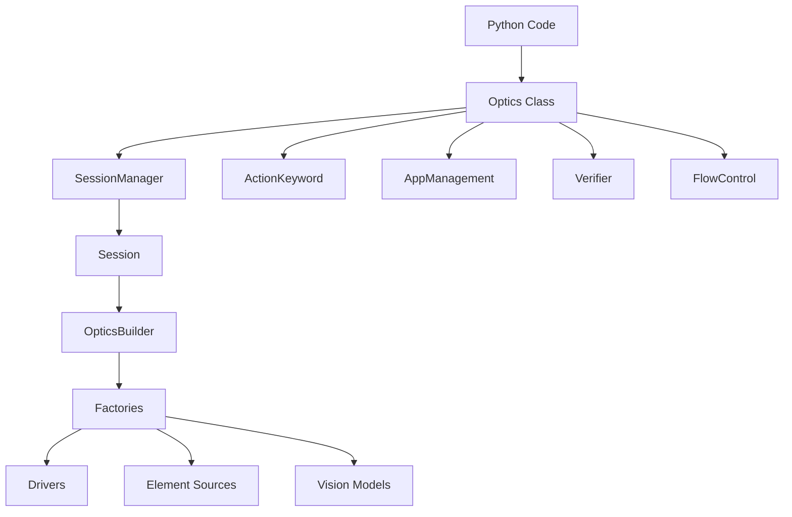

# Library Layer Architecture

The Optics Framework provides a Python library interface that enables programmatic access to framework functionality. This document explains the library architecture, usage patterns, and how it integrates with the core framework.

## Overview

The Library layer provides:

1. **Programmatic Interface** - Direct Python API for test automation
2. **Robot Framework Integration** - Can be used as a Robot Framework library
3. **Session Management** - Create and manage test sessions programmatically
4. **Keyword Access** - Direct access to all framework keywords
5. **Configuration Management** - Flexible configuration via code or files

## Library Architecture



**Location:** `optics_framework/optics.py`

## Optics Class

The `Optics` class is the main entry point for the Python library. It provides a unified interface that can be used both as a standalone Python library and as a Robot Framework library.

### Class Structure

```python
@library(scope="GLOBAL")
class Optics:
    """
    A lightweight interface to interact with the Optics Framework.
    Provides direct access to app management, action, and verification keywords
    with a single setup method.
    Supports Robot Framework as a library when Robot Framework is installed.
    """

    def __init__(self, config: Optional[Dict[str, Any]] = None):
        """Initialize the Optics instance. Call setup() to configure."""

    @keyword("Setup")
    def setup(self, config: Union[str, Dict[str, Any], None] = None, ...):
        """Configure the framework with driver and element source settings."""
```

### Initialization

The `Optics` class can be initialized with or without configuration:

**With Configuration:**
```python
from optics_framework import Optics

config = {
    "driver_sources": [{"appium": {"enabled": True, "url": "http://localhost:4723"}}],
    "elements_sources": [{"appium_find_element": {"enabled": True}}]
}

optics = Optics(config=config)
```

**Without Configuration (setup later):**
```python
from optics_framework import Optics

optics = Optics()
optics.setup(config=config)
```

## Usage Patterns

### 1. Standalone Python Script

The library can be used in standalone Python scripts:

```python
from optics_framework import Optics

# Initialize and configure
optics = Optics()
optics.setup(
    driver_sources=[{"appium": {"enabled": True, "url": "http://localhost:4723"}}],
    elements_sources=[{"appium_find_element": {"enabled": True}}]
)

# Use keywords
optics.launch_app("com.example.app")
optics.press_element("submit_button")
optics.enter_text("username_field", "testuser")
optics.validate_element("welcome_message")

# Cleanup
optics.quit()
```

### 2. Robot Framework Library

When Robot Framework is installed, the `Optics` class can be used as a Robot Framework library:

```robotframework
*** Settings ***
Library    optics_framework.optics.Optics

*** Test Cases ***
Example Test
    Setup    driver_sources=[{"appium": {"enabled": True, "url": "http://localhost:4723"}}]
    Launch App    com.example.app
    Press Element    submit_button
    Enter Text    username_field    testuser
    Validate Element    welcome_message
    Quit
```

### 3. Configuration from File

Configuration can be loaded from YAML or JSON files:

```python
from optics_framework import Optics

# From YAML file
optics = Optics()
optics.setup_from_file("config.yaml")

# Or inline YAML/JSON string
yaml_config = """
driver_sources:
  - appium:
      enabled: true
      url: "http://localhost:4723"
elements_sources:
  - appium_find_element:
      enabled: true
"""
optics.setup(config=yaml_config)
```

## Component Access

The `Optics` class provides direct access to underlying components:

### Action Keywords

```python
optics = Optics(config=config)

# Element interactions
optics.press_element("button_id")
optics.press_by_coordinates(100, 200)
optics.press_by_percentage(50, 50)

# Text input
optics.enter_text("input_field", "text")
optics.enter_text_direct("input_field", "text")

# Gestures
optics.swipe(100, 200, 300, 400)
optics.scroll(100, 200, 300, 400)
```

### App Management

```python
# App lifecycle
optics.launch_app("com.example.app")
optics.launch_other_app("com.other.app")
optics.close_and_terminate_app()
optics.force_terminate_app()

# App information
version = optics.get_app_version()
session_id = optics.get_driver_session_id()
```

### Verification

```python
# Element validation
optics.validate_element("element_id")
optics.assert_presence(["element1", "element2"], rule="all")

# Screen validation
optics.validate_screen(["element1", "element2"])

# Screenshots and page source
screenshot = optics.capture_screenshot()
page_source = optics.capture_page_source()
```

### Flow Control

```python
# Conditional execution
optics.condition("${variable} == 'value'", "keyword_name")

# Data operations
data = optics.read_data("data.csv")
result = optics.invoke_api("GET", "https://api.example.com/data")

# Loops
optics.run_loop(5, "keyword_name")

# Evaluation
value = optics.evaluate("${var1} + ${var2}")
date = optics.date_evaluate("today + 1 day")
```

## Session Management

### Session Lifecycle

The library manages sessions internally:

```python
optics = Optics()

# Setup creates a session
optics.setup(config=config)  # Session created automatically

# All operations use the active session
optics.press_element("button")

# Quit terminates the session
optics.quit()  # Session terminated and cleaned up
```

### Multiple Sessions

For advanced use cases, you can manage multiple sessions:

```python
from optics_framework import Optics
from optics_framework.common.session_manager import SessionManager

# Create multiple Optics instances for different sessions
optics1 = Optics(config=config1)
optics2 = Optics(config=config2)

# Each instance has its own session
optics1.launch_app("app1")
optics2.launch_app("app2")
```

## Configuration

### Configuration Formats

The library supports multiple configuration formats:

**Dictionary:**
```python
config = {
    "driver_sources": [{"appium": {"enabled": True, "url": "http://localhost:4723"}}],
    "elements_sources": [{"appium_find_element": {"enabled": True}}],
    "text_detection": [{"easyocr": {"enabled": True}}],
    "image_detection": [{"templatematch": {"enabled": True}}],
    "project_path": "/path/to/project"
}
optics.setup(config=config)
```

**YAML String:**
```python
yaml_config = """
driver_sources:
  - appium:
      enabled: true
      url: "http://localhost:4723"
      capabilities:
        platformName: "Android"
elements_sources:
  - appium_find_element:
      enabled: true
"""
optics.setup(config=yaml_config)
```

**JSON String:**
```python
json_config = """
{
  "driver_sources": [{"appium": {"enabled": true, "url": "http://localhost:4723"}}],
  "elements_sources": [{"appium_find_element": {"enabled": true}}]
}
"""
optics.setup(config=json_config)
```

**File Path:**
```python
optics.setup_from_file("config.yaml")
```

### Configuration Parameters

Configuration can also be passed as individual parameters:

```python
optics.setup(
    driver_sources=[{"appium": {"enabled": True, "url": "http://localhost:4723"}}],
    elements_sources=[{"appium_find_element": {"enabled": True}}],
    text_detection=[{"easyocr": {"enabled": True}}],
    image_detection=[{"templatematch": {"enabled": True}}],
    execution_output_path_param="/path/to/output"
)
```

## Element Management

### Adding Elements

Elements can be added and retrieved programmatically:

```python
# Add element
optics.add_element("submit_button", "//button[@id='submit']")

# Get element value
element_value = optics.get_element_value("submit_button")

# Use element in keywords
optics.press_element("submit_button")  # Uses stored element
```

### Element Variables

Elements can be referenced using `${variable}` syntax:

```python
optics.add_element("button", "//button[@id='submit']")

# Resolve variable
optics.press_element("${button}")  # Resolves to stored element value
```

## Fallback Parameters

The library supports fallback parameters for resilience:

```python
# Single fallback value
optics.press_element(["button1", "button2", "button3"])

# Multiple fallback parameters
optics.press_element(
    element=["btn1", "btn2"],
    timeout=30
)
```

The framework automatically tries each value until one succeeds.

## Integration with Core Framework

### Session Manager Integration

The library uses `SessionManager` internally:

```python
# Optics class creates and manages sessions
optics = Optics()
optics.setup(config)  # Creates session via SessionManager

# Session is accessible
session_id = optics.session_id
session = optics.session_manager.get_session(session_id)
```

### Builder Integration

The library uses `OpticsBuilder` for component construction:

```python
# Builder is created during setup
optics.setup(config)

# Components are built via OpticsBuilder
# Access to built components:
driver = optics.session_manager.get_session(optics.session_id).driver
```

### API Class Integration

The library delegates to API classes:

```python
# Optics class wraps API classes
optics.press_element("button")
# Internally calls: optics.action_keyword.press_element("button")

optics.validate_element("element")
# Internally calls: optics.verifier.validate_element("element")
```

## Error Handling

The library uses the framework's error handling system:

```python
from optics_framework.common.error import OpticsError, Code

try:
    optics.press_element("nonexistent_element")
except OpticsError as e:
    print(f"Error code: {e.code}")
    print(f"Error message: {e.message}")
    print(f"Error details: {e.details}")
```

## Robot Framework Integration

### Library Registration

When Robot Framework is installed, the `Optics` class is automatically registered as a library:

```python
@library(scope="GLOBAL")
class Optics:
    # Class implementation
```

### Keyword Discovery

Robot Framework automatically discovers keywords decorated with `@keyword`:

```python
@keyword("Press Element")
def press_element(self, element: str, ...):
    """Press an element."""
    pass
```

### Scope Management

The library uses `GLOBAL` scope, meaning a single instance is shared across all test cases:

```robotframework
*** Settings ***
Library    optics_framework.optics.Optics

*** Test Cases ***
Test 1
    Setup    config=config.yaml
    Press Element    button1

Test 2
    # Uses same Optics instance from Test 1
    Press Element    button2
```

## Best Practices

### 1. Configuration Management

- Use configuration files for complex setups
- Store sensitive data (URLs, credentials) in environment variables
- Use project-specific configuration files

### 2. Session Lifecycle

- Always call `quit()` when done to clean up resources
- Use context managers for automatic cleanup:

```python
from contextlib import contextmanager

@contextmanager
def optics_session(config):
    optics = Optics()
    optics.setup(config=config)
    try:
        yield optics
    finally:
        optics.quit()

# Usage
with optics_session(config) as optics:
    optics.press_element("button")
```

### 3. Error Handling

- Always wrap operations in try/except blocks
- Handle `OpticsError` specifically for framework errors
- Check session state before operations

### 4. Element Management

- Store frequently used elements
- Use descriptive element names
- Leverage fallback parameters for resilience

### 5. Code Organization

- Separate configuration from test logic
- Use helper functions for common operations
- Organize keywords into logical groups

## Performance Considerations

### 1. Session Reuse

- Reuse `Optics` instances across multiple operations
- Avoid creating new instances for each operation

### 2. Lazy Initialization

- Components are initialized on-demand
- First operation may be slower due to initialization

### 3. Resource Cleanup

- Always call `quit()` to release resources
- Driver connections are closed on quit

## Troubleshooting

### Setup Not Complete

**Problem:** `INVALID_SETUP` error when calling keywords.

**Solutions:**
1. Ensure `setup()` is called before using keywords
2. Check configuration is valid
3. Verify at least one driver is enabled

### Element Not Found

**Problem:** Element cannot be located.

**Solutions:**
1. Verify element identifier is correct
2. Check element is visible on screen
3. Use fallback parameters for multiple strategies
4. Increase timeout if needed

### Session Errors

**Problem:** Session-related errors.

**Solutions:**
1. Verify session was created successfully
2. Check session hasn't been terminated
3. Ensure `quit()` wasn't called prematurely

### Robot Framework Integration Issues

**Problem:** Keywords not available in Robot Framework.

**Solutions:**
1. Verify Robot Framework is installed
2. Check library import path is correct
3. Ensure `@keyword` decorators are present
4. Review Robot Framework logs

## Related Documentation

- [Component Architecture](components.md#optics-class) - Optics class details
- [Session Management](components.md#sessionmanager) - Session lifecycle
- [Configuration](../configuration.md) - Configuration guide
- [API Reference](../api_reference.md) - Python API and keyword reference
- [REST API Usage](../usage/REST_API_usage.md) - REST API endpoints
- [Strategies](strategies.md) - Self-healing strategies
- [Error Handling](error_handling.md) - Error codes and handling
