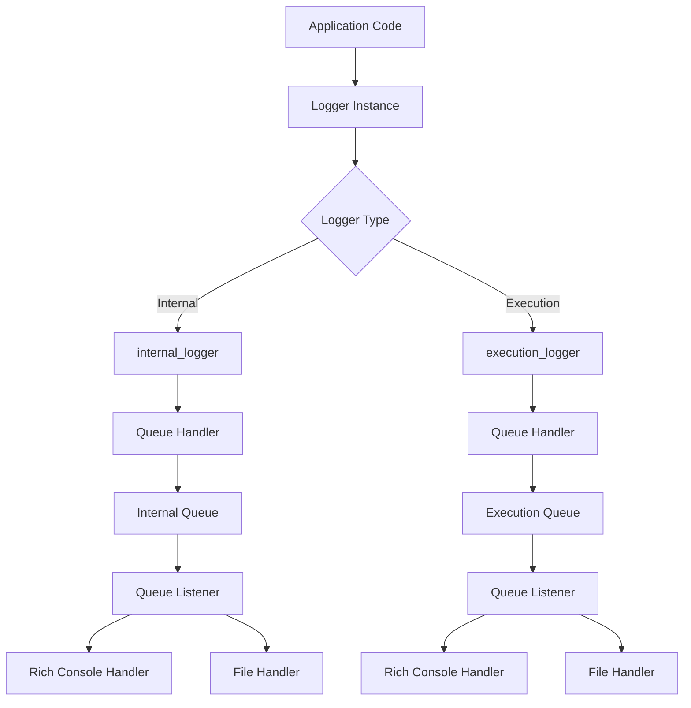

# Logging Architecture

The Optics Framework uses a sophisticated logging system that provides structured logging, multiple logger instances, and integration with execution tracking. This document explains the logging architecture, configuration, and usage patterns.

## Overview

The logging system consists of:

1. **Multiple Logger Instances** - Separate loggers for different concerns
2. **Queue-Based Logging** - Thread-safe logging using queues
3. **Rich Console Output** - Beautiful formatted console output using Rich library
4. **File Logging** - Rotating file handlers for persistent logs
5. **Sensitive Data Sanitization** - Automatic sanitization of sensitive information
6. **Session Context** - Session-scoped logging with context managers
7. **Log Capture** - Capturing logs during keyword execution

## Logger Architecture



## Logger Instances

### Internal Logger

**Name:** `optics.internal`
**Purpose:** Framework-internal operations, debugging, and development

```python
from optics_framework.common.logging_config import internal_logger

internal_logger.debug("Debug message")
internal_logger.info("Information message")
internal_logger.warning("Warning message")
internal_logger.error("Error message")
```

**Characteristics:**

- Propagates to root logger: **No** (`propagate = False`)
- Rich tracebacks: **Yes** (shows full tracebacks with locals)
- Use cases: Framework debugging, component initialization, error details

### Execution Logger

**Name:** `optics.execution`
**Purpose:** Test execution events, keyword execution, and user-facing information

```python
from optics_framework.common.logging_config import execution_logger

execution_logger.info("Test case started")
execution_logger.info("Keyword executed successfully")
execution_logger.warning("Element not found, trying fallback")
```

**Characteristics:**

- Propagates to root logger: **Yes** (`propagate = True`)
- Rich tracebacks: **No** (cleaner output)
- Use cases: Test execution tracking, keyword results, execution tracer logs

## Logging Configuration

### Configuration Structure

Logging is configured through the main configuration system:

```yaml
# config.yaml
log_level: "INFO"  # DEBUG, INFO, WARNING, ERROR, CRITICAL
file_log: true
log_path: "./logs/test_execution.log"  # Optional
json_log: false
json_path: "./logs/test_logs.json"  # Optional
execution_output_path: "./output"
```

### Log Levels

The framework supports standard Python log levels:

- **DEBUG**: Detailed information for troubleshooting
- **INFO**: General informational messages (default)
- **WARNING**: Warning messages
- **ERROR**: Error messages
- **CRITICAL**: Critical failures

### Dynamic Reconfiguration

Logging can be reconfigured at runtime:

```python
from optics_framework.common.logging_config import reconfigure_logging
from optics_framework.common.config_handler import ConfigHandler

config_handler = ConfigHandler(config)
reconfigure_logging(config_handler.config)
```

**When Reconfiguration Occurs:**

- Session creation
- Configuration updates
- Runtime configuration changes

## Log Handlers

### Console Handlers

Both loggers use Rich handlers for beautiful console output:

```python
# Internal logger - Rich with tracebacks
internal_console_handler = RichHandler(
    rich_tracebacks=True,
    tracebacks_show_locals=True,
    show_time=True,
    show_level=True
)

# Execution logger - Clean Rich output
execution_console_handler = RichHandler(
    rich_tracebacks=False,
    show_time=True,
    show_level=True,
    markup=True
)
```

### File Handlers

File handlers use rotating file handlers:

```python
handler = RotatingFileHandler(
    path,
    maxBytes=10 * 1024 * 1024,  # 10MB
    backupCount=10  # Keep 10 backup files
)
```

**File Handler Features:**

- Automatic rotation at 10MB
- Keeps 10 backup files
- Separate files for internal and execution logs
- Configurable log paths

### Queue Handlers

Logging uses queue-based handlers for thread safety:

```python
execution_queue_handler = QueueHandler(self.execution_log_queue)
self.execution_logger.addHandler(self.execution_queue_handler)
```

**Benefits:**

- Thread-safe logging
- Non-blocking log writes
- Background processing
- Better performance

## Sensitive Data Sanitization

The framework automatically sanitizes sensitive data in log messages:

```python
class SensitiveDataFormatter(logging.Formatter):
    def _sanitize(self, message: str) -> str:
        # Removes patterns like @:password, @:api_key
        return re.sub(r"@:([^\s,\)\]]+)", "****", message)
```

**Sanitization Pattern:**

- Matches: `@:password`, `@:api_key`, `@:token`
- Replaces with: `****`
- Prevents accidental credential exposure

**Usage:**
```python
# This will be sanitized
internal_logger.info("Connecting with @:api_key")
# Output: "Connecting with ****"
```

## Session Context Logging

The framework provides session-scoped logging:

```python
from optics_framework.common.logging_config import LoggerContext

with LoggerContext(session_id) as (session_execution_logger, session_internal_logger):
    session_execution_logger.info("Session-specific log message")
    # Logs include session_id automatically
```

**SessionLoggerAdapter:**

- Automatically adds session_id to log records
- Provides session-scoped logging
- Used during test execution

## Log Capture

During keyword execution, logs are captured:

```python
from optics_framework.common.logging_config import LogCaptureBuffer

class LogCaptureBuffer(logging.Handler):
    def __init__(self):
        super().__init__()
        self.records = []

    def emit(self, record):
        self.records.append(record)
```

**Usage in Test Runner:**
```python
capture_handler = LogCaptureBuffer()
execution_logger.addHandler(capture_handler)

# Execute keyword
execute_keyword(...)

# Get captured logs
logs = capture_handler.get_records()
```

**Use Cases:**

- Capturing logs during keyword execution
- Including logs in test results
- Debugging keyword failures
- Event logging

## Integration with Execution Tracer

The execution tracer uses the execution logger:

```python
from optics_framework.common.logging_config import execution_logger
from optics_framework.common.execution_tracer import execution_tracer

# Execution tracer automatically logs to execution_logger
execution_tracer.log_attempt(
    strategy=XPathStrategy,
    element="submit_button",
    status="success",
    duration=0.15
)
# Logs: "Trying XPathStrategy on 'submit_button' ... SUCCESS, duration: 0.15s"
```

## Log Format

### Console Format

**Internal Logger:**
```
12:34:56 INFO     Debug message
```

**Execution Logger:**
```
12:34:56 INFO     Test case started
```

### File Format

```
INFO | 2024-01-01 12:34:56 | optics.internal:function_name:123 | Log message
```

**Format Components:**
- Level name
- Timestamp
- Logger name:function:line
- Message

## Logging Manager

The `LoggingManager` class manages all logging infrastructure:

```python
class LoggingManager:
    def __init__(self):
        # Initialize loggers
        # Set up handlers
        # Configure queues

    def initialize_handlers(self, config):
        # Configure handlers based on config
        # Add file handlers if enabled
        # Set log levels

    def shutdown_logging(self):
        # Clean shutdown
        # Stop listeners
        # Flush handlers
```

## Shutdown and Cleanup

The framework provides graceful logging shutdown:

```python
from optics_framework.common.logging_config import shutdown_logging

# Automatically called on exit
atexit.register(shutdown_logging)
```

**Shutdown Process:**

1. Disable root logger
2. Stop queue listeners
3. Wait for threads to terminate
4. Flush all handlers
5. Clear log queues

## Best Practices

### 1. Use Appropriate Logger

```python
# Framework debugging
internal_logger.debug("Component initialized")

# Test execution events
execution_logger.info("Keyword executed")
```

### 2. Log Levels

```python
# Debug: Detailed troubleshooting
internal_logger.debug("Element coordinates: (100, 200)")

# Info: General information
execution_logger.info("Test case completed")

# Warning: Non-critical issues
execution_logger.warning("Element not found, using fallback")

# Error: Errors that don't stop execution
execution_logger.error("Driver connection failed")

# Critical: Critical failures
internal_logger.critical("System error, shutting down")
```

### 3. Sensitive Data

```python
# Good - sanitized
internal_logger.info("API key: @:api_key")

# Bad - exposed
internal_logger.info(f"API key: {api_key}")
```

### 4. Context Information

```python
# Include context in messages
execution_logger.info(f"Element '{element_id}' located at ({x}, {y})")
```

### 5. Exception Logging

```python
try:
    operation()
except Exception as e:
    internal_logger.exception("Operation failed", exc_info=e)
    # Logs full traceback
```

## Configuration Examples

### Development Configuration

```yaml
log_level: "DEBUG"
file_log: true
log_path: "./logs/dev.log"
```

### Production Configuration

```yaml
log_level: "INFO"
file_log: true
log_path: "./logs/production.log"
json_log: true
json_path: "./logs/production.json"
```

### Minimal Configuration

```yaml
log_level: "INFO"
# Uses defaults for everything else
```

## Troubleshooting

### Logs Not Appearing

**Problem:** Logs not showing in console or files

**Solutions:**

1. Check log level configuration
2. Verify handlers are initialized
3. Check file permissions for file logging
4. Review configuration loading

### Too Many Logs

**Problem:** Excessive log output

**Solutions:**

1. Increase log level (INFO → WARNING)
2. Disable file logging if not needed
3. Review debug statements

### Missing Logs

**Problem:** Some logs missing

**Solutions:**

1. Check logger propagation settings
2. Verify handlers are attached
3. Review log level filters
4. Check queue listener status

### Performance Issues

**Problem:** Logging causing performance problems

**Solutions:**

1. Reduce log level
2. Disable file logging
3. Review log message frequency
4. Check queue sizes

## Related Documentation

- [Execution Architecture](execution.md) - Execution tracer integration
- [Execution Tracer](execution.md#execution-tracer) - Strategy attempt logging
- [Error Handling](error_handling.md) - Error logging patterns
- [Configuration](../configuration.md) - Logging configuration options
- [Components](components.md) - Component logging usage
- [Architecture Decisions](decisions.md) - Logging system design decisions
