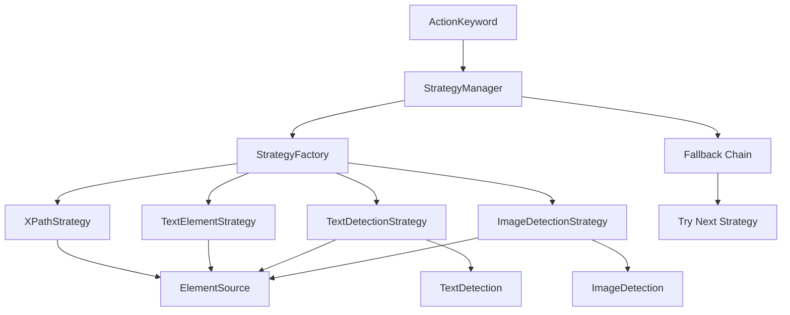
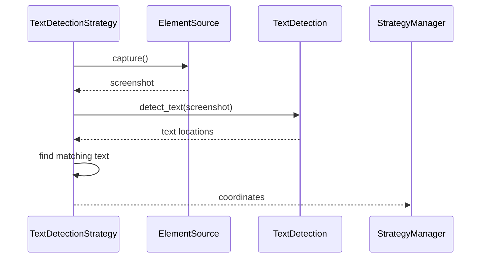
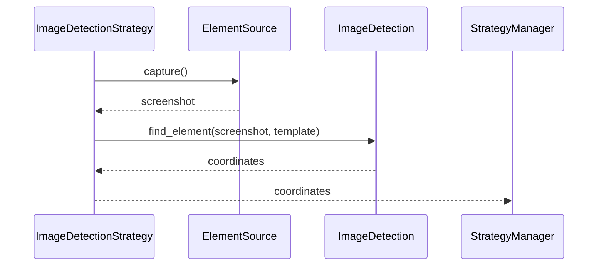
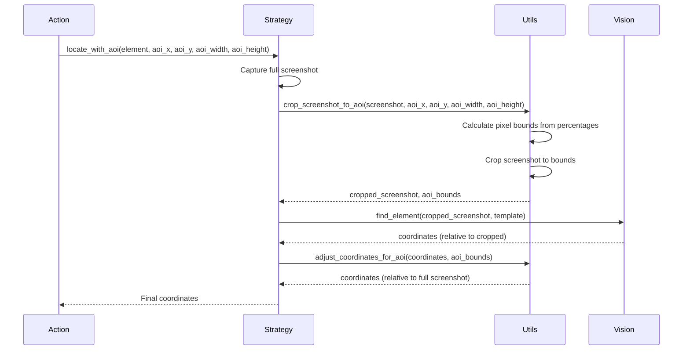
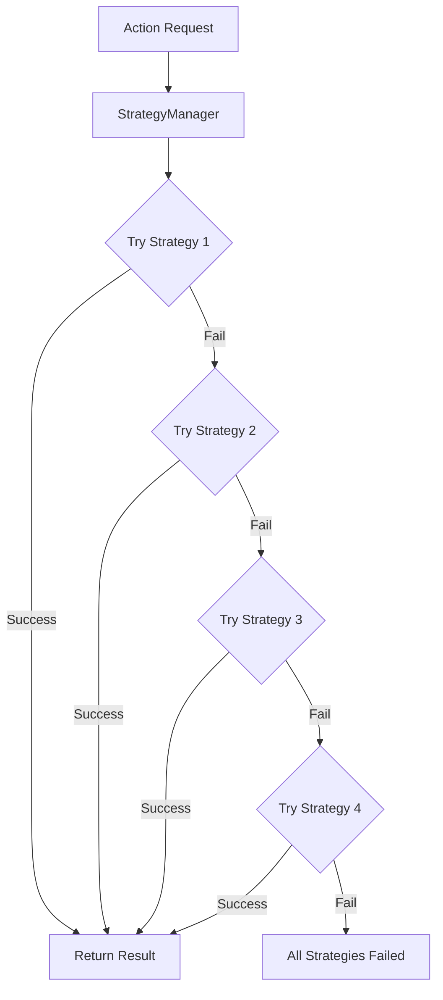
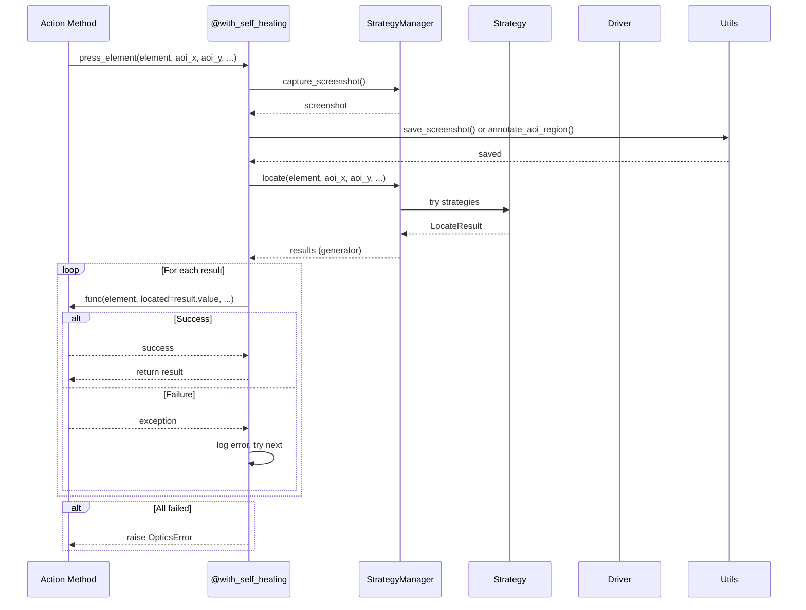
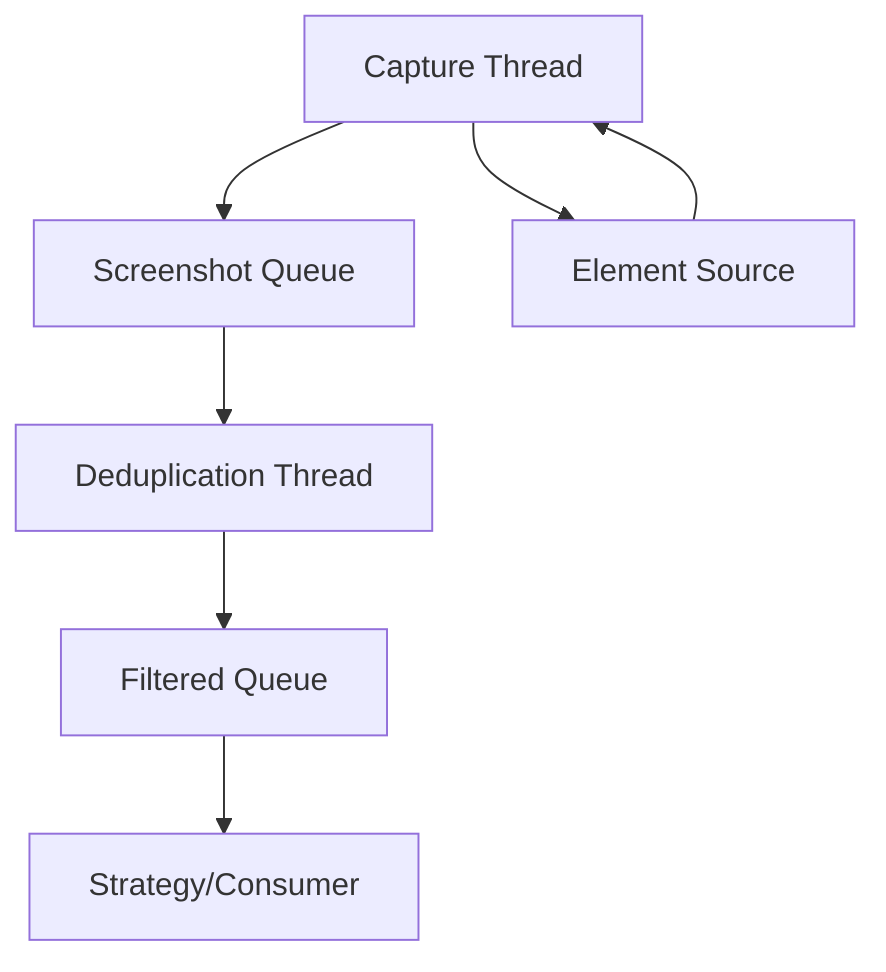

# Strategy Pattern and Self-Healing

The Optics Framework uses the Strategy pattern extensively to provide self-healing test automation. This document explains how strategies work, how they're selected, and how the fallback mechanism ensures test resilience.

## Overview

The strategy pattern allows the framework to try multiple methods for locating elements, with automatic fallback when one method fails. This creates a self-healing system that adapts to UI changes and different application states.

## Strategy Architecture



## StrategyManager

**Location:** `optics_framework/common/strategies.py`

The `StrategyManager` orchestrates multiple location strategies and manages fallback chains.

### Key Responsibilities

- Strategy creation and management
- Strategy execution with fallback
- Screenshot and page source strategy management
- Element location coordination

### Initialization

```python
strategy_manager = StrategyManager(
    element_source=element_source_fallback,
    text_detection=text_detection_fallback,
    image_detection=image_detection_fallback
)
```

### Strategy Building

The manager builds three types of strategies:

1. **Locator Strategies**: For element location
2. **Screenshot Strategies**: For screen capture
3. **Page Source Strategies**: For page source extraction

## Locator Strategies

### XPathStrategy

**Priority:** 1 (Highest)

Locates elements using XPath expressions through the element source.

#### When Used

- Element type is "XPath"
- Element source supports `locate()` method
- Fastest method when available

#### Implementation

```python
def locate(self, element: str, index: int = 0):
    return self.element_source.locate(element, index)
```

#### Examples

**Basic XPath:**
```python
# Element: "//button[@id='submit']"
# Strategy: XPathStrategy
# Process: Direct element location via XPath
# Result: Element object or coordinates
press_element("//button[@id='submit']")
```

**XPath with Attributes:**
```python
# Complex XPath with multiple attributes
press_element("//android.widget.Button[@resource-id='com.app:id/button' and @text='Submit']")
```

**XPath with Index:**
```python
# Get second matching element
press_element("//button[@class='action']", index=1)
```

**XPath Performance:**
- Fastest strategy (typically < 0.1s)
- Direct DOM access
- No screenshot required
- No vision processing

### TextElementStrategy

**Priority:** 2

Locates elements by text content directly through the element source.

#### When Used

- Element type is "Text" or "CSS"
- Element source supports direct text location
- Faster than OCR-based detection

#### Implementation

```python
def locate(self, element: str, index: int = 0):
    return self.element_source.locate(element, index)
```

#### Examples

**Text-Based Location:**
```python
# Element: "Submit Button"
# Strategy: TextElementStrategy
# Process: Direct text-based element location
# Result: Element object
press_element("Submit Button")
```

**CSS Selector:**
```python
# CSS selector (if supported by driver)
press_element("button.submit-btn")
```

**ID-Based:**
```python
# Element ID
press_element("submit-button-id")
```

**Performance:**
- Fast strategy (typically < 0.2s)
- Direct element access
- No screenshot required
- Driver-specific implementation

### TextDetectionStrategy

**Priority:** 3

Locates text elements using OCR (Optical Character Recognition).

#### When Used

- Element type is "Text"
- XPath and direct text location failed
- OCR model is available
- Element source supports screenshot capture

#### Implementation Flow



#### Features

- Screenshot-based detection
- Full text detection with bounding boxes
- Confidence-based matching
- Timeout support for element appearance

#### Examples

**Basic Text Detection:**
```python
# Element: "Login"
# Strategy: TextDetectionStrategy
# Process:
#   1. Capture screenshot
#   2. Run OCR on screenshot
#   3. Find "Login" text in OCR results
#   4. Return center coordinates
press_element("Login")
```

**Text with Index:**
```python
# Get second occurrence of "Submit"
press_element("Submit", index=1)
```

**Text in Specific Language:**
```python
# Configure OCR for specific language
# In config.yaml:
text_detection:
  - easyocr:
      enabled: true
      capabilities:
        languages: ["en", "es"]  # English and Spanish

# Use in test
press_element("Iniciar Sesión")  # Spanish text
```

**Performance:**
- Slower strategy (typically 1-3s)
- Requires screenshot capture
- OCR processing time
- Accuracy depends on image quality

### ImageDetectionStrategy

**Priority:** 4 (Lowest)

Locates elements using image template matching.

#### When Used

- Element type is "Image"
- Other strategies failed
- Image detection model is available
- Element source supports screenshot capture

#### Implementation Flow



#### Features

- Template-based matching
- SIFT/FLANN feature matching
- Area of Interest (AOI) support
- Multiple match support (index-based)

#### AOI Support

The strategy supports locating images within a specified Area of Interest (AOI). AOI allows you to restrict element location to a specific region of the screen, improving performance and accuracy.

**What is AOI?**
Area of Interest (AOI) is a percentage-based region of the screen where element location is performed. Instead of searching the entire screen, the framework crops the screenshot to the AOI region, performs location within that region, then adjusts coordinates back to the full screen.

**Why Use AOI?**
- **Performance**: Smaller search area = faster location
- **Accuracy**: Reduces false positives from similar elements elsewhere
- **Efficiency**: Focuses vision models on relevant screen area
- **Flexibility**: Works with any screen size (percentage-based)

**AOI Parameters:**
- `aoi_x`: X percentage of AOI top-left corner (0-100)
- `aoi_y`: Y percentage of AOI top-left corner (0-100)
- `aoi_width`: Width percentage of AOI (0-100)
- `aoi_height`: Height percentage of AOI (0-100)

**Example:**
```python
# Locate element in top-right quarter of screen
press_element(
    "submit_button",
    aoi_x="50",      # Start at 50% from left
    aoi_y="0",       # Start at top
    aoi_width="50",  # 50% width
    aoi_height="50"  # 50% height
)
```

**AOI Implementation Flow:**



**Coordinate Adjustment:**
```python
def adjust_coordinates_for_aoi(coordinates, aoi_bounds):
    """
    Adjust coordinates found in cropped AOI back to full screenshot.

    Args:
        coordinates: (x, y) found in cropped screenshot
        aoi_bounds: (x1, y1, x2, y2) pixel bounds of AOI

    Returns:
        (adjusted_x, adjusted_y) in full screenshot coordinates
    """
    x, y = coordinates
    x1, y1, x2, y2 = aoi_bounds
    adjusted_x = x1 + x
    adjusted_y = y1 + y
    return (adjusted_x, adjusted_y)
```

**AOI Validation:**
```python
def calculate_aoi_bounds(screenshot_shape, aoi_x, aoi_y, aoi_width, aoi_height):
    """
    Calculate pixel bounds for AOI from percentage coordinates.

    Validates:
    - All parameters between 0-100
    - AOI doesn't exceed screen bounds
    - Width and height > 0
    """
    # Validation logic
    # Calculate pixel bounds
    return (x1, y1, x2, y2)
```

**AOI Annotation:**
When AOI is used, screenshots are annotated with the AOI region for debugging:

```python
def annotate_aoi_region(screenshot, aoi_x, aoi_y, aoi_width, aoi_height):
    """
    Draw rectangle on screenshot showing AOI region.

    - Red rectangle shows AOI bounds
    - Label shows AOI parameters
    - Saved to execution output directory
    """
```

**Supported Strategies:**
- `ImageDetectionStrategy`: Supports `locate_with_aoi()`
- `TextDetectionStrategy`: Supports `locate_with_aoi()`
- `XPathStrategy`: AOI not applicable (uses DOM structure)
- `TextElementStrategy`: AOI not applicable (uses DOM structure)

**Use Cases:**
1. **Button in Specific Region**: Locate button only in bottom navigation
2. **Form Fields**: Search only in form area, not entire screen
3. **Modal Dialogs**: Focus search on dialog region
4. **Performance Optimization**: Reduce search area for faster location

#### Examples

**Basic Image Matching:**
```python
# Element: "button_template.png"
# Strategy: ImageDetectionStrategy
# Process:
#   1. Capture screenshot
#   2. Load template image from project_path/input_templates/
#   3. Match template in screenshot using SIFT/FLANN
#   4. Return center coordinates
press_element("button_template.png")
```

**Image with Index:**
```python
# Get second occurrence of template
press_element("icon_template.png", index=1)
```

**Image with AOI:**
```python
# Search for image only in top-right quarter
press_element(
    "button_template.png",
    aoi_x="50",      # Start at 50% from left
    aoi_y="0",       # Start at top
    aoi_width="50",  # 50% width
    aoi_height="50"  # 50% height
)
```

**Template Organization:**
```
project/
└── test_data/
    └── input_templates/
        ├── button_template.png
        ├── login_form.png
        └── submit_button.png
```

**Performance:**
- Slowest strategy (typically 2-5s)
- Requires screenshot capture
- SIFT feature detection
- FLANN matching computation
- Performance improves with AOI

## Strategy Selection

### Automatic Selection

Strategies are automatically selected based on:

1. **Element Type**: Determined from element identifier
   - XPath: `//button[@id='submit']`
   - Text: `"Submit Button"`
   - Image: `button_template.png`

2. **Element Source Capabilities**: Checked via `supports()` method
   - Does element source implement required methods?
   - Is the method actually implemented (not a stub)?

3. **Priority Ordering**: Strategies tried in priority order
   - Higher priority = tried first
   - Lower priority = fallback option

### Strategy Factory

**Location:** `optics_framework/common/strategies.py`

The `StrategyFactory` creates strategies based on element source capabilities.

```python
class StrategyFactory:
    def __init__(self, text_detection, image_detection, strategy_manager):
        self._registry = [
            (XPathStrategy, "XPath", {}, 1),
            (TextElementStrategy, "Text", {}, 2),
            (TextDetectionStrategy, "Text", {...}, 3),
            (ImageDetectionStrategy, "Image", {...}, 4),
        ]
```

### Strategy Creation

```python
def create_strategies(self, element_source):
    strategies = [
        (cls(element_source, **args), priority)
        for cls, etype, args, priority in self._registry
        if cls.supports(etype, element_source)
    ]
    strategies.sort(key=lambda x: x[1])  # Sort by priority
    return [strategy for strategy, _ in strategies]
```

## Fallback Mechanism

### Multi-Level Fallback

The framework implements fallback at multiple levels:



### Strategy Fallback Flow

```python
def locate(self, element: str, index: int = 0):
    results = []
    for strategy in self.locator_strategies:
        try:
            result = strategy.locate(element, index)
            if result is not None:
                results.append(LocateResult(result, strategy))
        except Exception as e:
            internal_logger.debug(f"Strategy {strategy} failed: {e}")
            continue

    # Yield results from all successful strategies
    for result in results:
        yield result
```

### Element Source Fallback

If multiple element sources are configured, they're tried in order:

```python
# If AppiumScreenshot fails, try SeleniumScreenshot
element_source_fallback.capture()
```

### Vision Model Fallback

If multiple vision models are configured, they're tried in order:

```python
# If EasyOCR fails, try GoogleVision
text_detection_fallback.detect_text(screenshot)
```

## Self-Healing Decorator

**Location:** `optics_framework/api/action_keyword.py`

The `@with_self_healing` decorator wraps action methods to provide automatic fallback and self-healing capabilities. It orchestrates element location, handles multiple results, and provides comprehensive error handling.

### Decorator Flow



### Implementation Details

**Decorator Signature:**
```python
def with_self_healing(func: Callable) -> Callable:
    @wraps(func)
    def wrapper(self, element, *args, **kwargs):
        # Implementation
    return wrapper
```

**Step-by-Step Process:**

**1. Screenshot Capture:**
```python
# Capture screenshot before location
screenshot_np = self.strategy_manager.capture_screenshot()
```

**2. AOI Parameter Extraction:**
```python
# Extract and parse AOI parameters
aoi_x = parse_aoi_param(kwargs.pop('aoi_x', '0'), 0)
aoi_y = parse_aoi_param(kwargs.pop('aoi_y', '0'), 0)
aoi_width = parse_aoi_param(kwargs.pop('aoi_width', '100'), 100)
aoi_height = parse_aoi_param(kwargs.pop('aoi_height', '100'), 100)

# Check if AOI is being used
is_aoi_used = not (aoi_x == 0 and aoi_y == 0 and aoi_width == 100 and aoi_height == 100)
```

**3. Screenshot Saving:**
```python
# Save screenshot with AOI annotation if AOI is used
if is_aoi_used:
    annotated_screenshot = utils.annotate_aoi_region(
        screenshot_np, aoi_x, aoi_y, aoi_width, aoi_height
    )
    utils.save_screenshot(
        annotated_screenshot,
        f"{func.__name__}_with_aoi",
        output_dir=self.execution_dir
    )
else:
    utils.save_screenshot(
        screenshot_np,
        func.__name__,
        output_dir=self.execution_dir
    )
```

**4. Element Location:**
```python
# Locate element with or without AOI
if is_aoi_used:
    results = self.strategy_manager.locate(
        element, aoi_x, aoi_y, aoi_width, aoi_height, index=index
    )
else:
    results = self.strategy_manager.locate(element, index=index)
```

**5. Result Iteration:**
```python
last_exception = None
result_count = 0

for result in results:
    result_count += 1
    try:
        # Try executing action with this result
        return func(self, element, located=result.value, *args, **kwargs)
    except Exception as e:
        # Log error and try next result
        internal_logger.error(
            f"Action '{func.__name__}' failed with "
            f"{result.strategy.__class__.__name__}: {e}"
        )
        last_exception = e
        continue  # Try next result
```

**6. Error Handling:**
```python
# Handle different failure scenarios
if result_count == 0:
    # No strategies yielded a result
    raise OpticsError(
        Code.E0201,
        message=f"No valid strategies found for '{element}' in '{func.__name__}'"
    )

if last_exception:
    # All strategies failed
    raise OpticsError(
        Code.X0201,
        message=f"All strategies failed for '{element}' in '{func.__name__}': {last_exception}",
        cause=last_exception
    )

# Unexpected case
raise OpticsError(
    Code.E0801,
    message=f"Unexpected failure: No results or exceptions for '{element}' in '{func.__name__}'"
)
```

### Key Features

**1. Automatic Screenshot Capture:**
- Captures screenshot before element location
- Saves screenshot for debugging
- Annotates AOI region if used

**2. Strategy-Based Location:**
- Uses StrategyManager to locate element
- Supports multiple location strategies
- Handles AOI parameters automatically

**3. Multiple Result Handling:**
- Iterates through all successful strategy results
- Tries each result until one succeeds
- Continues on failure (self-healing)

**4. Error Aggregation:**
- Logs each failure with strategy information
- Preserves last exception for error message
- Provides detailed error context

**5. Screenshot Saving:**
- Saves screenshots to execution output directory
- Annotates AOI regions for debugging
- Uses function name for screenshot filename

**6. AOI Integration:**
- Extracts AOI parameters from kwargs
- Passes AOI to strategy manager
- Annotates screenshots with AOI region

### Usage Example

**Basic Usage:**
```python
@with_self_healing
def press_element(
    self,
    element: str,
    repeat: str = "1",
    offset_x: str = "0",
    offset_y: str = "0",
    index: str = "0",
    aoi_x: str = "0",
    aoi_y: str = "0",
    aoi_width: str = "100",
    aoi_height: str = "100",
    event_name: Optional[str] = None,
    *, located: Any = None
) -> None:
    """
    Press an element with self-healing.

    The decorator handles:
    - Screenshot capture
    - Element location
    - Multiple result handling
    - Error aggregation
    """
    # located parameter is provided by decorator
    if isinstance(located, tuple):
        x, y = located
        self.driver.press_coordinates(x + int(offset_x), y + int(offset_y))
    else:
        self.driver.press_element(located, int(repeat))
```

**With AOI:**
```python
# Press element in specific region
press_element(
    "submit_button",
    aoi_x="50",      # Right half of screen
    aoi_y="0",       # Top
    aoi_width="50",  # 50% width
    aoi_height="100" # Full height
)
```

### Error Scenarios

**1. No Strategies Available:**
```python
# Error: E0201 - No valid strategies found
# Occurs when no strategies can locate the element
```

**2. All Strategies Failed:**
```python
# Error: X0201 - All strategies failed
# Occurs when all strategies tried but all failed
# Includes last exception as cause
```

**3. Unexpected Failure:**
```python
# Error: E0801 - Unexpected failure
# Occurs in unexpected scenarios
```

### Debugging Support

**Screenshot Files:**
- Saved to `execution_output_path`
- Named after function: `press_element.png`
- AOI annotated: `press_element_with_aoi.png`

**Logging:**
- Each strategy attempt is logged
- Failures include strategy name and error
- Execution logger shows location attempts

**Error Messages:**
- Include element name
- Include function name
- Include strategy that failed
- Include original exception

### Best Practices

1. **Always Use Decorator**: Apply to all element interaction methods
2. **Handle Located Parameter**: Check if tuple (coordinates) or object (element)
3. **Provide Context**: Include meaningful error messages
4. **Save Screenshots**: Enable screenshot saving for debugging
5. **Use AOI When Appropriate**: Improve performance and accuracy

### Integration Points

- **StrategyManager**: For element location
- **Utils**: For screenshot saving and AOI annotation
- **Driver**: For actual action execution
- **Error System**: For error reporting
- **Logging**: For debugging information

## Screenshot Strategies

### ScreenshotStrategy

Manages screenshot capture from element sources.

#### Features

- Black screen detection
- Screenshot validation
- Screenshot streaming support
- Multiple element source fallback

### Screenshot Streaming

**Location:** `optics_framework/common/screenshot_stream.py`

Screenshot streaming provides continuous screenshot capture for timeout-based element location operations. This is useful when waiting for elements to appear or when monitoring screen changes.

#### Architecture



#### Key Components

**ScreenshotStream Class:**
```python
class ScreenshotStream:
    def __init__(self, capture_screenshot_callable, max_queue_size=100):
        self.capture_screenshot = capture_screenshot_callable
        self.screenshot_queue = queue.Queue(maxsize=max_queue_size)
        self.filtered_queue = queue.Queue(maxsize=max_queue_size)
        self.stop_event = threading.Event()
```

#### Capture Process

**1. Continuous Capture:**
```python
def capture_stream(self, timeout):
    """
    Continuously captures screenshots in a separate thread.

    - Captures at maximum rate
    - Stores in screenshot_queue
    - Stops on timeout or stop_event
    """
    start_time = time.time()
    while not self.stop_event.is_set() and (time.time() - start_time) < timeout:
        frame = self.capture_screenshot()
        self.screenshot_queue.put((frame, timestamp))
```

**2. Deduplication:**
```python
def process_screenshot_queue(self):
    """
    Processes screenshots with SSIM-based deduplication.

    - Compares frames using Structural Similarity Index
    - Filters duplicate frames (similarity >= 0.75)
    - Stores unique frames in filtered_queue
    """
    similarity = ssim(gray_last_frame, gray_frame)
    if similarity >= 0.75:
        # Skip duplicate
        return last_processed_frame
    # Add to filtered queue
```

**SSIM Deduplication:**
- Uses Structural Similarity Index (SSIM) to detect duplicate frames
- Threshold: 0.75 (75% similarity = duplicate)
- Reduces processing load by filtering similar screenshots
- Preserves unique frames for element location

#### Usage

**Starting Stream:**
```python
stream = ScreenshotStream(capture_screenshot_callable)
stream.start_capture(timeout=30, deduplication=True)
```

**Getting Screenshots:**
```python
# Get latest screenshot
frame, timestamp = stream.get_latest_screenshot(wait_time=1)

# Get all available screenshots
frames = stream.get_all_available_screenshots(wait_time=0.1)

# Get specific number of frames
frames = stream.fetch_frames_from_queue(num_frames=10)
```

**Stopping Stream:**
```python
stream.stop_capture(wait_for_threads=True, timeout=5)
```

#### Thread Management

**Capture Thread:**
- Continuously captures screenshots
- Non-blocking (daemon thread)
- Stops on timeout or stop_event

**Deduplication Thread:**
- Processes screenshots from queue
- Applies SSIM deduplication
- Stores unique frames in filtered queue
- Optional (can be disabled)

**Cleanup:**
```python
def stop_capture(self, wait_for_threads=True, timeout=5):
    """
    Stops capture and waits for threads to finish.

    - Sets stop_event
    - Waits for threads with timeout
    - Logs warnings if threads don't stop
    """
```

#### Queue Management

**Queue Sizes:**
- Default max size: 100 frames
- Oldest frames dropped when queue is full
- Prevents memory issues

**Queue Operations:**
```python
# Clear queues
stream.clear_queues()

# Get queue sizes (debugging)
sizes = stream.get_queue_sizes()
# Returns: {'screenshot_queue_size': 10, 'filtered_queue_size': 5}
```

#### Performance Considerations

**Benefits:**
- Non-blocking capture (doesn't slow down execution)
- Deduplication reduces processing load
- Queue-based (decouples capture from consumption)

**Trade-offs:**
- Memory usage (queues store frames)
- CPU usage (deduplication computation)
- Thread overhead

**Optimization Tips:**
- Adjust `max_queue_size` based on needs
- Disable deduplication if not needed
- Use appropriate timeout values
- Clear queues between operations

#### Use Cases

1. **Timeout-Based Location**: Wait for element to appear
2. **Screen Change Detection**: Monitor for UI changes
3. **Continuous Monitoring**: Track screen state over time
4. **Performance Analysis**: Capture frames for analysis

#### Integration with Strategies

Strategies can use screenshot streaming for timeout-based operations:

```python
# In strategy implementation
def locate_with_timeout(self, element: str, timeout: int = 30):
    stream = ScreenshotStream(self.element_source.capture)
    stream.start_capture(timeout, deduplication=True)

    while True:
        frame, timestamp = stream.get_latest_screenshot()
        if frame is None:
            continue

        # Try to locate element in frame
        result = self._locate_in_frame(frame, element)
        if result:
            stream.stop_capture()
            return result

        # Check timeout
        if time.time() - start_time > timeout:
            break

    stream.stop_capture()
    raise ElementNotFoundError()
```

## Page Source Strategies

### PagesourceStrategy

Manages page source extraction from element sources.

#### Features

- Page source extraction
- Interactive element detection
- Multiple format support (XML, HTML)
- Element hierarchy navigation

## Strategy Result Handling

### LocateResult

Wraps location results with strategy information:

```python
class LocateResult:
    def __init__(self, value: Union[object, Tuple[int, int]], strategy: LocatorStrategy):
        self.value = value  # Coordinates or element object
        self.strategy = strategy  # Which strategy found it
        self.is_coordinates = isinstance(value, tuple)
```

### Result Types

1. **Coordinates**: `(x, y)` tuple for direct coordinate-based actions
2. **Element Object**: Element object for driver-specific actions

## Best Practices

### Strategy Selection

1. **Use XPath when possible**: Fastest and most reliable
2. **Fallback to vision**: When UI structure is unknown
3. **Configure multiple models**: For maximum resilience
4. **Set appropriate timeouts**: For element appearance

### Performance Optimization

1. **Priority ordering**: Fastest strategies first
2. **Caching**: Screenshots may be cached
3. **Early exit**: Stop trying when first strategy succeeds
4. **Parallel execution**: Multiple strategies can run in parallel

### Error Handling

1. **Graceful degradation**: Try next strategy on failure
2. **Error aggregation**: Collect all errors for debugging
3. **Screenshot capture**: Save screenshots on failures
4. **Detailed logging**: Log strategy attempts and results

## Extension Guide

### Adding a New Strategy

1. Create class extending `LocatorStrategy`:

```python
class CustomStrategy(LocatorStrategy):
    def __init__(self, element_source: ElementSourceInterface):
        self._element_source = element_source

    def locate(self, element: str, index: int = 0):
        # Implementation
        pass

    @staticmethod
    def supports(element_type: str, element_source: ElementSourceInterface) -> bool:
        return element_type == "Custom" and ...
```

2. Register in `StrategyFactory`:

```python
self._registry = [
    ...,
    (CustomStrategy, "Custom", {}, 5),  # Priority 5
]
```

3. Strategy will be automatically used when:
   - Element type matches
   - Element source supports it
   - Higher priority strategies fail

## Debugging Strategies

### Enable Debug Logging

```python
import logging
logging.getLogger("optics_framework.common.strategies").setLevel(logging.DEBUG)
```

### Strategy Execution Log

The framework logs:
- Which strategies are tried
- Which strategy succeeded
- Why strategies failed
- Screenshot locations

### Visual Debugging

Screenshots are saved with strategy information:
- `press_element_with_xpath.png`
- `press_element_with_ocr.png`
- `press_element_with_image.png`

## Related Documentation

- [Components](components.md) - Component architecture and Optics class
- [Engines](engines.md) - Engine implementations
- [Execution](execution.md) - Execution flow and test context
- [Error Handling](error_handling.md) - Error codes and handling
- [Logging](logging.md) - Logging system
- [Architecture Decisions](decisions.md) - Strategy pattern rationale
- [Extending](extending.md) - Creating custom strategies
- [Self-Healing Decorator](strategies.md#self-healing-decorator) - Detailed decorator implementation
- [AOI Support](strategies.md#aoi-support) - Area of Interest system
- [Screenshot Streaming](strategies.md#screenshot-streaming) - Continuous screenshot capture
